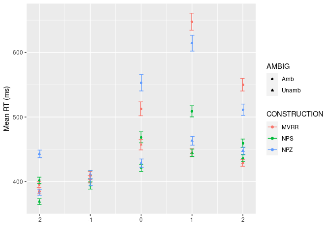
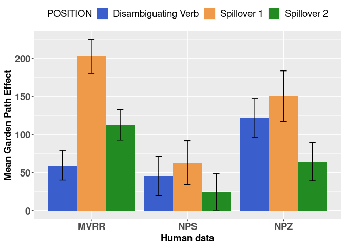
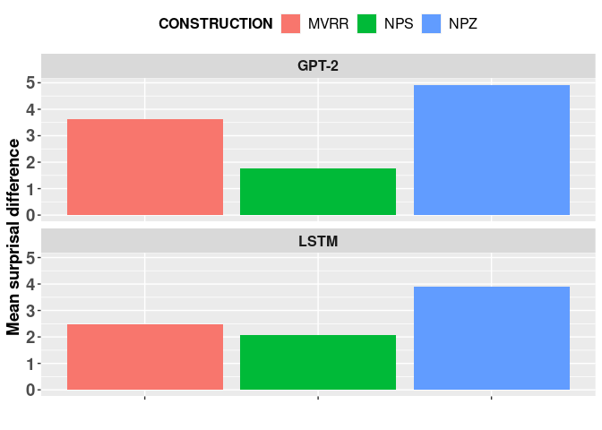
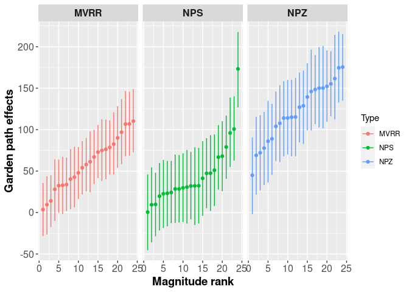
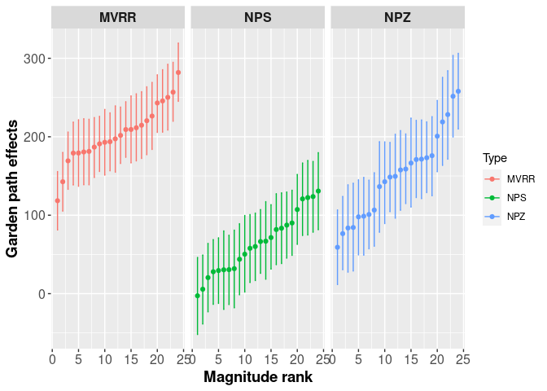
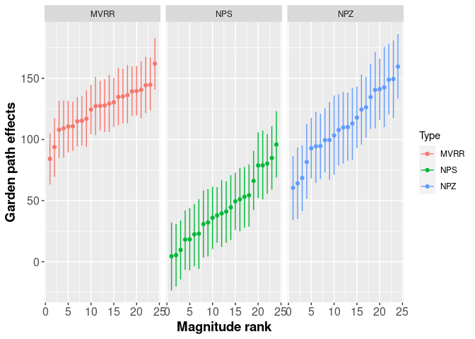
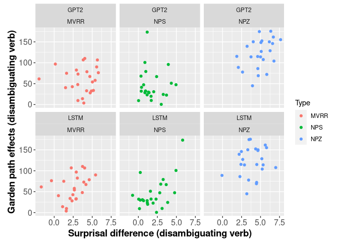
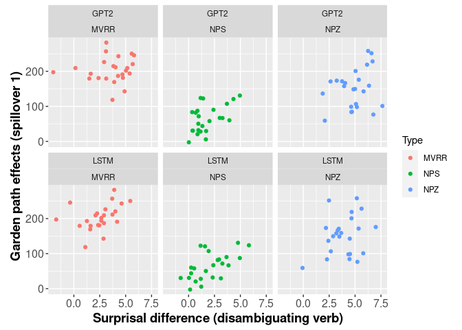
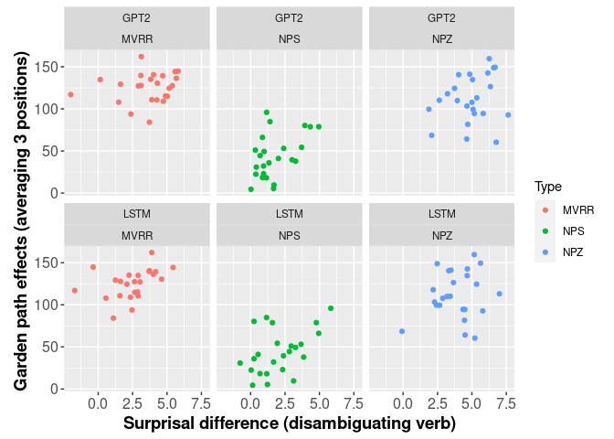
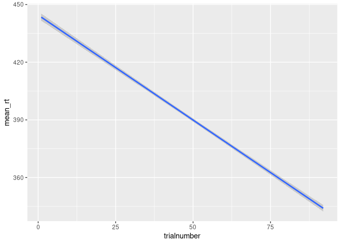

### Load in data

``` r
rt.data <- read.csv("ClassicGardenPathSet.csv", header=TRUE) %>%
  filter(ROI %in% c(-2,-1,0,1,2)) %>%
  filter(RT <= 7000) %>% mutate(participant=MD5)
filler.data <- read.csv("Fillers.csv", header = TRUE) %>%
  filter(RT <=7000) %>% mutate(participant=MD5)
```

### Plotting the data

Lets start by plotting the mean RTs for words in the critical positions

``` r
rt.data_summ <- rt.data %>%
  group_by(ROI, AMBIG, CONSTRUCTION) %>%
  summarise(mean_rt = mean(RT),
            se_rt = sd(RT)/sqrt(n())) %>%
  ungroup() 
```

    ## `summarise()` has grouped output by 'ROI', 'AMBIG'. You can override using the `.groups` argument.

``` r
ggplot(rt.data_summ, aes(x=ROI, y=mean_rt, colour=CONSTRUCTION, shape=AMBIG)) +
  geom_point() +
  geom_errorbar(aes(ymin=mean_rt - (2*se_rt), 
                    ymax = mean_rt + (2*se_rt)),
                width=.5,position=position_dodge(0.02)) +
  labs(x = '', y = 'Mean RT (ms)')
```



``` r
#all ambs (circles) are longer than their unamb counterparts (triangles)
#pretarget regions (-1) were very comparable
#pretarget regions (-2) interestingly differed for NPS and NPZ (possibly because of clause boundaries)
```

\#\#\#recode some factors and set contrasts

``` r
#itemwise (collapsing across constructions, 24*3=72)
rt.data$item72 <- ifelse(rt.data$CONSTRUCTION=="NPS",as.numeric(as.character(rt.data$item)),
                         ifelse(rt.data$CONSTRUCTION=="NPZ",as.numeric(as.character(rt.data$item))+24,as.numeric(as.character(rt.data$item))+48))
rt.data$item72 <- as.factor(rt.data$item72)
rt.data$SZM1 <- ifelse(
  rt.data$CONSTRUCTION=="NPS",1,0
)
rt.data$SZM2 <- ifelse(
  rt.data$CONSTRUCTION=="NPZ",1,0
)
```

### Fitting mixed effects model (two factors and their interaction)

``` r
#use || because the full models are too complex
#one lmer for each word position
lmer_0_AMBxCONSTR <- lmer(RT ~ AMBUAMB*(SZM1+SZM2)+(1+AMBUAMB*(SZM1+SZM2)||item)+(1+AMBUAMB*(SZM1+SZM2)||participant),data=rt.data[rt.data$ROI==0,])
```

    ## boundary (singular) fit: see ?isSingular

``` r
#one significant interaction: NPS similar to MVRR, and NPZ larger than MVRR at ROI0
summary(lmer_0_AMBxCONSTR)
```

    ## Linear mixed model fit by REML ['lmerMod']
    ## Formula: RT ~ AMBUAMB * (SZM1 + SZM2) + ((1 | item) + (0 + AMBUAMB | item) +  
    ##     (0 + SZM1 | item) + (0 + SZM2 | item) + (0 + AMBUAMB:SZM1 |  
    ##     item) + (0 + AMBUAMB:SZM2 | item)) + ((1 | participant) +  
    ##     (0 + AMBUAMB | participant) + (0 + SZM1 | participant) +  
    ##     (0 + SZM2 | participant) + (0 + AMBUAMB:SZM1 | participant) +  
    ##     (0 + AMBUAMB:SZM2 | participant))
    ##    Data: rt.data[rt.data$ROI == 0, ]
    ## 
    ## REML criterion at convergence: 695674.9
    ## 
    ## Scaled residuals: 
    ##     Min      1Q  Median      3Q     Max 
    ## -6.1001 -0.3542 -0.1409  0.1168 17.6101 
    ## 
    ## Random effects:
    ##  Groups        Name         Variance  Std.Dev. 
    ##  participant   AMBUAMB:SZM2 6.022e+04 2.454e+02
    ##  participant.1 AMBUAMB:SZM1 1.787e-04 1.337e-02
    ##  participant.2 SZM2         2.544e-04 1.595e-02
    ##  participant.3 SZM1         4.536e-05 6.735e-03
    ##  participant.4 AMBUAMB      1.528e+04 1.236e+02
    ##  participant.5 (Intercept)  2.487e+04 1.577e+02
    ##  item          AMBUAMB:SZM2 8.696e+02 2.949e+01
    ##  item.1        AMBUAMB:SZM1 1.467e+03 3.830e+01
    ##  item.2        SZM2         5.725e+02 2.393e+01
    ##  item.3        SZM1         5.678e+01 7.535e+00
    ##  item.4        AMBUAMB      1.238e+03 3.518e+01
    ##  item.5        (Intercept)  3.161e+02 1.778e+01
    ##  Residual                   1.087e+05 3.296e+02
    ## Number of obs: 47700, groups:  participant, 2000; item, 24
    ## 
    ## Fixed effects:
    ##              Estimate Std. Error t value
    ## (Intercept)   458.557      6.301  72.775
    ## AMBUAMB        59.230      9.370   6.321
    ## SZM1          -37.446      5.531  -6.770
    ## SZM2          -27.566      7.242  -3.806
    ## AMBUAMB:SZM1  -13.658     10.877  -1.256
    ## AMBUAMB:SZM2   61.973     11.151   5.558
    ## 
    ## Correlation of Fixed Effects:
    ##              (Intr) AMBUAMB SZM1   SZM2   AMBUAMB:SZM1
    ## AMBUAMB      -0.237                                   
    ## SZM1         -0.408  0.272                            
    ## SZM2         -0.311  0.209   0.357                    
    ## AMBUAMB:SZM1  0.206 -0.282  -0.467 -0.181             
    ## AMBUAMB:SZM2  0.201 -0.277  -0.231 -0.353  0.240      
    ## optimizer (nloptwrap) convergence code: 0 (OK)
    ## boundary (singular) fit: see ?isSingular

``` r
#summary(lmer(RT ~ AMBUAMB*(SZM1+SZM2)+(1+AMBUAMB*(SZM1+SZM2)||item)+(1+AMBUAMB*(SZM2)||participant),data=rt.data[rt.data$ROI==0,]))
#same results with diff random structures

lmer_1_AMBxCONSTR <- lmer(RT ~ AMBUAMB*(SZM1+SZM2)+(1+AMBUAMB*(SZM1+SZM2)||item)+(1+AMBUAMB*(SZM1+SZM2)||participant),data=rt.data[rt.data$ROI==1,])
```

    ## boundary (singular) fit: see ?isSingular

``` r
#two significant interactions: NPS smaller than MVRR, and NPZ also smaller than MVRR at ROI1
summary(lmer_1_AMBxCONSTR)
```

    ## Linear mixed model fit by REML ['lmerMod']
    ## Formula: RT ~ AMBUAMB * (SZM1 + SZM2) + ((1 | item) + (0 + AMBUAMB | item) +  
    ##     (0 + SZM1 | item) + (0 + SZM2 | item) + (0 + AMBUAMB:SZM1 |  
    ##     item) + (0 + AMBUAMB:SZM2 | item)) + ((1 | participant) +  
    ##     (0 + AMBUAMB | participant) + (0 + SZM1 | participant) +  
    ##     (0 + SZM2 | participant) + (0 + AMBUAMB:SZM1 | participant) +  
    ##     (0 + AMBUAMB:SZM2 | participant))
    ##    Data: rt.data[rt.data$ROI == 1, ]
    ## 
    ## REML criterion at convergence: 701437
    ## 
    ## Scaled residuals: 
    ##     Min      1Q  Median      3Q     Max 
    ## -4.6454 -0.3852 -0.1484  0.1518 15.8516 
    ## 
    ## Random effects:
    ##  Groups        Name         Variance Std.Dev.
    ##  participant   AMBUAMB:SZM2  28725.5 169.49  
    ##  participant.1 AMBUAMB:SZM1   3455.6  58.78  
    ##  participant.2 SZM2              0.0   0.00  
    ##  participant.3 SZM1              0.0   0.00  
    ##  participant.4 AMBUAMB       32391.9 179.98  
    ##  participant.5 (Intercept)   18307.9 135.31  
    ##  item          AMBUAMB:SZM2   2998.1  54.75  
    ##  item.1        AMBUAMB:SZM1   1678.9  40.97  
    ##  item.2        SZM2            342.3  18.50  
    ##  item.3        SZM1              0.0   0.00  
    ##  item.4        AMBUAMB        1692.8  41.14  
    ##  item.5        (Intercept)     817.7  28.60  
    ##  Residual                   124293.0 352.55  
    ## Number of obs: 47704, groups:  participant, 2000; item, 24
    ## 
    ## Fixed effects:
    ##              Estimate Std. Error t value
    ## (Intercept)   446.055      7.707  57.876
    ## AMBUAMB       203.506     10.937  18.607
    ## SZM1           -1.360      5.691  -0.239
    ## SZM2           19.058      6.857   2.779
    ## AMBUAMB:SZM1 -139.347     11.720 -11.889
    ## AMBUAMB:SZM2  -52.835     14.343  -3.684
    ## 
    ## Correlation of Fixed Effects:
    ##              (Intr) AMBUAMB SZM1   SZM2   AMBUAMB:SZM1
    ## AMBUAMB      -0.191                                   
    ## SZM1         -0.372  0.261                            
    ## SZM2         -0.309  0.217   0.422                    
    ## AMBUAMB:SZM1  0.180 -0.258  -0.484 -0.204             
    ## AMBUAMB:SZM2  0.147 -0.211  -0.201 -0.332  0.198      
    ## optimizer (nloptwrap) convergence code: 0 (OK)
    ## boundary (singular) fit: see ?isSingular

``` r
lmer_2_AMBxCONSTR <- lmer(RT ~ AMBUAMB*(SZM1+SZM2)+(1+AMBUAMB*(SZM1+SZM2)||item)+(1+AMBUAMB*(SZM1+SZM2)||participant),data=rt.data[rt.data$ROI==2,])
```

    ## boundary (singular) fit: see ?isSingular

``` r
###two significant interactions: NPS smaller than MVRR, and NPZ also smaller than MVRR at ROI2
summary(lmer_2_AMBxCONSTR)
```

    ## Linear mixed model fit by REML ['lmerMod']
    ## Formula: RT ~ AMBUAMB * (SZM1 + SZM2) + ((1 | item) + (0 + AMBUAMB | item) +  
    ##     (0 + SZM1 | item) + (0 + SZM2 | item) + (0 + AMBUAMB:SZM1 |  
    ##     item) + (0 + AMBUAMB:SZM2 | item)) + ((1 | participant) +  
    ##     (0 + AMBUAMB | participant) + (0 + SZM1 | participant) +  
    ##     (0 + SZM2 | participant) + (0 + AMBUAMB:SZM1 | participant) +  
    ##     (0 + AMBUAMB:SZM2 | participant))
    ##    Data: rt.data[rt.data$ROI == 2, ]
    ## 
    ## REML criterion at convergence: 677617.7
    ## 
    ## Scaled residuals: 
    ##     Min      1Q  Median      3Q     Max 
    ## -6.3344 -0.3989 -0.1462  0.1576 21.8581 
    ## 
    ## Random effects:
    ##  Groups        Name         Variance  Std.Dev. 
    ##  participant   AMBUAMB:SZM2 1.264e+04 1.124e+02
    ##  participant.1 AMBUAMB:SZM1 2.000e-04 1.414e-02
    ##  participant.2 SZM2         4.790e-05 6.921e-03
    ##  participant.3 SZM1         0.000e+00 0.000e+00
    ##  participant.4 AMBUAMB      9.411e+03 9.701e+01
    ##  participant.5 (Intercept)  1.368e+04 1.169e+02
    ##  item          AMBUAMB:SZM2 1.145e+03 3.384e+01
    ##  item.1        AMBUAMB:SZM1 8.199e+02 2.863e+01
    ##  item.2        SZM2         3.187e+02 1.785e+01
    ##  item.3        SZM1         0.000e+00 0.000e+00
    ##  item.4        AMBUAMB      1.547e+03 3.933e+01
    ##  item.5        (Intercept)  7.546e+02 2.747e+01
    ##  Residual                   7.663e+04 2.768e+02
    ## Number of obs: 47716, groups:  participant, 2000; item, 24
    ## 
    ## Fixed effects:
    ##              Estimate Std. Error t value
    ## (Intercept)   430.009      6.949  61.883
    ## AMBUAMB       113.726      9.458  12.024
    ## SZM1            5.905      4.477   1.319
    ## SZM2           19.512      5.793   3.368
    ## AMBUAMB:SZM1  -88.665      8.643 -10.259
    ## AMBUAMB:SZM2  -48.820      9.751  -5.007
    ## 
    ## Correlation of Fixed Effects:
    ##              (Intr) AMBUAMB SZM1   SZM2   AMBUAMB:SZM1
    ## AMBUAMB      -0.152                                   
    ## SZM1         -0.325  0.238                            
    ## SZM2         -0.251  0.184   0.394                    
    ## AMBUAMB:SZM1  0.168 -0.250  -0.516 -0.203             
    ## AMBUAMB:SZM2  0.149 -0.222  -0.233 -0.358  0.245      
    ## optimizer (nloptwrap) convergence code: 0 (OK)
    ## boundary (singular) fit: see ?isSingular

``` r
#summary(lmer(RT ~ AMBUAMB*(SZM1+SZM2)+(1+AMBUAMB*(SZM1+SZM2)||item)+(1+AMBUAMB*(SZM2)||participant),data=rt.data[rt.data$ROI==2,]))
#same results with diff random structures
```

### Fitting mixed effects model (one-factor,ambiguity, only)

``` r
#Position 0
lmer_0_item72 <- lmer(RT ~ AMBUAMB+(1+AMBUAMB|item72)+(1+AMBUAMB|participant),data=rt.data[rt.data$ROI==0,])
```

    ## boundary (singular) fit: see ?isSingular

``` r
#point estimate of ambiguity effect across constructions = 76 ms at ROI0
summary(lmer_0_item72)
```

    ## Linear mixed model fit by REML ['lmerMod']
    ## Formula: RT ~ AMBUAMB + (1 + AMBUAMB | item72) + (1 + AMBUAMB | participant)
    ##    Data: rt.data[rt.data$ROI == 0, ]
    ## 
    ## REML criterion at convergence: 696450
    ## 
    ## Scaled residuals: 
    ##     Min      1Q  Median      3Q     Max 
    ## -4.9573 -0.3654 -0.1446  0.1292 17.5797 
    ## 
    ## Random effects:
    ##  Groups      Name        Variance Std.Dev. Corr 
    ##  participant (Intercept)  17739.0 133.19        
    ##              AMBUAMB      16233.4 127.41   1.00 
    ##  item72      (Intercept)    688.4  26.24        
    ##              AMBUAMB       2618.2  51.17   -0.01
    ##  Residual                116145.2 340.80        
    ## Number of obs: 47700, groups:  participant, 2000; item72, 72
    ## 
    ## Fixed effects:
    ##             Estimate Std. Error t value
    ## (Intercept)  437.464      4.852   90.17
    ## AMBUAMB       76.022      7.405   10.27
    ## 
    ## Correlation of Fixed Effects:
    ##         (Intr)
    ## AMBUAMB 0.088 
    ## optimizer (nloptwrap) convergence code: 0 (OK)
    ## boundary (singular) fit: see ?isSingular

``` r
#averaging RT across Positions 0-2
lmer_item72_RTacross3words <- lmer(RTacross3words ~ AMBUAMB+(1+AMBUAMB|item72)+(1+AMBUAMB|participant),data=rt.data[rt.data$ROI==0&rt.data$RTacross3words<=7000,])
#point estimate of ambiguity effect across constructions and positions = 94 ms
summary(lmer_item72_RTacross3words)
```

    ## Linear mixed model fit by REML ['lmerMod']
    ## Formula: RTacross3words ~ AMBUAMB + (1 + AMBUAMB | item72) + (1 + AMBUAMB |  
    ##     participant)
    ##    Data: rt.data[rt.data$ROI == 0 & rt.data$RTacross3words <= 7000, ]
    ## 
    ## REML criterion at convergence: 648823.4
    ## 
    ## Scaled residuals: 
    ##     Min      1Q  Median      3Q     Max 
    ## -6.3866 -0.4605 -0.1407  0.2639 24.9080 
    ## 
    ## Random effects:
    ##  Groups      Name        Variance Std.Dev. Corr
    ##  participant (Intercept) 16555.9  128.67       
    ##              AMBUAMB     11655.9  107.96   0.64
    ##  item72      (Intercept)   517.2   22.74       
    ##              AMBUAMB      1974.5   44.44   0.29
    ##  Residual                40855.7  202.13       
    ## Number of obs: 47697, groups:  participant, 2000; item72, 72
    ## 
    ## Fixed effects:
    ##             Estimate Std. Error t value
    ## (Intercept)  444.136      4.156  106.86
    ## AMBUAMB       94.100      6.077   15.49
    ## 
    ## Correlation of Fixed Effects:
    ##         (Intr)
    ## AMBUAMB 0.269

``` r
#GPEs at ROI1
lmer_1_item72 <- lmer(RT ~ AMBUAMB+(1+AMBUAMB|item72)+(1+AMBUAMB|participant),data=rt.data[rt.data$ROI==1,])
#point estimate of ambiguity effect across constructions = 138 ms at ROI1
summary(lmer_1_item72)
```

    ## Linear mixed model fit by REML ['lmerMod']
    ## Formula: RT ~ AMBUAMB + (1 + AMBUAMB | item72) + (1 + AMBUAMB | participant)
    ##    Data: rt.data[rt.data$ROI == 1, ]
    ## 
    ## REML criterion at convergence: 701557
    ## 
    ## Scaled residuals: 
    ##     Min      1Q  Median      3Q     Max 
    ## -4.0315 -0.3969 -0.1547  0.1605 15.8388 
    ## 
    ## Random effects:
    ##  Groups      Name        Variance Std.Dev. Corr
    ##  participant (Intercept)  12992.4 113.98       
    ##              AMBUAMB      23706.1 153.97   0.81
    ##  item72      (Intercept)    952.1  30.86       
    ##              AMBUAMB       5441.9  73.77   0.16
    ##  Residual                129378.8 359.69       
    ## Number of obs: 47704, groups:  participant, 2000; item72, 72
    ## 
    ## Fixed effects:
    ##             Estimate Std. Error t value
    ## (Intercept)  453.232      5.042   89.89
    ## AMBUAMB      138.860      9.951   13.95
    ## 
    ## Correlation of Fixed Effects:
    ##         (Intr)
    ## AMBUAMB 0.128

\#\#\#testing reliability of itemwise GPE estimates (split-half
analysis)

``` r
set.seed(1111)
#create a new dataset sorting by participant, condition, and item
splithalf0 <- arrange(rt.data[rt.data$ROI==0,],participant,Type,item)
#for each participant, divide the number of observations for each condition they have into two.
numberpercondpersubj0 <- aggregate(splithalf0$Time,by=list(splithalf0$participant,splithalf0$Type),FUN=length)
numberpercondpersubj0$x1 <- round(numberpercondpersubj0$x/2)
numberpercondpersubj0$x2 <- numberpercondpersubj0$x-numberpercondpersubj0$x1
colnames(numberpercondpersubj0) <- c("participant","Type","totalnumb","numb1","numb2")
splithalf0$splitgroup <- NA
#randomly assign "group1" to some observation of each condition for each participant (by using sample())
for(i in 1:nrow(numberpercondpersubj0)){
  splithalf0[splithalf0$participant==numberpercondpersubj0[i,'participant']&splithalf0$Type==numberpercondpersubj0[i,'Type'],]$splitgroup <- sample(c(rep("first",numberpercondpersubj0[i,'numb1']),rep("second",numberpercondpersubj0[i,'numb2'])))
}
#fit lmer for each half of the dataset
lmer0_firsthalf <- lmer(RT ~ AMBUAMB+(1+AMBUAMB|item72)+(1+AMBUAMB|participant),data=splithalf0[splithalf0$splitgroup=="first",])
```

    ## boundary (singular) fit: see ?isSingular

``` r
lmer0_secondhalf <- lmer(RT ~ AMBUAMB+(1+AMBUAMB|item72)+(1+AMBUAMB|participant),data=splithalf0[splithalf0$splitgroup=="second",])
```

    ## boundary (singular) fit: see ?isSingular

``` r
cor.test(ranef(lmer0_firsthalf)[['item72']]$AMBUAMB,ranef(lmer0_secondhalf)[['item72']]$AMBUAMB)
```

    ## 
    ##  Pearson's product-moment correlation
    ## 
    ## data:  ranef(lmer0_firsthalf)[["item72"]]$AMBUAMB and ranef(lmer0_secondhalf)[["item72"]]$AMBUAMB
    ## t = 8.6324, df = 70, p-value = 1.251e-12
    ## alternative hypothesis: true correlation is not equal to 0
    ## 95 percent confidence interval:
    ##  0.5834702 0.8142834
    ## sample estimates:
    ##       cor 
    ## 0.7180753

``` r
#NPS
cor.test(ranef(lmer0_firsthalf)[['item72']]$AMBUAMB[1:24],ranef(lmer0_secondhalf)[['item72']]$AMBUAMB[1:24])
```

    ## 
    ##  Pearson's product-moment correlation
    ## 
    ## data:  ranef(lmer0_firsthalf)[["item72"]]$AMBUAMB[1:24] and ranef(lmer0_secondhalf)[["item72"]]$AMBUAMB[1:24]
    ## t = 4.4603, df = 22, p-value = 0.000196
    ## alternative hypothesis: true correlation is not equal to 0
    ## 95 percent confidence interval:
    ##  0.3957133 0.8548658
    ## sample estimates:
    ##       cor 
    ## 0.6891081

``` r
#NPZ
cor.test(ranef(lmer0_firsthalf)[['item72']]$AMBUAMB[25:48],ranef(lmer0_secondhalf)[['item72']]$AMBUAMB[25:48])
```

    ## 
    ##  Pearson's product-moment correlation
    ## 
    ## data:  ranef(lmer0_firsthalf)[["item72"]]$AMBUAMB[25:48] and ranef(lmer0_secondhalf)[["item72"]]$AMBUAMB[25:48]
    ## t = 3.2311, df = 22, p-value = 0.00384
    ## alternative hypothesis: true correlation is not equal to 0
    ## 95 percent confidence interval:
    ##  0.2125435 0.7899250
    ## sample estimates:
    ##       cor 
    ## 0.5673003

``` r
#MVRR
cor.test(ranef(lmer0_firsthalf)[['item72']]$AMBUAMB[49:72],ranef(lmer0_secondhalf)[['item72']]$AMBUAMB[49:72])
```

    ## 
    ##  Pearson's product-moment correlation
    ## 
    ## data:  ranef(lmer0_firsthalf)[["item72"]]$AMBUAMB[49:72] and ranef(lmer0_secondhalf)[["item72"]]$AMBUAMB[49:72]
    ## t = 3.3146, df = 22, p-value = 0.003151
    ## alternative hypothesis: true correlation is not equal to 0
    ## 95 percent confidence interval:
    ##  0.2264260 0.7953465
    ## sample estimates:
    ##       cor 
    ## 0.5771098

``` r
#overall pretty high reliability of item-wise GP effects (note, however, results vary somewhat with different random seeds)
```

\#\#\#Same analysis for ROI1 and ROI2

``` r
#do this for ROI1 (spillover1)
set.seed(1111)
splithalf1 <- arrange(rt.data[rt.data$ROI==1,],participant,Type,item)
numberpercondpersubj1 <- aggregate(splithalf1$Time,by=list(splithalf1$participant,splithalf1$Type),FUN=length)
numberpercondpersubj1$x1 <- round(numberpercondpersubj1$x/2)
numberpercondpersubj1$x2 <- numberpercondpersubj1$x-numberpercondpersubj1$x1
colnames(numberpercondpersubj1) <- c("participant","Type","totalnumb","numb1","numb2")
splithalf1$splitgroup <- NA
for(i in 1:nrow(numberpercondpersubj1)){
  splithalf1[splithalf1$participant==numberpercondpersubj1[i,'participant']&splithalf1$Type==numberpercondpersubj1[i,'Type'],]$splitgroup <- sample(c(rep("first",numberpercondpersubj1[i,'numb1']),rep("second",numberpercondpersubj1[i,'numb2'])))
}
lmer1_firsthalf <- lmer(RT ~ AMBUAMB+(1+AMBUAMB|item72)+(1+AMBUAMB|participant),data=splithalf1[splithalf1$splitgroup=="first",])
```

    ## boundary (singular) fit: see ?isSingular

``` r
lmer1_secondhalf <- lmer(RT ~ AMBUAMB+(1+AMBUAMB|item72)+(1+AMBUAMB|participant),data=splithalf1[splithalf1$splitgroup=="second",])
```

    ## boundary (singular) fit: see ?isSingular

``` r
#high reliability for ROI1 too
cor.test(ranef(lmer1_firsthalf)[['item72']]$AMBUAMB,ranef(lmer1_secondhalf)[['item72']]$AMBUAMB)
```

    ## 
    ##  Pearson's product-moment correlation
    ## 
    ## data:  ranef(lmer1_firsthalf)[["item72"]]$AMBUAMB and ranef(lmer1_secondhalf)[["item72"]]$AMBUAMB
    ## t = 12.918, df = 70, p-value < 2.2e-16
    ## alternative hypothesis: true correlation is not equal to 0
    ## 95 percent confidence interval:
    ##  0.7543551 0.8966553
    ## sample estimates:
    ##       cor 
    ## 0.8393403

``` r
#for ROI2 (spillover2)
splithalf2 <- arrange(rt.data[rt.data$ROI==2,],participant,Type,item)
numberpercondpersubj2 <- aggregate(splithalf2$Time,by=list(splithalf2$participant,splithalf2$Type),FUN=length)
numberpercondpersubj2$x1 <- round(numberpercondpersubj2$x/2)
numberpercondpersubj2$x2 <- numberpercondpersubj2$x-numberpercondpersubj2$x1
colnames(numberpercondpersubj2) <- c("participant","Type","totalnumb","numb1","numb2")
splithalf2$splitgroup <- NA
for(i in 1:nrow(numberpercondpersubj2)){
  splithalf2[splithalf2$participant==numberpercondpersubj2[i,'participant']&splithalf2$Type==numberpercondpersubj2[i,'Type'],]$splitgroup <- sample(c(rep("first",numberpercondpersubj2[i,'numb1']),rep("second",numberpercondpersubj2[i,'numb2'])))
}
lmer2_firsthalf <- lmer(RT ~ AMBUAMB+(1+AMBUAMB|item72)+(1+AMBUAMB|participant),data=splithalf2[splithalf2$splitgroup=="first",])
```

    ## Warning in checkConv(attr(opt, "derivs"), opt$par, ctrl = control$checkConv, :
    ## Model failed to converge with max|grad| = 0.00485495 (tol = 0.002, component 1)

``` r
lmer2_secondhalf <- lmer(RT ~ AMBUAMB+(1+AMBUAMB|item72)+(1+AMBUAMB|participant),data=splithalf2[splithalf2$splitgroup=="second",])
```

    ## boundary (singular) fit: see ?isSingular

``` r
#high reliability for ROI2 too
cor.test(ranef(lmer2_firsthalf)[['item72']]$AMBUAMB,ranef(lmer2_secondhalf)[['item72']]$AMBUAMB)
```

    ## 
    ##  Pearson's product-moment correlation
    ## 
    ## data:  ranef(lmer2_firsthalf)[["item72"]]$AMBUAMB and ranef(lmer2_secondhalf)[["item72"]]$AMBUAMB
    ## t = 10.313, df = 70, p-value = 1.091e-15
    ## alternative hypothesis: true correlation is not equal to 0
    ## 95 percent confidence interval:
    ##  0.6644653 0.8545199
    ## sample estimates:
    ##       cor 
    ## 0.7765891

\#\#\#derive item-wise GPE estimation from BRMS

``` r
#load lm's results
lm_prediction <- read.csv("lm_prediction.csv",header=T)
#pre-run the script for the brm versions, and load them here
load("brms_results_GP.RData")
#extract only random item-slopes
#extract the posterior for each iteration
#randomslope_names_AMBxCONSTR <- rownames(ps_P0_AMBxCONSTR)[which(grepl("r_item",rownames(ps_P0_AMBxCONSTR)))][-(1:15)]
randomslope_names_AMBxCONSTR <- readRDS("randomslope_names_AMBxCONSTR.RDS")
psamp_P0_AMBxCONSTR <- posterior_samples(brm_P0_AMBxCONSTR,fixed=TRUE,pars=c("b_AMBUAMB", "b_AMBUAMB:SZM1", "b_AMBUAMB:SZM2", randomslope_names_AMBxCONSTR))


###adding row-wise posterior estimates of fixed and random effects
for(i in 1:24){
  psamp_P0_AMBxCONSTR[,i+147] <- psamp_P0_AMBxCONSTR[,1]+ psamp_P0_AMBxCONSTR[,i+27]
}
MVRR_P0 <- psamp_P0_AMBxCONSTR[,148:171]
MVRR_SE_P0 <- vector()
MVRR_HDI_high_P0 <- vector()
MVRR_HDI_low_P0 <- vector()
for(i in 1:ncol(MVRR_P0)){
  MVRR_SE_P0 <- c(MVRR_SE_P0, sd(MVRR_P0[,i]))
  MVRR_HDI_high_P0 <- c(MVRR_HDI_high_P0, quantile(MVRR_P0[,i],0.025))
  MVRR_HDI_low_P0 <- c(MVRR_HDI_low_P0, quantile(MVRR_P0[,i],0.975))
}

#NPS
for(i in 1:24){
  psamp_P0_AMBxCONSTR[,i+171] <- psamp_P0_AMBxCONSTR[,1]+psamp_P0_AMBxCONSTR[,2]+psamp_P0_AMBxCONSTR[,i+27]+psamp_P0_AMBxCONSTR[,i+99]
}
NPS_P0 <- psamp_P0_AMBxCONSTR[,172:195]
NPS_SE_P0 <- vector()
NPS_HDI_high_P0 <- vector()
NPS_HDI_low_P0 <- vector()
for(i in 1:ncol(NPS_P0)){
  NPS_SE_P0 <- c(NPS_SE_P0, sd(NPS_P0[,i]))
  NPS_HDI_high_P0 <- c(NPS_HDI_high_P0, quantile(NPS_P0[,i],0.025))
  NPS_HDI_low_P0 <- c(NPS_HDI_low_P0, quantile(NPS_P0[,i],0.975))
}

#NPZ
for(i in 1:24){
  psamp_P0_AMBxCONSTR[,i+195] <- psamp_P0_AMBxCONSTR[,1]+psamp_P0_AMBxCONSTR[,3]+psamp_P0_AMBxCONSTR[,i+27]+psamp_P0_AMBxCONSTR[,i+123]
}
NPZ_P0 <- psamp_P0_AMBxCONSTR[,196:219]
NPZ_SE_P0 <- vector()
NPZ_HDI_high_P0 <- vector()
NPZ_HDI_low_P0 <- vector()
for(i in 1:ncol(NPZ_P0)){
  NPZ_SE_P0 <- c(NPZ_SE_P0, sd(NPZ_P0[,i]))
  NPZ_HDI_high_P0 <- c(NPZ_HDI_high_P0, quantile(NPZ_P0[,i],0.025))
  NPZ_HDI_low_P0 <- c(NPZ_HDI_low_P0, quantile(NPZ_P0[,i],0.975))
}


###create a dataframe that has all posterior estimate information
AMB_CONSTR_itemmean_estimate_P0 <- data.frame(ITEM_MEAN_P0=c(as.vector(colMeans(psamp_P0_AMBxCONSTR[,148:171])),as.vector(colMeans(psamp_P0_AMBxCONSTR[,172:195])),as.vector(colMeans(psamp_P0_AMBxCONSTR[,196:219]))),HDI_high_P0=c(MVRR_HDI_high_P0,NPS_HDI_high_P0,NPZ_HDI_high_P0),HDI_low_P0=c(MVRR_HDI_low_P0,NPS_HDI_low_P0,NPZ_HDI_low_P0),SE_P0=c(MVRR_SE_P0,NPS_SE_P0,NPZ_SE_P0),Type=c(rep(c("MVRR","NPS","NPZ"),each=24)),item=1:24)

lm_prediction <- left_join(lm_prediction,AMB_CONSTR_itemmean_estimate_P0)
```

    ## Joining, by = c("item", "Type")

``` r
cor.test(lm_prediction$ITEM_MEAN_P0,lm_prediction$lstmsurprisaldiff_ambminusuamb)
```

    ## 
    ##  Pearson's product-moment correlation
    ## 
    ## data:  lm_prediction$ITEM_MEAN_P0 and lm_prediction$lstmsurprisaldiff_ambminusuamb
    ## t = 5.3802, df = 70, p-value = 9.345e-07
    ## alternative hypothesis: true correlation is not equal to 0
    ## 95 percent confidence interval:
    ##  0.3535049 0.6865221
    ## sample estimates:
    ##       cor 
    ## 0.5408777

``` r
cor.test(lm_prediction$ITEM_MEAN_P0,lm_prediction$gpt2surprisaldiff_ambminusuamb)
```

    ## 
    ##  Pearson's product-moment correlation
    ## 
    ## data:  lm_prediction$ITEM_MEAN_P0 and lm_prediction$gpt2surprisaldiff_ambminusuamb
    ## t = 4.4228, df = 70, p-value = 3.491e-05
    ## alternative hypothesis: true correlation is not equal to 0
    ## 95 percent confidence interval:
    ##  0.2642944 0.6307277
    ## sample estimates:
    ##       cor 
    ## 0.4673479

``` r
cor.test(lm_prediction$ITEM_MEAN_P0[lm_prediction$Type=="NPS"],lm_prediction$lstmsurprisaldiff_ambminusuamb[lm_prediction$Type=="NPS"])
```

    ## 
    ##  Pearson's product-moment correlation
    ## 
    ## data:  lm_prediction$ITEM_MEAN_P0[lm_prediction$Type == "NPS"] and lm_prediction$lstmsurprisaldiff_ambminusuamb[lm_prediction$Type == "NPS"]
    ## t = 2.9773, df = 22, p-value = 0.00695
    ## alternative hypothesis: true correlation is not equal to 0
    ## 95 percent confidence interval:
    ##  0.1690716 0.7723432
    ## sample estimates:
    ##       cor 
    ## 0.5359172

``` r
cor.test(lm_prediction$ITEM_MEAN_P0[lm_prediction$Type=="NPS"],lm_prediction$gpt2surprisaldiff_ambminusuamb[lm_prediction$Type=="NPS"])
```

    ## 
    ##  Pearson's product-moment correlation
    ## 
    ## data:  lm_prediction$ITEM_MEAN_P0[lm_prediction$Type == "NPS"] and lm_prediction$gpt2surprisaldiff_ambminusuamb[lm_prediction$Type == "NPS"]
    ## t = -0.095532, df = 22, p-value = 0.9248
    ## alternative hypothesis: true correlation is not equal to 0
    ## 95 percent confidence interval:
    ##  -0.4203074  0.3862059
    ## sample estimates:
    ##         cor 
    ## -0.02036335

``` r
cor.test(lm_prediction$ITEM_MEAN_P0[lm_prediction$Type=="NPZ"],lm_prediction$lstmsurprisaldiff_ambminusuamb[lm_prediction$Type=="NPZ"])
```

    ## 
    ##  Pearson's product-moment correlation
    ## 
    ## data:  lm_prediction$ITEM_MEAN_P0[lm_prediction$Type == "NPZ"] and lm_prediction$lstmsurprisaldiff_ambminusuamb[lm_prediction$Type == "NPZ"]
    ## t = 0.82103, df = 22, p-value = 0.4204
    ## alternative hypothesis: true correlation is not equal to 0
    ## 95 percent confidence interval:
    ##  -0.2482404  0.5383729
    ## sample estimates:
    ##       cor 
    ## 0.1724226

``` r
cor.test(lm_prediction$ITEM_MEAN_P0[lm_prediction$Type=="NPZ"],lm_prediction$gpt2surprisaldiff_ambminusuamb[lm_prediction$Type=="NPZ"])
```

    ## 
    ##  Pearson's product-moment correlation
    ## 
    ## data:  lm_prediction$ITEM_MEAN_P0[lm_prediction$Type == "NPZ"] and lm_prediction$gpt2surprisaldiff_ambminusuamb[lm_prediction$Type == "NPZ"]
    ## t = 2.1715, df = 22, p-value = 0.04095
    ## alternative hypothesis: true correlation is not equal to 0
    ## 95 percent confidence interval:
    ##  0.02015143 0.70418427
    ## sample estimates:
    ##       cor 
    ## 0.4201329

``` r
cor.test(lm_prediction$ITEM_MEAN_P0[lm_prediction$Type=="MVRR"],lm_prediction$lstmsurprisaldiff_ambminusuamb[lm_prediction$Type=="MVRR"])
```

    ## 
    ##  Pearson's product-moment correlation
    ## 
    ## data:  lm_prediction$ITEM_MEAN_P0[lm_prediction$Type == "MVRR"] and lm_prediction$lstmsurprisaldiff_ambminusuamb[lm_prediction$Type == "MVRR"]
    ## t = 1.793, df = 22, p-value = 0.08673
    ## alternative hypothesis: true correlation is not equal to 0
    ## 95 percent confidence interval:
    ##  -0.0541172  0.6647229
    ## sample estimates:
    ##       cor 
    ## 0.3570747

``` r
cor.test(lm_prediction$ITEM_MEAN_P0[lm_prediction$Type=="MVRR"],lm_prediction$gpt2surprisaldiff_ambminusuamb[lm_prediction$Type=="MVRR"])
```

    ## 
    ##  Pearson's product-moment correlation
    ## 
    ## data:  lm_prediction$ITEM_MEAN_P0[lm_prediction$Type == "MVRR"] and lm_prediction$gpt2surprisaldiff_ambminusuamb[lm_prediction$Type == "MVRR"]
    ## t = -0.043872, df = 22, p-value = 0.9654
    ## alternative hypothesis: true correlation is not equal to 0
    ## 95 percent confidence interval:
    ##  -0.4111983  0.3955360
    ## sample estimates:
    ##          cor 
    ## -0.009353056

\#\#\#itemwise at P1

``` r
psamp_P1_AMBxCONSTR <- posterior_samples(brm_P1_AMBxCONSTR,fixed=TRUE,pars=c("b_AMBUAMB", "b_AMBUAMB:SZM1", "b_AMBUAMB:SZM2", randomslope_names_AMBxCONSTR))
for(i in 1:24){
  psamp_P1_AMBxCONSTR[,i+147] <- psamp_P1_AMBxCONSTR[,1]+ psamp_P1_AMBxCONSTR[,i+27]
}

MVRR_P1 <- psamp_P1_AMBxCONSTR[,148:171]
MVRR_SE_P1 <- vector()
MVRR_HDI_high_P1 <- vector()
MVRR_HDI_low_P1 <- vector()
for(i in 1:ncol(MVRR_P1)){
  MVRR_SE_P1 <- c(MVRR_SE_P1, sd(MVRR_P1[,i]))
  MVRR_HDI_high_P1 <- c(MVRR_HDI_high_P1, quantile(MVRR_P1[,i],0.025))
  MVRR_HDI_low_P1 <- c(MVRR_HDI_low_P1, quantile(MVRR_P1[,i],0.975))
}


#NPS
for(i in 1:24){
  psamp_P1_AMBxCONSTR[,i+171] <- psamp_P1_AMBxCONSTR[,1]+psamp_P1_AMBxCONSTR[,2]+psamp_P1_AMBxCONSTR[,i+27]+psamp_P1_AMBxCONSTR[,i+99]
}

NPS_P1 <- psamp_P1_AMBxCONSTR[,172:195]
NPS_SE_P1 <- vector()
NPS_HDI_high_P1 <- vector()
NPS_HDI_low_P1 <- vector()
for(i in 1:ncol(NPS_P1)){
  NPS_SE_P1 <- c(NPS_SE_P1, sd(NPS_P1[,i]))
  NPS_HDI_high_P1 <- c(NPS_HDI_high_P1, quantile(NPS_P1[,i],0.025))
  NPS_HDI_low_P1 <- c(NPS_HDI_low_P1, quantile(NPS_P1[,i],0.975))
}

#NPZ
for(i in 1:24){
  psamp_P1_AMBxCONSTR[,i+195] <- psamp_P1_AMBxCONSTR[,1]+psamp_P1_AMBxCONSTR[,3]+psamp_P1_AMBxCONSTR[,i+27]+psamp_P1_AMBxCONSTR[,i+123]
}


NPZ_P1 <- psamp_P1_AMBxCONSTR[,196:219]
NPZ_SE_P1 <- vector()
NPZ_HDI_high_P1 <- vector()
NPZ_HDI_low_P1 <- vector()
for(i in 1:ncol(NPZ_P1)){
  NPZ_SE_P1 <- c(NPZ_SE_P1, sd(NPZ_P1[,i]))
  NPZ_HDI_high_P1 <- c(NPZ_HDI_high_P1, quantile(NPZ_P1[,i],0.025))
  NPZ_HDI_low_P1 <- c(NPZ_HDI_low_P1, quantile(NPZ_P1[,i],0.975))
}


AMB_CONSTR_itemmean_estimate_P1 <- data.frame(ITEM_MEAN_P1=c(as.vector(colMeans(psamp_P1_AMBxCONSTR[,148:171])),as.vector(colMeans(psamp_P1_AMBxCONSTR[,172:195])),as.vector(colMeans(psamp_P1_AMBxCONSTR[,196:219]))),HDI_high_P1=c(MVRR_HDI_high_P1,NPS_HDI_high_P1,NPZ_HDI_high_P1),HDI_low_P1=c(MVRR_HDI_low_P1,NPS_HDI_low_P1,NPZ_HDI_low_P1),SE_P1=c(MVRR_SE_P1,NPS_SE_P1,NPZ_SE_P1),Type=c(rep(c("MVRR","NPS","NPZ"),each=24)),item=1:24)

lm_prediction <- left_join(lm_prediction,AMB_CONSTR_itemmean_estimate_P1)
```

    ## Joining, by = c("item", "Type")

``` r
cor.test(lm_prediction$ITEM_MEAN_P1,lm_prediction$lstmsurprisaldiff_ambminusuamb)
```

    ## 
    ##  Pearson's product-moment correlation
    ## 
    ## data:  lm_prediction$ITEM_MEAN_P1 and lm_prediction$lstmsurprisaldiff_ambminusuamb
    ## t = 3.0096, df = 70, p-value = 0.003635
    ## alternative hypothesis: true correlation is not equal to 0
    ## 95 percent confidence interval:
    ##  0.1159006 0.5286918
    ## sample estimates:
    ##       cor 
    ## 0.3384808

``` r
cor.test(lm_prediction$ITEM_MEAN_P1,lm_prediction$gpt2surprisaldiff_ambminusuamb)
```

    ## 
    ##  Pearson's product-moment correlation
    ## 
    ## data:  lm_prediction$ITEM_MEAN_P1 and lm_prediction$gpt2surprisaldiff_ambminusuamb
    ## t = 4.4876, df = 70, p-value = 2.76e-05
    ## alternative hypothesis: true correlation is not equal to 0
    ## 95 percent confidence interval:
    ##  0.2706347 0.6348222
    ## sample estimates:
    ##       cor 
    ## 0.4726681

``` r
cor.test(lm_prediction$ITEM_MEAN_P1[lm_prediction$Type=="NPS"],lm_prediction$lstmsurprisaldiff_ambminusuamb[lm_prediction$Type=="NPS"])
```

    ## 
    ##  Pearson's product-moment correlation
    ## 
    ## data:  lm_prediction$ITEM_MEAN_P1[lm_prediction$Type == "NPS"] and lm_prediction$lstmsurprisaldiff_ambminusuamb[lm_prediction$Type == "NPS"]
    ## t = 3.4662, df = 22, p-value = 0.002195
    ## alternative hypothesis: true correlation is not equal to 0
    ## 95 percent confidence interval:
    ##  0.2511291 0.8047739
    ## sample estimates:
    ##       cor 
    ## 0.5943186

``` r
cor.test(lm_prediction$ITEM_MEAN_P1[lm_prediction$Type=="NPS"],lm_prediction$gpt2surprisaldiff_ambminusuamb[lm_prediction$Type=="NPS"])
```

    ## 
    ##  Pearson's product-moment correlation
    ## 
    ## data:  lm_prediction$ITEM_MEAN_P1[lm_prediction$Type == "NPS"] and lm_prediction$gpt2surprisaldiff_ambminusuamb[lm_prediction$Type == "NPS"]
    ## t = 2.8884, df = 22, p-value = 0.00853
    ## alternative hypothesis: true correlation is not equal to 0
    ## 95 percent confidence interval:
    ##  0.1534097 0.7657740
    ## sample estimates:
    ##       cor 
    ## 0.5243566

``` r
cor.test(lm_prediction$ITEM_MEAN_P1[lm_prediction$Type=="NPZ"],lm_prediction$lstmsurprisaldiff_ambminusuamb[lm_prediction$Type=="NPZ"])
```

    ## 
    ##  Pearson's product-moment correlation
    ## 
    ## data:  lm_prediction$ITEM_MEAN_P1[lm_prediction$Type == "NPZ"] and lm_prediction$lstmsurprisaldiff_ambminusuamb[lm_prediction$Type == "NPZ"]
    ## t = 1.3111, df = 22, p-value = 0.2033
    ## alternative hypothesis: true correlation is not equal to 0
    ## 95 percent confidence interval:
    ##  -0.1505286  0.6067219
    ## sample estimates:
    ##       cor 
    ## 0.2692157

``` r
cor.test(lm_prediction$ITEM_MEAN_P1[lm_prediction$Type=="NPZ"],lm_prediction$gpt2surprisaldiff_ambminusuamb[lm_prediction$Type=="NPZ"])
```

    ## 
    ##  Pearson's product-moment correlation
    ## 
    ## data:  lm_prediction$ITEM_MEAN_P1[lm_prediction$Type == "NPZ"] and lm_prediction$gpt2surprisaldiff_ambminusuamb[lm_prediction$Type == "NPZ"]
    ## t = 1.2318, df = 22, p-value = 0.231
    ## alternative hypothesis: true correlation is not equal to 0
    ## 95 percent confidence interval:
    ##  -0.1664499  0.5962996
    ## sample estimates:
    ##       cor 
    ## 0.2540018

``` r
cor.test(lm_prediction$ITEM_MEAN_P1[lm_prediction$Type=="MVRR"],lm_prediction$lstmsurprisaldiff_ambminusuamb[lm_prediction$Type=="MVRR"])
```

    ## 
    ##  Pearson's product-moment correlation
    ## 
    ## data:  lm_prediction$ITEM_MEAN_P1[lm_prediction$Type == "MVRR"] and lm_prediction$lstmsurprisaldiff_ambminusuamb[lm_prediction$Type == "MVRR"]
    ## t = 2.0127, df = 22, p-value = 0.05654
    ## alternative hypothesis: true correlation is not equal to 0
    ## 95 percent confidence interval:
    ##  -0.01076569  0.68825485
    ## sample estimates:
    ##       cor 
    ## 0.3943436

``` r
cor.test(lm_prediction$ITEM_MEAN_P1[lm_prediction$Type=="MVRR"],lm_prediction$gpt2surprisaldiff_ambminusuamb[lm_prediction$Type=="MVRR"])
```

    ## 
    ##  Pearson's product-moment correlation
    ## 
    ## data:  lm_prediction$ITEM_MEAN_P1[lm_prediction$Type == "MVRR"] and lm_prediction$gpt2surprisaldiff_ambminusuamb[lm_prediction$Type == "MVRR"]
    ## t = 0.42595, df = 22, p-value = 0.6743
    ## alternative hypothesis: true correlation is not equal to 0
    ## 95 percent confidence interval:
    ##  -0.3248068  0.4764540
    ## sample estimates:
    ##        cor 
    ## 0.09043984

``` r
lstm_itemgpe_by_surprisal <- ggplot(lm_prediction,aes(x=lstmsurprisaldiff_ambminusuamb,y=ITEM_MEAN_P0,color=Type))+
  labs(title = "r =0.54, (LSTM)")+
  xlab("")+
  ylab("")+
  geom_pointrange(aes(ymin=HDI_low_P0, ymax=HDI_high_P0))+
  theme(axis.text.x = element_text(size=13),
        axis.text.y = element_text(size=12),
        plot.title = element_text(size = 13))
lstm_itemgpe_by_surprisal <- set_panel_size(lstm_itemgpe_by_surprisal,width=unit(7.5,"cm"),height=unit(7.5,"cm"))
gpt2_itemgpe_by_surprisal <- ggplot(lm_prediction,aes(x=gpt2surprisaldiff_ambminusuamb,y=ITEM_MEAN_P0,col=Type))+
  labs(title = "r =0.47, (GPT-2)")+
  xlab("")+
  ylab("")+
  geom_pointrange(aes(ymin=HDI_low_P0, ymax=HDI_high_P0))+
  theme(axis.text.x = element_text(size=13),
        axis.text.y = element_text(size=12),
        plot.title = element_text(size = 13))
gpt2_itemgpe_by_surprisal <- set_panel_size(gpt2_itemgpe_by_surprisal,width=unit(7.5,"cm"),height=unit(7.5,"cm"))
grid.arrange(lstm_itemgpe_by_surprisal,
             gpt2_itemgpe_by_surprisal,ncol=2,
             bottom=textGrob("Surprisal difference at the disambiguating verb (ambig - unambig)", gp=gpar(fontsize=14)),
             left=textGrob("Empirical Garden Path Effect at the disambiguating verb", gp=gpar(fontsize=14),rot=90))
```


``` r
#zoomming inside each construction for each lm
#lstm
cor.test(lm_prediction$lstmsurprisaldiff_ambminusuamb[lm_prediction$Type=="MVRR"], lm_prediction$ITEM_MEAN_P0[lm_prediction$Type=="MVRR"])
```

    ## 
    ##  Pearson's product-moment correlation
    ## 
    ## data:  lm_prediction$lstmsurprisaldiff_ambminusuamb[lm_prediction$Type == "MVRR"] and lm_prediction$ITEM_MEAN_P0[lm_prediction$Type == "MVRR"]
    ## t = 1.793, df = 22, p-value = 0.08673
    ## alternative hypothesis: true correlation is not equal to 0
    ## 95 percent confidence interval:
    ##  -0.0541172  0.6647229
    ## sample estimates:
    ##       cor 
    ## 0.3570747

``` r
cor.test(lm_prediction$lstmsurprisaldiff_ambminusuamb[lm_prediction$Type=="NPS"], lm_prediction$ITEM_MEAN_P0[lm_prediction$Type=="NPS"])
```

    ## 
    ##  Pearson's product-moment correlation
    ## 
    ## data:  lm_prediction$lstmsurprisaldiff_ambminusuamb[lm_prediction$Type == "NPS"] and lm_prediction$ITEM_MEAN_P0[lm_prediction$Type == "NPS"]
    ## t = 2.9773, df = 22, p-value = 0.00695
    ## alternative hypothesis: true correlation is not equal to 0
    ## 95 percent confidence interval:
    ##  0.1690716 0.7723432
    ## sample estimates:
    ##       cor 
    ## 0.5359172

``` r
cor.test(lm_prediction$lstmsurprisaldiff_ambminusuamb[lm_prediction$Type=="NPZ"], lm_prediction$ITEM_MEAN_P0[lm_prediction$Type=="NPZ"])
```

    ## 
    ##  Pearson's product-moment correlation
    ## 
    ## data:  lm_prediction$lstmsurprisaldiff_ambminusuamb[lm_prediction$Type == "NPZ"] and lm_prediction$ITEM_MEAN_P0[lm_prediction$Type == "NPZ"]
    ## t = 0.82103, df = 22, p-value = 0.4204
    ## alternative hypothesis: true correlation is not equal to 0
    ## 95 percent confidence interval:
    ##  -0.2482404  0.5383729
    ## sample estimates:
    ##       cor 
    ## 0.1724226

``` r
#gpt2
cor.test(lm_prediction$gpt2surprisaldiff_ambminusuamb[lm_prediction$Type=="MVRR"], lm_prediction$ITEM_MEAN_P0[lm_prediction$Type=="MVRR"])
```

    ## 
    ##  Pearson's product-moment correlation
    ## 
    ## data:  lm_prediction$gpt2surprisaldiff_ambminusuamb[lm_prediction$Type == "MVRR"] and lm_prediction$ITEM_MEAN_P0[lm_prediction$Type == "MVRR"]
    ## t = -0.043872, df = 22, p-value = 0.9654
    ## alternative hypothesis: true correlation is not equal to 0
    ## 95 percent confidence interval:
    ##  -0.4111983  0.3955360
    ## sample estimates:
    ##          cor 
    ## -0.009353056

``` r
cor.test(lm_prediction$gpt2surprisaldiff_ambminusuamb[lm_prediction$Type=="NPS"], lm_prediction$ITEM_MEAN_P0[lm_prediction$Type=="NPS"])
```

    ## 
    ##  Pearson's product-moment correlation
    ## 
    ## data:  lm_prediction$gpt2surprisaldiff_ambminusuamb[lm_prediction$Type == "NPS"] and lm_prediction$ITEM_MEAN_P0[lm_prediction$Type == "NPS"]
    ## t = -0.095532, df = 22, p-value = 0.9248
    ## alternative hypothesis: true correlation is not equal to 0
    ## 95 percent confidence interval:
    ##  -0.4203074  0.3862059
    ## sample estimates:
    ##         cor 
    ## -0.02036335

``` r
cor.test(lm_prediction$gpt2surprisaldiff_ambminusuamb[lm_prediction$Type=="NPZ"], lm_prediction$ITEM_MEAN_P0[lm_prediction$Type=="NPZ"])
```

    ## 
    ##  Pearson's product-moment correlation
    ## 
    ## data:  lm_prediction$gpt2surprisaldiff_ambminusuamb[lm_prediction$Type == "NPZ"] and lm_prediction$ITEM_MEAN_P0[lm_prediction$Type == "NPZ"]
    ## t = 2.1715, df = 22, p-value = 0.04095
    ## alternative hypothesis: true correlation is not equal to 0
    ## 95 percent confidence interval:
    ##  0.02015143 0.70418427
    ## sample estimates:
    ##       cor 
    ## 0.4201329

\#\#\#inspect results if using RTacross3words (rather than word by word)

``` r
psamp_RTacross3words <- posterior_samples(brm_RTacross3words, fixed=TRUE, pars=c("b_AMBUAMB", "b_AMBUAMB:SZM1", "b_AMBUAMB:SZM2", randomslope_names_AMBxCONSTR))
#MVRR
for(i in 1:24){
  psamp_RTacross3words[,i+147] <- psamp_RTacross3words[,1]+ psamp_RTacross3words[,i+27]
}
MVRR_RTacross3words <- psamp_RTacross3words[,148:171]
MVRR_SE_RTacross3words <- vector()
MVRR_HDI_high_RTacross3words <- vector()
MVRR_HDI_low_RTacross3words <- vector()
for(i in 1:ncol(MVRR_RTacross3words)){
  MVRR_SE_RTacross3words <- c(MVRR_SE_RTacross3words, sd(MVRR_RTacross3words[,i]))
  MVRR_HDI_high_RTacross3words <- c(MVRR_HDI_high_RTacross3words, quantile(MVRR_RTacross3words[,i],0.025))
  MVRR_HDI_low_RTacross3words <- c(MVRR_HDI_low_RTacross3words, quantile(MVRR_RTacross3words[,i],0.975))
}
#NPS
for(i in 1:24){
  psamp_RTacross3words[,i+171] <- psamp_RTacross3words[,1]+psamp_RTacross3words[,2]+psamp_RTacross3words[,i+27]+psamp_RTacross3words[,i+99]
}
NPS_RTacross3words <- psamp_RTacross3words[,172:195]
NPS_SE_RTacross3words <- vector()
NPS_HDI_high_RTacross3words <- vector()
NPS_HDI_low_RTacross3words <- vector()
for(i in 1:ncol(NPS_RTacross3words)){
  NPS_SE_RTacross3words <- c(NPS_SE_RTacross3words, sd(NPS_RTacross3words[,i]))
  NPS_HDI_high_RTacross3words <- c(NPS_HDI_high_RTacross3words, quantile(NPS_RTacross3words[,i],0.025))
  NPS_HDI_low_RTacross3words <- c(NPS_HDI_low_RTacross3words, quantile(NPS_RTacross3words[,i],0.975))
}
#NPZ
for(i in 1:24){
  psamp_RTacross3words[,i+195] <- psamp_RTacross3words[,1]+psamp_RTacross3words[,3]+psamp_RTacross3words[,i+27]+psamp_RTacross3words[,i+123]
}
NPZ_RTacross3words <- psamp_RTacross3words[,196:219]
NPZ_SE_RTacross3words <- vector()
NPZ_HDI_high_RTacross3words <- vector()
NPZ_HDI_low_RTacross3words <- vector()
for(i in 1:ncol(NPZ_RTacross3words)){
  NPZ_SE_RTacross3words <- c(NPZ_SE_RTacross3words, sd(NPZ_RTacross3words[,i]))
  NPZ_HDI_high_RTacross3words <- c(NPZ_HDI_high_RTacross3words, quantile(NPZ_RTacross3words[,i],0.025))
  NPZ_HDI_low_RTacross3words <- c(NPZ_HDI_low_RTacross3words, quantile(NPZ_RTacross3words[,i],0.975))
}


AMB_CONSTR_itemmean_estimate_RTacross3words <- data.frame(ITEM_MEAN_RTacross3words=c(as.vector(colMeans(psamp_RTacross3words[,148:171])),as.vector(colMeans(psamp_RTacross3words[,172:195])),as.vector(colMeans(psamp_RTacross3words[,196:219]))),HDI_high_RTacross3words=c(MVRR_HDI_high_RTacross3words,NPS_HDI_high_RTacross3words,NPZ_HDI_high_RTacross3words),HDI_low_RTacross3words=c(MVRR_HDI_low_RTacross3words,NPS_HDI_low_RTacross3words,NPZ_HDI_low_RTacross3words),SE_RTacross3words=c(MVRR_SE_RTacross3words,NPS_SE_RTacross3words,NPZ_SE_RTacross3words),Type=c(rep(c("MVRR","NPS","NPZ"),each=24)),item=1:24)

lm_prediction <- left_join(lm_prediction,AMB_CONSTR_itemmean_estimate_RTacross3words)
```

    ## Joining, by = c("item", "Type")

``` r
cor.test(lm_prediction$lstmsurprisaldiff_ambminusuamb[lm_prediction$Type=="MVRR"], lm_prediction$ITEM_MEAN_RTacross3words[lm_prediction$Type=="MVRR"])
```

    ## 
    ##  Pearson's product-moment correlation
    ## 
    ## data:  lm_prediction$lstmsurprisaldiff_ambminusuamb[lm_prediction$Type == "MVRR"] and lm_prediction$ITEM_MEAN_RTacross3words[lm_prediction$Type == "MVRR"]
    ## t = 2.1303, df = 22, p-value = 0.04457
    ## alternative hypothesis: true correlation is not equal to 0
    ## 95 percent confidence interval:
    ##  0.01216336 0.70013352
    ## sample estimates:
    ##      cor 
    ## 0.413531

``` r
cor.test(lm_prediction$lstmsurprisaldiff_ambminusuamb[lm_prediction$Type=="NPS"], lm_prediction$ITEM_MEAN_RTacross3words[lm_prediction$Type=="NPS"])
```

    ## 
    ##  Pearson's product-moment correlation
    ## 
    ## data:  lm_prediction$lstmsurprisaldiff_ambminusuamb[lm_prediction$Type == "NPS"] and lm_prediction$ITEM_MEAN_RTacross3words[lm_prediction$Type == "NPS"]
    ## t = 2.4147, df = 22, p-value = 0.02451
    ## alternative hypothesis: true correlation is not equal to 0
    ## 95 percent confidence interval:
    ##  0.06663038 0.72690240
    ## sample estimates:
    ##       cor 
    ## 0.4577242

``` r
cor.test(lm_prediction$lstmsurprisaldiff_ambminusuamb[lm_prediction$Type=="NPZ"], lm_prediction$ITEM_MEAN_RTacross3words[lm_prediction$Type=="NPZ"])
```

    ## 
    ##  Pearson's product-moment correlation
    ## 
    ## data:  lm_prediction$lstmsurprisaldiff_ambminusuamb[lm_prediction$Type == "NPZ"] and lm_prediction$ITEM_MEAN_RTacross3words[lm_prediction$Type == "NPZ"]
    ## t = 0.73904, df = 22, p-value = 0.4677
    ## alternative hypothesis: true correlation is not equal to 0
    ## 95 percent confidence interval:
    ##  -0.2643502  0.5260143
    ## sample estimates:
    ##       cor 
    ## 0.1556441

``` r
cor.test(lm_prediction$gpt2surprisaldiff_ambminusuamb[lm_prediction$Type=="MVRR"], lm_prediction$ITEM_MEAN_RTacross3words[lm_prediction$Type=="MVRR"])
```

    ## 
    ##  Pearson's product-moment correlation
    ## 
    ## data:  lm_prediction$gpt2surprisaldiff_ambminusuamb[lm_prediction$Type == "MVRR"] and lm_prediction$ITEM_MEAN_RTacross3words[lm_prediction$Type == "MVRR"]
    ## t = 0.77269, df = 22, p-value = 0.4479
    ## alternative hypothesis: true correlation is not equal to 0
    ## 95 percent confidence interval:
    ##  -0.2577496  0.5311186
    ## sample estimates:
    ##       cor 
    ## 0.1625481

``` r
cor.test(lm_prediction$gpt2surprisaldiff_ambminusuamb[lm_prediction$Type=="NPS"], lm_prediction$ITEM_MEAN_RTacross3words[lm_prediction$Type=="NPS"])
```

    ## 
    ##  Pearson's product-moment correlation
    ## 
    ## data:  lm_prediction$gpt2surprisaldiff_ambminusuamb[lm_prediction$Type == "NPS"] and lm_prediction$ITEM_MEAN_RTacross3words[lm_prediction$Type == "NPS"]
    ## t = 2.5684, df = 22, p-value = 0.01753
    ## alternative hypothesis: true correlation is not equal to 0
    ## 95 percent confidence interval:
    ##  0.09536684 0.74026073
    ## sample estimates:
    ##       cor 
    ## 0.4802866

``` r
cor.test(lm_prediction$gpt2surprisaldiff_ambminusuamb[lm_prediction$Type=="NPZ"], lm_prediction$ITEM_MEAN_RTacross3words[lm_prediction$Type=="NPZ"])
```

    ## 
    ##  Pearson's product-moment correlation
    ## 
    ## data:  lm_prediction$gpt2surprisaldiff_ambminusuamb[lm_prediction$Type == "NPZ"] and lm_prediction$ITEM_MEAN_RTacross3words[lm_prediction$Type == "NPZ"]
    ## t = 1.1186, df = 22, p-value = 0.2754
    ## alternative hypothesis: true correlation is not equal to 0
    ## 95 percent confidence interval:
    ##  -0.1891168  0.5810042
    ## sample estimates:
    ##       cor 
    ## 0.2319772

\#\#\#plotting human’s mean GPE

``` r
#ps_P0_AMBxCONSTR <- posterior_summary(brm_P0_AMBxCONSTR)
#randomslope_names_AMBxCONSTR <- rownames(ps_P0_AMBxCONSTR)[which(grepl("r_item",rownames(ps_P0_AMBxCONSTR)))][-(1:15)]
psamp_P0_AMBxCONSTR <- posterior_samples(brm_P0_AMBxCONSTR,fixed=TRUE,pars=c("b_AMBUAMB", "b_AMBUAMB:SZM1", "b_AMBUAMB:SZM2"))
psamp_P1_AMBxCONSTR <- posterior_samples(brm_P1_AMBxCONSTR,fixed=TRUE,pars=c("b_AMBUAMB", "b_AMBUAMB:SZM1", "b_AMBUAMB:SZM2"))
psamp_P2_AMBxCONSTR <- posterior_samples(brm_P2_AMBxCONSTR,fixed=TRUE,pars=c("b_AMBUAMB", "b_AMBUAMB:SZM1", "b_AMBUAMB:SZM2"))
mean_3positions <- data.frame(CONSTRUCTION=c("MVRR","NPS","NPZ"),
                               POSITION=c(rep(c("Disambiguating Verb","Spillover 1","Spillover 2"),each=3)),
                               MEAN=c(mean(psamp_P0_AMBxCONSTR[,1]),mean((psamp_P0_AMBxCONSTR[,1]+psamp_P0_AMBxCONSTR[,2])),mean((psamp_P0_AMBxCONSTR[,1]+psamp_P0_AMBxCONSTR[,3])),mean(psamp_P1_AMBxCONSTR[,1]),mean((psamp_P1_AMBxCONSTR[,1]+psamp_P1_AMBxCONSTR[,2])),mean((psamp_P1_AMBxCONSTR[,1]+psamp_P1_AMBxCONSTR[,3])),mean(psamp_P2_AMBxCONSTR[,1]),mean((psamp_P2_AMBxCONSTR[,1]+psamp_P2_AMBxCONSTR[,2])),mean((psamp_P2_AMBxCONSTR[,1]+psamp_P2_AMBxCONSTR[,3]))),
                               HDI_low=c(quantile(psamp_P0_AMBxCONSTR[,1],0.025),quantile((psamp_P0_AMBxCONSTR[,1]+psamp_P0_AMBxCONSTR[,2]),0.025),quantile((psamp_P0_AMBxCONSTR[,1]+psamp_P0_AMBxCONSTR[,3]),0.025),quantile(psamp_P1_AMBxCONSTR[,1],0.025),quantile((psamp_P1_AMBxCONSTR[,1]+psamp_P1_AMBxCONSTR[,2]),0.025),quantile((psamp_P1_AMBxCONSTR[,1]+psamp_P1_AMBxCONSTR[,3]),0.025),quantile(psamp_P2_AMBxCONSTR[,1],0.025),quantile((psamp_P2_AMBxCONSTR[,1]+psamp_P2_AMBxCONSTR[,2]),0.025),quantile((psamp_P2_AMBxCONSTR[,1]+psamp_P2_AMBxCONSTR[,3]),0.025)),
                               HDI_high=c(quantile(psamp_P0_AMBxCONSTR[,1],0.975),quantile((psamp_P0_AMBxCONSTR[,1]+psamp_P0_AMBxCONSTR[,2]),0.975),quantile((psamp_P0_AMBxCONSTR[,1]+psamp_P0_AMBxCONSTR[,3]),0.975),quantile(psamp_P1_AMBxCONSTR[,1],0.975),quantile((psamp_P1_AMBxCONSTR[,1]+psamp_P1_AMBxCONSTR[,2]),0.975),quantile((psamp_P1_AMBxCONSTR[,1]+psamp_P1_AMBxCONSTR[,3]),0.975),quantile(psamp_P2_AMBxCONSTR[,1],0.975),quantile((psamp_P2_AMBxCONSTR[,1]+psamp_P2_AMBxCONSTR[,2]),0.975),quantile((psamp_P2_AMBxCONSTR[,1]+psamp_P2_AMBxCONSTR[,3]),0.975)))
Human <- ggplot(data=mean_3positions, aes(x=CONSTRUCTION, y=MEAN, fill=POSITION)) +
  geom_bar(stat="identity",position=position_dodge())+
  scale_fill_manual(values = c("royalblue3","tan2","forestgreen"))+
  geom_errorbar(aes(ymin=HDI_low,ymax=HDI_high),width=.2,position=position_dodge(.9))+
  xlab("Human data")+
  ylab("Mean Garden Path Effect")+
  theme(axis.title=element_text(size=14,face="bold"),
        axis.text = element_text(size=14,face="bold"),
        legend.text = element_text(size=14),
        legend.title = element_text(size=14),
        legend.position="top")
plot(Human)
```



\#\#\#Plotting lm’s prediction (construction-level)

``` r
lm_mean <- melt(lm_prediction[,c('item','Type','lstmsurprisaldiff_ambminusuamb','gpt2surprisaldiff_ambminusuamb','lstmsurprisaldiff_ambminusuamb_spillover1','lstmsurprisaldiff_ambminusuamb_spillover2','gpt2surprisaldiff_ambminusuamb_spillover1','gpt2surprisaldiff_ambminusuamb_spillover2')],
                    id.vars=c("item",'Type'),
                    variable.name="DV",value.name="surprisaldiff")
lm_mean$position <- ifelse(grepl("spillover1",lm_mean$DV),"Spillover 1",
                               ifelse(grepl("spillover2",lm_mean$DV),"Spillover 2","Disambiguating Verb"))
lm_mean$LM <- ifelse(grepl("gpt2",lm_mean$DV),"GPT-2","LSTM")
A1 <- aggregate(lm_mean$surprisaldiff,
                by=list(lm_mean$Type,lm_mean$LM,lm_mean$position),FUN=mean) %>% filter(Group.2=="LSTM")
A2 <- aggregate(lm_mean$surprisaldiff,
                by=list(lm_mean$Type,lm_mean$LM,lm_mean$position),FUN=mean) %>% filter(Group.2=="GPT-2")
A <- rbind(A1,A2)
colnames(A) <- c("CONSTRUCTION","LMs","POSITION","surprisal difference")
ggplot(A[A$POSITION=="Disambiguating Verb",],aes(x=CONSTRUCTION,y=`surprisal difference`,fill=CONSTRUCTION))+
  geom_bar(stat="identity",position=position_dodge())+
  xlab("")+
  ylab("Mean surprisal difference")+
  theme(legend.position = "left",
        legend.title = element_text(size=12,face="bold"),
        axis.title=element_text(size=14,face="bold"),
        axis.text.x = element_text(size=0),
        axis.text.y = element_text(size=14,face="bold"))+facet_wrap(~LMs,nrow=2)
```



\#\#\#plotting itemwise GPEs in each construction by their magnitude

``` r
lm_prediction <- lm_prediction%>%group_by(Type)%>%mutate(Rank_P0=rank(ITEM_MEAN_P0))%>%ungroup()
ggplot(lm_prediction,aes(x=Rank_P0,y=ITEM_MEAN_P0,colour=Type))+
  facet_wrap(~Type)+
  geom_point()+
  geom_errorbar(aes(ymin=HDI_low_P0,ymax=HDI_high_P0),width=.2,position=position_dodge(.9))+
  xlab("Magnitude rank")+
  ylab("Garden path effects")+
  theme(axis.title=element_text(size=14,face="bold"),
  axis.text = element_text(size=12))
```



``` r
lm_prediction <- lm_prediction%>%group_by(Type)%>%mutate(Rank_P1=rank(ITEM_MEAN_P1))%>%ungroup()
ggplot(lm_prediction,aes(x=Rank_P1,y=ITEM_MEAN_P1,colour=Type))+
  facet_wrap(~Type)+
  geom_point()+
  geom_errorbar(aes(ymin=HDI_low_P1,ymax=HDI_high_P1),width=.2,position=position_dodge(.9))+
  xlab("Magnitude rank")+
  ylab("Garden path effects")+
  theme(axis.title=element_text(size=14,face="bold"),
  axis.text = element_text(size=12))
```



``` r
lm_prediction <- lm_prediction%>%group_by(Type)%>%mutate(Rank_RTacross3words=rank(ITEM_MEAN_RTacross3words))%>%ungroup()
ggplot(lm_prediction,aes(x=Rank_RTacross3words,y=ITEM_MEAN_RTacross3words,colour=Type))+
  facet_wrap(~Type)+
  geom_point()+
  geom_errorbar(aes(ymin=HDI_low_RTacross3words,ymax=HDI_high_RTacross3words),width=.2,position=position_dodge(.9))+
  xlab("Magnitude rank")+
  ylab("Garden path effects")+
  theme(axis.title=element_text(size=14,face="bold"),
  axis.text = element_text(size=12))
```



\#\#\#plotting itemwise surprisal difference against itemwise gpe

``` r
#because we are using facet function, now we need both lms' surprisal on the same column
lm_prediction2 <- rbind(lm_prediction,lm_prediction)
lm_prediction2$surprisaldiff_ambminusuamb <- c(lm_prediction$lstmsurprisaldiff_ambminusuamb,lm_prediction$gpt2surprisaldiff_ambminusuamb)
lm_prediction2$LMs <- c(rep(c("LSTM","GPT2"),each=72))
#surprisal disamb x gpe disamb
ggplot(lm_prediction2,aes(x=surprisaldiff_ambminusuamb,y=ITEM_MEAN_P0,colour=Type))+
  geom_point()+
  facet_wrap(LMs~Type)+
  xlab("Surprisal difference (disambiguating verb)")+
  ylab("Garden path effects (disambiguating verb)")+
  theme(axis.text.x = element_text(size=12),
        axis.text.y = element_text(size=12),
        axis.title=element_text(size=14,face="bold"),
        plot.title = element_text(size = 14))+
  theme(aspect.ratio = 1)
```



``` r
#surprisal disamb x gpe spillover 1
ggplot(lm_prediction2,aes(x=surprisaldiff_ambminusuamb,y=ITEM_MEAN_P1,colour=Type))+
  geom_point()+
  facet_wrap(LMs~Type)+
  xlab("Surprisal difference (disambiguating verb)")+
  ylab("Garden path effects (spillover 1)")+
  theme(axis.text.x = element_text(size=12),
        axis.text.y = element_text(size=12),
        axis.title=element_text(size=14,face="bold"),
        plot.title = element_text(size = 14))+
  theme(aspect.ratio = 1)
```



``` r
###aggregate across 3 positions
ggplot(lm_prediction2,aes(x=surprisaldiff_ambminusuamb,y=ITEM_MEAN_RTacross3words,colour=Type))+
  geom_point()+
  facet_wrap(LMs~Type)+
  xlab("Surprisal difference (disambiguating verb)")+
  ylab("Garden path effects (averaging 3 positions)")+
  theme(axis.text.x = element_text(size=12),
        axis.text.y = element_text(size=12),
        axis.title=element_text(size=14,face="bold"),
        plot.title = element_text(size = 14))+
  theme(aspect.ratio = 1)
```



\#\#\#look at timecourse effects (e.g., fatigue, adaptation)

``` r
#look at syntactic-independent timecourse effects (i.e., look at filler sentences that had no specific syntactic structures)
#averaging reading times across all positions for each filler sentnece
filler_averaging_readingtime_bytrial <- filler.data %>% group_by(participant,Sentence,item) %>% summarise(mean_rt = mean(RT,na.rm=T),
            se_rt = sd(RT)/sqrt(n()))
```

    ## `summarise()` has grouped output by 'participant', 'Sentence'. You can override using the `.groups` argument.

``` r
filler_averaging_readingtime_bytrial <- left_join(filler_averaging_readingtime_bytrial,distinct(filler.data,participant,Sentence,trialnumber))
```

    ## Joining, by = c("participant", "Sentence")

``` r
summary(lmer(mean_rt~trialnumber+(1|item)+(1|participant),data=filler_averaging_readingtime_bytrial))
```

    ## Linear mixed model fit by REML ['lmerMod']
    ## Formula: mean_rt ~ trialnumber + (1 | item) + (1 | participant)
    ##    Data: filler_averaging_readingtime_bytrial
    ## 
    ## REML criterion at convergence: 928572.4
    ## 
    ## Scaled residuals: 
    ##     Min      1Q  Median      3Q     Max 
    ## -35.816  -0.513  -0.104   0.351  37.642 
    ## 
    ## Random effects:
    ##  Groups      Name        Variance Std.Dev.
    ##  participant (Intercept) 10747.7  103.67  
    ##  item        (Intercept)   575.1   23.98  
    ##  Residual                 5759.0   75.89  
    ## Number of obs: 80000, groups:  participant, 2000; item, 40
    ## 
    ## Fixed effects:
    ##              Estimate Std. Error t value
    ## (Intercept) 464.58933    4.50859   103.0
    ## trialnumber  -1.49712    0.01433  -104.5
    ## 
    ## Correlation of Fixed Effects:
    ##             (Intr)
    ## trialnumber -0.158

``` r
ggplot(filler_averaging_readingtime_bytrial, aes(x=trialnumber, y=mean_rt)) +
    geom_smooth(method="lm")
```

    ## `geom_smooth()` using formula 'y ~ x'



``` r
aggregate(filler_averaging_readingtime_bytrial$mean_rt,by=list(filler_averaging_readingtime_bytrial$trialnumber),FUN=mean)
```

    ##    Group.1        x
    ## 1        1 223.3333
    ## 2        2 485.2156
    ## 3        3 498.5951
    ## 4        4 470.0307
    ## 5        5 480.2456
    ## 6        7 459.5660
    ## 7        8 461.4639
    ## 8        9 449.2033
    ## 9       10 452.6163
    ## 10      12 435.5439
    ## 11      13 439.8446
    ## 12      14 424.2954
    ## 13      15 432.1183
    ## 14      17 418.4797
    ## 15      18 427.2502
    ## 16      19 412.4878
    ## 17      20 415.4262
    ## 18      22 410.0802
    ## 19      23 415.5206
    ## 20      24 406.9533
    ## 21      25 410.9382
    ## 22      27 402.4658
    ## 23      28 405.1060
    ## 24      29 395.1101
    ## 25      30 402.1186
    ## 26      32 394.3497
    ## 27      33 397.7268
    ## 28      34 388.4231
    ## 29      35 393.3050
    ## 30      37 388.6013
    ## 31      38 388.7237
    ## 32      39 385.1348
    ## 33      40 383.3895
    ## 34      41 381.2541
    ## 35      42 380.6250
    ## 36      44 381.5451
    ## 37      45 384.6779
    ## 38      46 377.5715
    ## 39      47 382.4253
    ## 40      49 376.7389
    ## 41      50 372.9537
    ## 42      51 374.9415
    ## 43      52 378.7731
    ## 44      54 373.4866
    ## 45      55 373.8909
    ## 46      56 372.0582
    ## 47      57 371.6949
    ## 48      59 367.0496
    ## 49      60 373.9153
    ## 50      61 370.5609
    ## 51      62 365.5796
    ## 52      64 365.7831
    ## 53      65 362.0732
    ## 54      66 365.4451
    ## 55      67 364.1654
    ## 56      69 363.0137
    ## 57      70 360.7769
    ## 58      71 363.0864
    ## 59      72 362.3464
    ## 60      73 361.9385
    ## 61      74 358.9115
    ## 62      75 367.8786
    ## 63      76 374.6366
    ## 64      77 363.0491
    ## 65      78 367.6934
    ## 66      79 362.8273
    ## 67      80 370.1192
    ## 68      81 359.1141
    ## 69      82 372.3802
    ## 70      83 371.8568
    ## 71      84 365.1301
    ## 72      85 368.2614
    ## 73      86 357.1296
    ## 74      87 360.2668
    ## 75      88 360.7212
    ## 76      89 369.4147
    ## 77      90 362.4976
    ## 78      91 364.5810
    ## 79      92 358.1542

``` r
#significant speed-up as trial number went up
```
