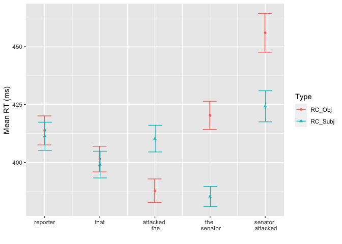
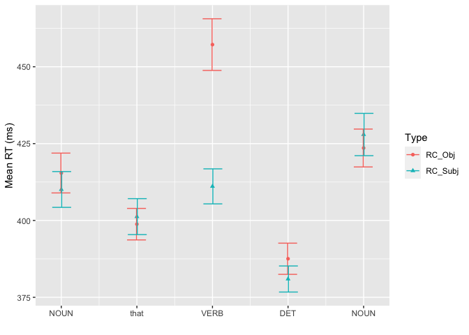
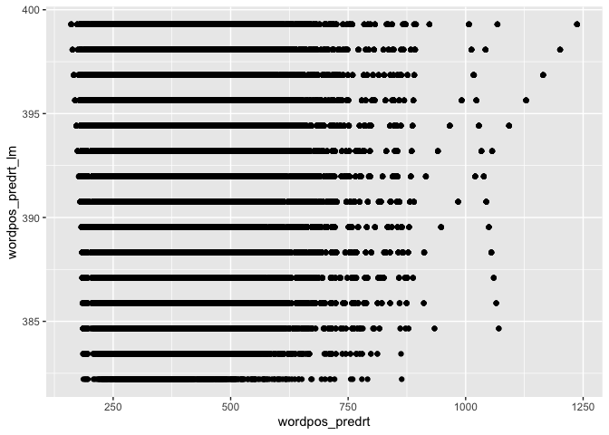

SAP Benchmark (SPR): RC subset
================

### Load in data

``` r
rt.data <- read.csv("./preprocessed_data/RelativeClauseSet.csv", header=TRUE) %>%
  filter(ROI %in% c(-2,-1,0,1,2)) %>%
  filter(RT <= 7000) %>%
  rename(participant = MD5)

filler.data <- read.csv("./preprocessed_data/Fillers.csv", header = TRUE) %>%
  filter(RT <=7000) %>%
  rename(participant = MD5)
```

### Plotting the data

Lets start by plotting the mean RTs for words in the critical positions

``` r
rt.data_summ <- rt.data %>%
  filter(WordPosition %in% c(2,3,4,5,6)) %>%
  group_by(WordPosition, Type) %>%
  summarise(mean_rt = mean(RT),
            se_rt = sd(RT)/sqrt(n())) %>%
  ungroup() 
```

    ## `summarise()` has grouped output by 'WordPosition'. You can override using the `.groups` argument.

``` r
# %>%
#   mutate(WordPosition = factor(WordPosition))


ggplot(rt.data_summ, aes(x=WordPosition, y=mean_rt, colour=Type, shape=Type)) +
  geom_point() +
  geom_errorbar(aes(ymin=mean_rt - (2*se_rt), 
                    ymax = mean_rt + (2*se_rt)),
                width=.5,position=position_dodge(0.02)) + 
  scale_x_continuous(breaks = c(2,3,4,5,6),
                     labels = c("reporter", "that", "attacked \n the", "the \n senator", "senator \n attacked"))+
  labs(x = '', y = 'Mean RT (ms)')
```

<!-- -->

``` r
## SRC: The girl that 
```

To ease the comparison of the same words with each other, we can align
them.

``` r
rt.data_summ2 <- rt.data %>%
  group_by(ROI, Type) %>%
  summarise(mean_rt = mean(RT),
            se_rt = sd(RT)/sqrt(n()))
```

    ## `summarise()` has grouped output by 'ROI'. You can override using the `.groups` argument.

``` r
ggplot(rt.data_summ2, aes(x=ROI, y=mean_rt, colour=Type, shape=Type)) +
  geom_point() +
  geom_errorbar(aes(ymin=mean_rt - (2*se_rt), 
                    ymax = mean_rt + (2*se_rt)),
                width=.5,position=position_dodge(0.02)) + 
  scale_x_continuous(breaks = c(-2,-1,0,1,2),
                     labels = c("NOUN", "that", "VERB", "DET", "NOUN")) +
  labs(x = '', y = 'Mean RT (ms)')
```

<!-- -->

``` r
## SRC: The girl that 
```

Even after alignment, the VERBs in both conditions are not directly
comparable to each other – since they occur in different positions. To
account for the effect of word position, we can compute RTs with the
effect of word position regressed out.

``` r
position_fit_lmer <- lmer(RT ~ scale(WordPosition) + (1+scale(WordPosition)| participant), filler.data)
```

    ## Warning in checkConv(attr(opt, "derivs"), opt$par, ctrl = control$checkConv, :
    ## Model failed to converge with max|grad| = 0.00861872 (tol = 0.002, component 1)

``` r
position_fit_lm <- lm(RT ~ scale(WordPosition), filler.data)


summary(position_fit_lmer)
```

    ## Linear mixed model fit by REML ['lmerMod']
    ## Formula: RT ~ scale(WordPosition) + (1 + scale(WordPosition) | participant)
    ##    Data: filler.data
    ## 
    ## REML criterion at convergence: 19023682
    ## 
    ## Scaled residuals: 
    ##      Min       1Q   Median       3Q      Max 
    ## -212.461   -0.393   -0.158    0.142   31.677 
    ## 
    ## Random effects:
    ##  Groups      Name                Variance Std.Dev. Corr 
    ##  participant (Intercept)         10821.5  104.03        
    ##              scale(WordPosition)   504.8   22.47   -0.19
    ##  Residual                        44621.5  211.24        
    ## Number of obs: 1403522, groups:  participant, 2000
    ## 
    ## Fixed effects:
    ##                     Estimate Std. Error t value
    ## (Intercept)         388.4972     2.3329  166.53
    ## scale(WordPosition)  -7.1814     0.5331  -13.47
    ## 
    ## Correlation of Fixed Effects:
    ##             (Intr)
    ## scl(WrdPst) -0.181
    ## optimizer (nloptwrap) convergence code: 0 (OK)
    ## Model failed to converge with max|grad| = 0.00861872 (tol = 0.002, component 1)

``` r
summary(position_fit_lm)
```

    ## 
    ## Call:
    ## lm(formula = RT ~ scale(WordPosition), data = filler.data)
    ## 
    ## Residuals:
    ##    Min     1Q Median     3Q    Max 
    ## -45059   -118    -43     49   6590 
    ## 
    ## Coefficients:
    ##                     Estimate Std. Error t value Pr(>|t|)    
    ## (Intercept)         388.4647     0.1996 1945.98   <2e-16 ***
    ## scale(WordPosition)  -7.1625     0.1996  -35.88   <2e-16 ***
    ## ---
    ## Signif. codes:  0 '***' 0.001 '**' 0.01 '*' 0.05 '.' 0.1 ' ' 1
    ## 
    ## Residual standard error: 236.5 on 1403520 degrees of freedom
    ## Multiple R-squared:  0.0009164,  Adjusted R-squared:  0.0009157 
    ## F-statistic:  1287 on 1 and 1403520 DF,  p-value: < 2.2e-16

``` r
rt.data$corrected_rt <- rt.data$RT + rt.data$WordPosition*coef(position_fit_lm)["scale(WordPosition)"] 
## Is this the correct way of computing corrected RT?? 
## Also, find a better way of doing this with mixed effect model by subtracting by-participant slopes also?
```

``` r
rt.data_summ3 <- rt.data %>%
  group_by(ROI, Type) %>%
  summarise(mean_corrected_rt = mean(corrected_rt),
            se_corrected_rt = sd(corrected_rt)/sqrt(n()))
```

    ## `summarise()` has grouped output by 'ROI'. You can override using the `.groups` argument.

``` r
ggplot(rt.data_summ3, aes(x=ROI, y=mean_corrected_rt, colour=Type, shape=Type)) +
  geom_point() +
  geom_errorbar(aes(ymin=mean_corrected_rt - (2*se_corrected_rt), 
                    ymax = mean_corrected_rt + (2*se_corrected_rt)),
                width=.5,position=position_dodge(0.02)) + 
  scale_x_continuous(breaks = c(-2,-1,0,1,2),
                     labels = c("NOUN", "that", "VERB", "DET", "NOUN")) +
  labs(x = '', y = 'Mean RT (ms)')
```

<!-- -->

### Fitting mixed effects model

``` r
verb_dat <- rt.data %>%
  filter(ROI == 0) %>%
  mutate(Type = factor(Type, levels = c('RC_Subj', 'RC_Obj')))

contrasts(verb_dat$Type)
```

    ##         RC_Obj
    ## RC_Subj      0
    ## RC_Obj       1

``` r
fit1 <- lmer(corrected_rt ~ Type + (1 + Type | participant) + (1 + Type | item), data=verb_dat)

summary(fit1)
```

    ## Linear mixed model fit by REML ['lmerMod']
    ## Formula: corrected_rt ~ Type + (1 + Type | participant) + (1 + Type |  
    ##     item)
    ##    Data: verb_dat
    ## 
    ## REML criterion at convergence: 226473.2
    ## 
    ## Scaled residuals: 
    ##     Min      1Q  Median      3Q     Max 
    ## -5.0446 -0.3746 -0.1469  0.1469 20.0355 
    ## 
    ## Random effects:
    ##  Groups      Name        Variance Std.Dev. Corr
    ##  participant (Intercept)  9135.8   95.58       
    ##              TypeRC_Obj  14972.8  122.36   0.82
    ##  item        (Intercept)   228.4   15.11       
    ##              TypeRC_Obj   2050.7   45.28   0.39
    ##  Residual                74885.2  273.65       
    ## Number of obs: 15908, groups:  participant, 2000; item, 24
    ## 
    ## Fixed effects:
    ##             Estimate Std. Error t value
    ## (Intercept)  381.711      4.848  78.734
    ## TypeRC_Obj    31.730     10.572   3.001
    ## 
    ## Correlation of Fixed Effects:
    ##            (Intr)
    ## TypeRC_Obj 0.126
