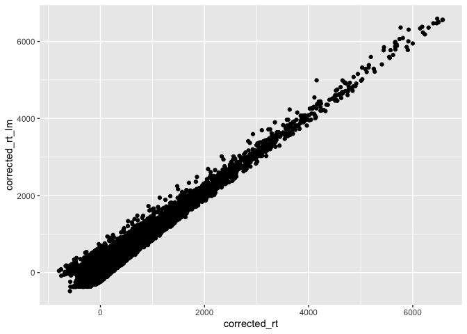
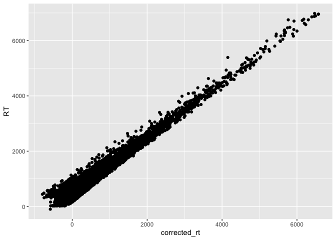
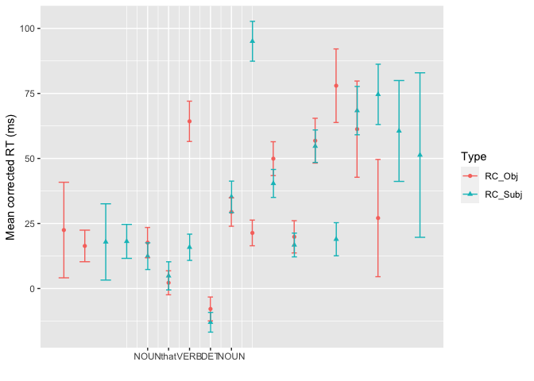
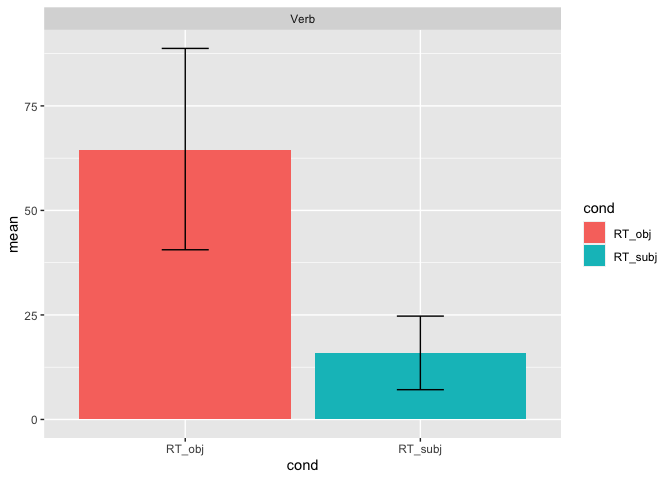
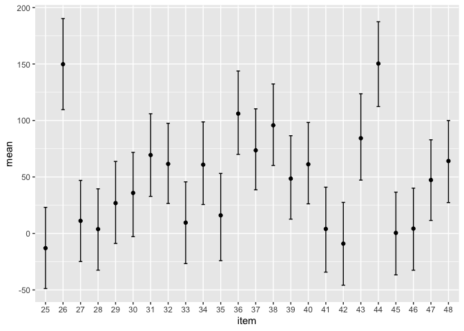
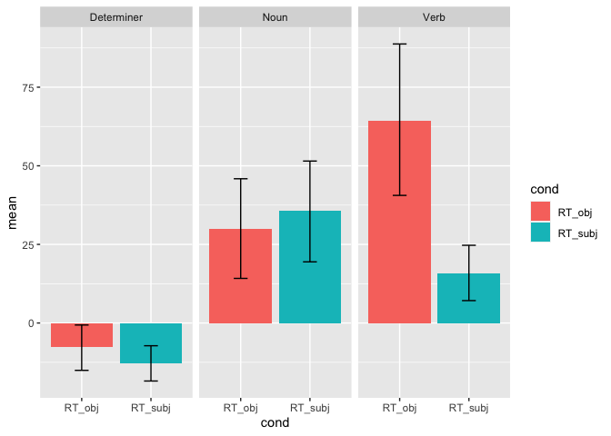
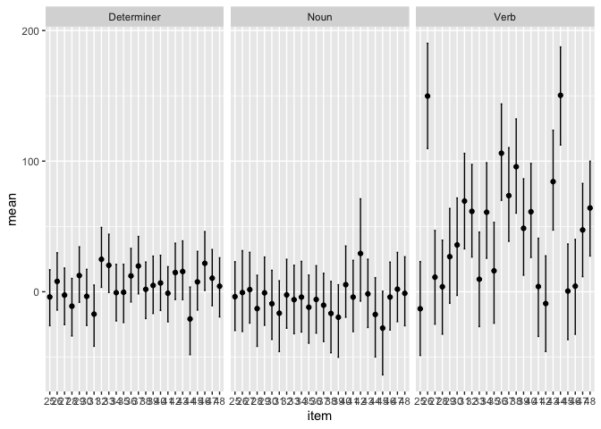
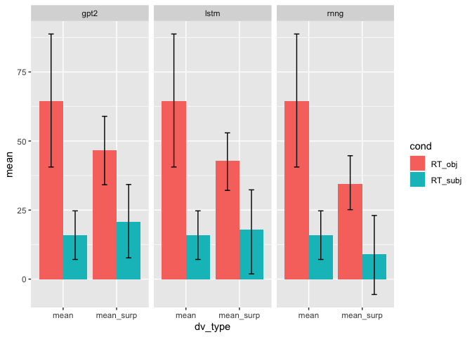
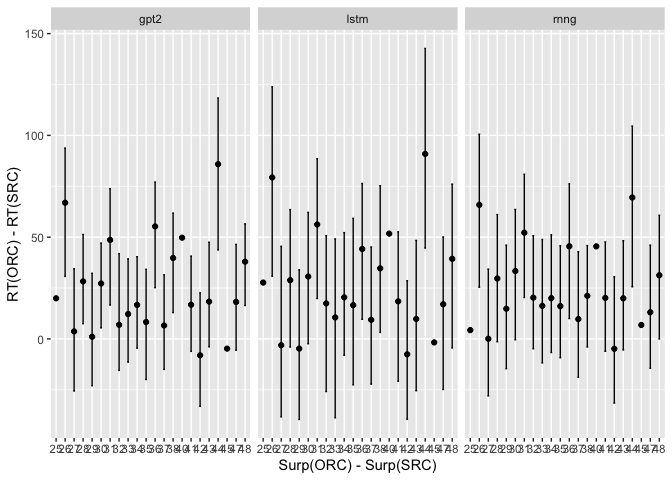
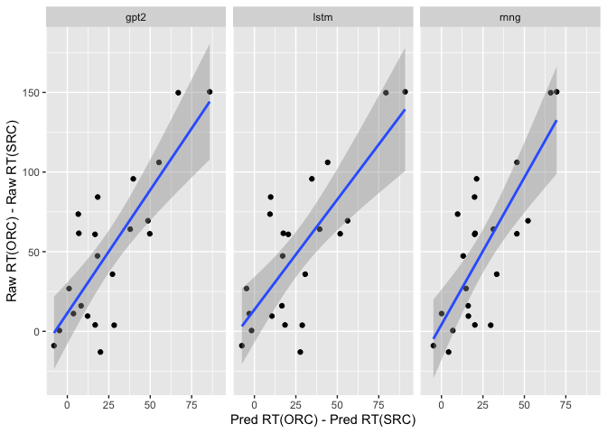

SAP Benchmark (SPR): RC subset
================

### Load in data

``` r
rt.data <- read.csv("./preprocessed_data/RelativeClauseSet.csv", header=TRUE) %>%
  # filter(ROI %in% c(-2,-1,0,1,2)) %>%
  filter(RT <= 7000) %>%
  rename(participant = MD5)

filler.data <- read.csv("./preprocessed_data/Fillers.csv", header = TRUE) %>%
  filter(RT <=7000) %>%
  rename(participant = MD5)
```

### Plotting the data

Lets start by plotting the mean RTs for words in the critical positions

``` r
rt.data_summ <- rt.data %>%
  filter(WordPosition %in% c(2,3,4,5,6)) %>%
  group_by(WordPosition, Type) %>%
  summarise(mean_rt = mean(RT),
            se_rt = sd(RT)/sqrt(n())) %>%
  ungroup() 
```

    ## `summarise()` has grouped output by 'WordPosition'. You can override using the `.groups` argument.

``` r
ggplot(rt.data_summ, aes(x=WordPosition, y=mean_rt, colour=Type, shape=Type)) +
  geom_point() +
  geom_errorbar(aes(ymin=mean_rt - (2*se_rt), 
                    ymax = mean_rt + (2*se_rt)),
                width=.5,position=position_dodge(0.02)) + 
  scale_x_continuous(breaks = c(2,3,4,5,6),
                     labels = c("reporter", "that", "attacked \n the", "the \n senator", "senator \n attacked"))+
  labs(x = '', y = 'Mean RT (ms)')
```

<!-- -->

``` r
## SRC: The girl that 
```

To ease the comparison of the same words with each other, we can align
them.

``` r
rt.data_summ2 <- rt.data %>%
  group_by(ROI, Type) %>%
  summarise(mean_rt = mean(RT),
            se_rt = sd(RT)/sqrt(n()))
```

    ## `summarise()` has grouped output by 'ROI'. You can override using the `.groups` argument.

``` r
ggplot(rt.data_summ2, aes(x=ROI, y=mean_rt, colour=Type, shape=Type)) +
  geom_point() +
  geom_errorbar(aes(ymin=mean_rt - (2*se_rt), 
                    ymax = mean_rt + (2*se_rt)),
                width=.5,position=position_dodge(0.02)) + 
  scale_x_continuous(breaks = c(-2,-1,0,1,2),
                     labels = c("NOUN", "that", "VERB", "DET", "NOUN")) +
  labs(x = '', y = 'Mean RT (ms)')
```

    ## Warning: Removed 2 rows containing missing values (geom_point).

<!-- -->

``` r
## SRC: The girl that 
```

Even after alignment, the VERBs in both conditions are not directly
comparable to each other – since they occur in different positions. To
account for the effect of word position, we can compute RTs with the
effect of word position regressed out.

### Specifying the dependent variable

``` r
position_fit_lmer <- lmer(RT ~ scale(WordPosition) + (1 + scale(WordPosition) | participant), filler.data)
```

    ## Warning in checkConv(attr(opt, "derivs"), opt$par, ctrl = control$checkConv, :
    ## Model failed to converge with max|grad| = 0.00861872 (tol = 0.002, component 1)

``` r
position_fit_lmer_nocor <- lmer(RT ~ scale(WordPosition) + (1 + scale(WordPosition) || participant), filler.data)

position_fit_lm <- lm(RT ~ scale(WordPosition), filler.data)

summary(position_fit_lmer)
```

    ## Linear mixed model fit by REML ['lmerMod']
    ## Formula: RT ~ scale(WordPosition) + (1 + scale(WordPosition) | participant)
    ##    Data: filler.data
    ## 
    ## REML criterion at convergence: 19023682
    ## 
    ## Scaled residuals: 
    ##      Min       1Q   Median       3Q      Max 
    ## -212.461   -0.393   -0.158    0.142   31.677 
    ## 
    ## Random effects:
    ##  Groups      Name                Variance Std.Dev. Corr 
    ##  participant (Intercept)         10821.5  104.03        
    ##              scale(WordPosition)   504.8   22.47   -0.19
    ##  Residual                        44621.5  211.24        
    ## Number of obs: 1403522, groups:  participant, 2000
    ## 
    ## Fixed effects:
    ##                     Estimate Std. Error t value
    ## (Intercept)         388.4972     2.3329  166.53
    ## scale(WordPosition)  -7.1814     0.5331  -13.47
    ## 
    ## Correlation of Fixed Effects:
    ##             (Intr)
    ## scl(WrdPst) -0.181
    ## optimizer (nloptwrap) convergence code: 0 (OK)
    ## Model failed to converge with max|grad| = 0.00861872 (tol = 0.002, component 1)

``` r
summary(position_fit_lmer_nocor)
```

    ## Linear mixed model fit by REML ['lmerMod']
    ## Formula: 
    ## RT ~ scale(WordPosition) + ((1 | participant) + (0 + scale(WordPosition) |  
    ##     participant))
    ##    Data: filler.data
    ## 
    ## REML criterion at convergence: 19023749
    ## 
    ## Scaled residuals: 
    ##      Min       1Q   Median       3Q      Max 
    ## -212.462   -0.393   -0.158    0.142   31.682 
    ## 
    ## Random effects:
    ##  Groups        Name                Variance Std.Dev.
    ##  participant   (Intercept)         10819.5  104.02  
    ##  participant.1 scale(WordPosition)   504.7   22.47  
    ##  Residual                          44621.5  211.24  
    ## Number of obs: 1403522, groups:  participant, 2000
    ## 
    ## Fixed effects:
    ##                     Estimate Std. Error t value
    ## (Intercept)         388.4972     2.3327  166.54
    ## scale(WordPosition)  -7.1812     0.5331  -13.47
    ## 
    ## Correlation of Fixed Effects:
    ##             (Intr)
    ## scl(WrdPst) 0.000

``` r
summary(position_fit_lm)
```

    ## 
    ## Call:
    ## lm(formula = RT ~ scale(WordPosition), data = filler.data)
    ## 
    ## Residuals:
    ##    Min     1Q Median     3Q    Max 
    ## -45059   -118    -43     49   6590 
    ## 
    ## Coefficients:
    ##                     Estimate Std. Error t value Pr(>|t|)    
    ## (Intercept)         388.4647     0.1996 1945.98   <2e-16 ***
    ## scale(WordPosition)  -7.1625     0.1996  -35.88   <2e-16 ***
    ## ---
    ## Signif. codes:  0 '***' 0.001 '**' 0.01 '*' 0.05 '.' 0.1 ' ' 1
    ## 
    ## Residual standard error: 236.5 on 1403520 degrees of freedom
    ## Multiple R-squared:  0.0009164,  Adjusted R-squared:  0.0009157 
    ## F-statistic:  1287 on 1 and 1403520 DF,  p-value: < 2.2e-16

``` r
rt.data$wordpos_predrt <- predict(position_fit_lmer_nocor, rt.data)
rt.data$wordpos_predrt_lm <- predict(position_fit_lm, rt.data)

rt.data$corrected_rt <- rt.data$RT - rt.data$wordpos_predrt
rt.data$corrected_rt_lm <- rt.data$RT - rt.data$wordpos_predrt_lm
```

``` r
ggplot(rt.data, aes(x=wordpos_predrt, y = wordpos_predrt_lm)) +
  geom_point()
```

<!-- -->

``` r
ggplot(rt.data, aes(x=corrected_rt, y = corrected_rt_lm)) +
  geom_point()
```

<!-- -->

``` r
ggplot(rt.data, aes(x=corrected_rt, y = RT)) +
  geom_point()
```

<!-- -->

``` r
rt.data_summ3 <- rt.data %>%
  group_by(ROI, Type) %>%
  summarise(mean_corrected_rt = mean(corrected_rt),
            se_corrected_rt = sd(corrected_rt)/sqrt(n()))
```

    ## `summarise()` has grouped output by 'ROI'. You can override using the `.groups` argument.

``` r
ggplot(rt.data_summ3, aes(x=ROI, y=mean_corrected_rt, colour=Type, shape=Type)) +
  geom_point() +
  geom_errorbar(aes(ymin=mean_corrected_rt - (2*se_corrected_rt), 
                    ymax = mean_corrected_rt + (2*se_corrected_rt)),
                width=.5,position=position_dodge(0.02)) + 
  scale_x_continuous(breaks = c(-2,-1,0,1,2),
                     labels = c("NOUN", "that", "VERB", "DET", "NOUN")) +
  labs(x = '', y = 'Mean corrected RT (ms)')
```

    ## Warning: Removed 2 rows containing missing values (geom_point).

<!-- -->

### Fitting mixed effects model

**Pre-registered analysis**

``` r
verb_dat <- rt.data %>%
  filter(ROI == 0) %>%
  mutate(Type = factor(Type, levels = c('RC_Subj', 'RC_Obj')),
         Type_num = ifelse(Type == 'RC_Subj', 0, 1))

contrasts(verb_dat$Type)
```

    ##         RC_Obj
    ## RC_Subj      0
    ## RC_Obj       1

``` r
## part intercept is 0 because we removed out this intercept through word pos correction
fit1 <- lmer(corrected_rt ~ Type_num + (0 + Type_num | participant) + (1 + Type_num | item), data=verb_dat)

summary(fit1)
```

    ## Linear mixed model fit by REML ['lmerMod']
    ## Formula: corrected_rt ~ Type_num + (0 + Type_num | participant) + (1 +  
    ##     Type_num | item)
    ##    Data: verb_dat
    ## 
    ## REML criterion at convergence: 224777.6
    ## 
    ## Scaled residuals: 
    ##     Min      1Q  Median      3Q     Max 
    ## -4.6334 -0.3575 -0.1505  0.1198 20.7509 
    ## 
    ## Random effects:
    ##  Groups      Name        Variance Std.Dev. Corr
    ##  participant Type_num    22694.5  150.65       
    ##  item        (Intercept)   214.4   14.64       
    ##              Type_num     2447.2   49.47   0.14
    ##  Residual                72124.3  268.56       
    ## Number of obs: 15908, groups:  participant, 2000; item, 24
    ## 
    ## Fixed effects:
    ##             Estimate Std. Error t value
    ## (Intercept)   15.877      4.243   3.742
    ## Type_num      48.414     11.465   4.223
    ## 
    ## Correlation of Fixed Effects:
    ##          (Intr)
    ## Type_num -0.102

**Looking at other word positions**

``` r
det_dat <- rt.data %>%
  filter(ROI == 1) %>%
  mutate(Type = factor(Type, levels = c('RC_Subj', 'RC_Obj')),
         Type_num = ifelse(Type == 'RC_Subj', 0, 1))

contrasts(det_dat$Type)
```

    ##         RC_Obj
    ## RC_Subj      0
    ## RC_Obj       1

``` r
## part intercept is 0 because we removed out this intercept through word pos correction
fit2 <- lmer(corrected_rt ~ Type_num + (0 + Type_num | participant) + (1 + Type_num | item), data=det_dat)

summary(fit2)
```

    ## Linear mixed model fit by REML ['lmerMod']
    ## Formula: corrected_rt ~ Type_num + (0 + Type_num | participant) + (1 +  
    ##     Type_num | item)
    ##    Data: det_dat
    ## 
    ## REML criterion at convergence: 211633
    ## 
    ## Scaled residuals: 
    ##     Min      1Q  Median      3Q     Max 
    ## -3.6136 -0.4032 -0.1281  0.1773 28.8208 
    ## 
    ## Random effects:
    ##  Groups      Name        Variance Std.Dev. Corr 
    ##  participant Type_num     3187.44  56.457       
    ##  item        (Intercept)    94.77   9.735       
    ##              Type_num      299.22  17.298  -0.75
    ##  Residual                33538.10 183.134       
    ## Number of obs: 15912, groups:  participant, 2000; item, 24
    ## 
    ## Fixed effects:
    ##             Estimate Std. Error t value
    ## (Intercept)  -12.983      2.858  -4.543
    ## Type_num       5.169      4.743   1.090
    ## 
    ## Correlation of Fixed Effects:
    ##          (Intr)
    ## Type_num -0.698

``` r
noun_dat <- rt.data %>%
  filter(ROI == 2) %>%
  mutate(Type = factor(Type, levels = c('RC_Subj', 'RC_Obj')),
         Type_num = ifelse(Type == 'RC_Subj', 0, 1))

contrasts(noun_dat$Type)
```

    ##         RC_Obj
    ## RC_Subj      0
    ## RC_Obj       1

``` r
## part intercept is 0 because we removed out this intercept through word pos correction
fit3 <- lmer(corrected_rt ~ Type_num + (0 + Type_num | participant) + (1 + Type_num | item), data=noun_dat)

summary(fit3)
```

    ## Linear mixed model fit by REML ['lmerMod']
    ## Formula: corrected_rt ~ Type_num + (0 + Type_num | participant) + (1 +  
    ##     Type_num | item)
    ##    Data: noun_dat
    ## 
    ## REML criterion at convergence: 221588
    ## 
    ## Scaled residuals: 
    ##     Min      1Q  Median      3Q     Max 
    ## -2.3782 -0.4190 -0.1907  0.1231 21.0421 
    ## 
    ## Random effects:
    ##  Groups      Name        Variance Std.Dev. Corr 
    ##  participant Type_num      961.0   31.00        
    ##  item        (Intercept)  1222.0   34.96        
    ##              Type_num      345.8   18.59   -0.32
    ##  Residual                64712.9  254.39        
    ## Number of obs: 15911, groups:  participant, 2000; item, 24
    ## 
    ## Fixed effects:
    ##             Estimate Std. Error t value
    ## (Intercept)   35.235      7.685   4.585
    ## Type_num      -5.766      5.582  -1.033
    ## 
    ## Correlation of Fixed Effects:
    ##          (Intr)
    ## Type_num -0.390

### Fitting BRMS model

#### At the verb

``` r
prior1 <- c(prior("normal(300,1000)", class = "Intercept"),
            prior("normal(0,150)", class = "b"),  
            prior("normal(0,200)", class = "sd"),    
            prior("normal(0,500)", class = "sigma"))

#Note brms automatically truncates the distributions for sd and sigma.
```

``` r
# fit1_bayes <- brm(corrected_rt ~ Type_num + (0 + Type_num | participant) + (1 + Type_num | item),
#                   data=verb_dat,
#                   prior = prior1,
#                   cores = 4,
#                   iter = 4000,
#                   seed = 117
#                   )
# 
# saveRDS(fit1_bayes, './saved_objects/fit1_bayes_prior1_rawrt')

fit1_bayes <- readRDS('./saved_objects/fit1_bayes_prior1_rawrt')
```

``` r
summary(fit1_bayes)
```

    ##  Family: gaussian 
    ##   Links: mu = identity; sigma = identity 
    ## Formula: corrected_rt ~ Type_num + (0 + Type_num | participant) + (1 + Type_num | item) 
    ##    Data: verb_dat (Number of observations: 15908) 
    ##   Draws: 4 chains, each with iter = 4000; warmup = 2000; thin = 1;
    ##          total post-warmup draws = 8000
    ## 
    ## Group-Level Effects: 
    ## ~item (Number of levels: 24) 
    ##                         Estimate Est.Error l-95% CI u-95% CI Rhat Bulk_ESS
    ## sd(Intercept)              15.07      5.06     5.40    25.57 1.00     2468
    ## sd(Type_num)               52.95      9.90    36.66    75.74 1.00     2578
    ## cor(Intercept,Type_num)     0.16      0.31    -0.43     0.77 1.00      897
    ##                         Tail_ESS
    ## sd(Intercept)               2241
    ## sd(Type_num)                4092
    ## cor(Intercept,Type_num)      969
    ## 
    ## ~participant (Number of levels: 2000) 
    ##              Estimate Est.Error l-95% CI u-95% CI Rhat Bulk_ESS Tail_ESS
    ## sd(Type_num)   150.66      4.38   142.08   159.37 1.00     3385     5137
    ## 
    ## Population-Level Effects: 
    ##           Estimate Est.Error l-95% CI u-95% CI Rhat Bulk_ESS Tail_ESS
    ## Intercept    15.87      4.41     7.12    24.72 1.00     5520     6119
    ## Type_num     48.59     11.94    25.29    72.37 1.00     2277     3884
    ## 
    ## Family Specific Parameters: 
    ##       Estimate Est.Error l-95% CI u-95% CI Rhat Bulk_ESS Tail_ESS
    ## sigma   268.62      1.63   265.45   271.79 1.00     9492     5920
    ## 
    ## Draws were sampled using sampling(NUTS). For each parameter, Bulk_ESS
    ## and Tail_ESS are effective sample size measures, and Rhat is the potential
    ## scale reduction factor on split chains (at convergence, Rhat = 1).

**Plot group level effects**

``` r
fit1_samples_summ <- posterior_samples(fit1_bayes) %>%
  mutate(RT_subj  = b_Intercept,
         RT_obj = b_Intercept + b_Type_num) %>%
  select(RT_subj, RT_obj) %>%
  gather(key = 'cond', value = 'RT', RT_subj, RT_obj) %>%
  group_by(cond) %>%
  summarise(mean = mean(RT),
            lower = quantile(RT, 0.025)[[1]],
            upper = quantile(RT, 0.975)[[1]]) %>%
  mutate(region = 'Verb')
```

    ## Warning: Method 'posterior_samples' is deprecated. Please see ?as_draws for
    ## recommended alternatives.

``` r
ggplot(fit1_samples_summ, aes(x=cond, y=mean, fill=cond)) +
  geom_bar(stat="identity", postion= position_dodge() ) + 
  geom_errorbar(aes(ymin=lower,
                    ymax=upper), 
                width=0.2) + 
  facet_wrap(~region)
```

    ## Warning: Ignoring unknown parameters: postion

<!-- -->

**Plot item level effects**

``` r
split_by_randomeffect <- function(fit) {
  post_samples <- posterior_samples(fit)
  
  intercept <- post_samples %>%
    select(matches('r_item.*Intercept]')) %>%
    mutate(sim = c(1:n())) %>%
    gather(key='key', 'item_intercept', matches('r_item.*Intercept]')) %>%
    mutate(item = gsub(".*?([0-9]+).*", "\\1", key))
  
  slope <- post_samples %>%
    select(matches('r_item.*Type_num]')) %>%
    gather(key='key', 'item_slope', matches('r_item.*Type_num]')) %>%
    mutate(item = gsub(".*?([0-9]+).*", "\\1", key)) %>%
    select(-key)
  
  fixed <-  post_samples %>%
    select('b_Intercept', 'b_Type_num') %>%
    mutate(sim = c(1:n()))
  
  combined <- cbind(intercept, slope)
  combined <- merge(combined, fixed, by='sim') 
  combined <- combined[, !duplicated(colnames(combined))]
  
  return(combined)
  
}


fit1_byitem <- split_by_randomeffect(fit1_bayes)%>%
  mutate(RT_SRC = b_Intercept + item_intercept,
         RT_ORC = RT_SRC + b_Type_num + item_slope,
         diff = RT_ORC - RT_SRC) %>%
  group_by(item) %>%
  summarise(mean = mean(diff),
            lower = quantile(diff, 0.025)[[1]],
            upper = quantile(diff, 0.975)[[1]]) %>%
  mutate(region = 'Verb')
```

    ## Warning: Method 'posterior_samples' is deprecated. Please see ?as_draws for
    ## recommended alternatives.

    ## Warning in merge.data.frame(combined, fixed, by = "sim"): column name 'item' is
    ## duplicated in the result

``` r
ggplot(fit1_byitem, aes(x=item, y=mean)) +
  geom_point() + 
  geom_errorbar(aes(ymin=lower,
                    ymax=upper), 
                width=0.2) 
```

<!-- -->

``` r
# + 
#   facet_wrap(~region)
```

#### At other positions

``` r
fit2_bayes <- brm(corrected_rt ~ Type_num + (0 + Type_num | participant) + (1 + Type_num | item),
                  data=det_dat,
                  prior = prior1,
                  cores = 4,
                  iter = 4000,
                  seed = 117
                  )
```

    ## Compiling Stan program...

    ## Trying to compile a simple C file

    ## Running /Library/Frameworks/R.framework/Resources/bin/R CMD SHLIB foo.c
    ## clang -mmacosx-version-min=10.13 -I"/Library/Frameworks/R.framework/Resources/include" -DNDEBUG   -I"/Library/Frameworks/R.framework/Versions/4.1/Resources/library/Rcpp/include/"  -I"/Library/Frameworks/R.framework/Versions/4.1/Resources/library/RcppEigen/include/"  -I"/Library/Frameworks/R.framework/Versions/4.1/Resources/library/RcppEigen/include/unsupported"  -I"/Library/Frameworks/R.framework/Versions/4.1/Resources/library/BH/include" -I"/Library/Frameworks/R.framework/Versions/4.1/Resources/library/StanHeaders/include/src/"  -I"/Library/Frameworks/R.framework/Versions/4.1/Resources/library/StanHeaders/include/"  -I"/Library/Frameworks/R.framework/Versions/4.1/Resources/library/RcppParallel/include/"  -I"/Library/Frameworks/R.framework/Versions/4.1/Resources/library/rstan/include" -DEIGEN_NO_DEBUG  -DBOOST_DISABLE_ASSERTS  -DBOOST_PENDING_INTEGER_LOG2_HPP  -DSTAN_THREADS  -DBOOST_NO_AUTO_PTR  -include '/Library/Frameworks/R.framework/Versions/4.1/Resources/library/StanHeaders/include/stan/math/prim/mat/fun/Eigen.hpp'  -D_REENTRANT -DRCPP_PARALLEL_USE_TBB=1   -I/usr/local/include   -fPIC  -Wall -g -O2  -c foo.c -o foo.o
    ## In file included from <built-in>:1:
    ## In file included from /Library/Frameworks/R.framework/Versions/4.1/Resources/library/StanHeaders/include/stan/math/prim/mat/fun/Eigen.hpp:13:
    ## In file included from /Library/Frameworks/R.framework/Versions/4.1/Resources/library/RcppEigen/include/Eigen/Dense:1:
    ## In file included from /Library/Frameworks/R.framework/Versions/4.1/Resources/library/RcppEigen/include/Eigen/Core:88:
    ## /Library/Frameworks/R.framework/Versions/4.1/Resources/library/RcppEigen/include/Eigen/src/Core/util/Macros.h:628:1: error: unknown type name 'namespace'
    ## namespace Eigen {
    ## ^
    ## /Library/Frameworks/R.framework/Versions/4.1/Resources/library/RcppEigen/include/Eigen/src/Core/util/Macros.h:628:16: error: expected ';' after top level declarator
    ## namespace Eigen {
    ##                ^
    ##                ;
    ## In file included from <built-in>:1:
    ## In file included from /Library/Frameworks/R.framework/Versions/4.1/Resources/library/StanHeaders/include/stan/math/prim/mat/fun/Eigen.hpp:13:
    ## In file included from /Library/Frameworks/R.framework/Versions/4.1/Resources/library/RcppEigen/include/Eigen/Dense:1:
    ## /Library/Frameworks/R.framework/Versions/4.1/Resources/library/RcppEigen/include/Eigen/Core:96:10: fatal error: 'complex' file not found
    ## #include <complex>
    ##          ^~~~~~~~~
    ## 3 errors generated.
    ## make: *** [foo.o] Error 1

    ## Start sampling

``` r
saveRDS(fit2_bayes, './saved_objects/fit2_bayes_prior1_rawrt')


fit3_bayes <- brm(corrected_rt ~ Type_num + (0 + Type_num | participant) + (1 + Type_num | item),
                  data=noun_dat,
                  prior = prior1,
                  cores = 4,
                  iter = 4000,
                  seed = 117
                  )
```

    ## Compiling Stan program...

    ## recompiling to avoid crashing R session

    ## Trying to compile a simple C file

    ## Running /Library/Frameworks/R.framework/Resources/bin/R CMD SHLIB foo.c
    ## clang -mmacosx-version-min=10.13 -I"/Library/Frameworks/R.framework/Resources/include" -DNDEBUG   -I"/Library/Frameworks/R.framework/Versions/4.1/Resources/library/Rcpp/include/"  -I"/Library/Frameworks/R.framework/Versions/4.1/Resources/library/RcppEigen/include/"  -I"/Library/Frameworks/R.framework/Versions/4.1/Resources/library/RcppEigen/include/unsupported"  -I"/Library/Frameworks/R.framework/Versions/4.1/Resources/library/BH/include" -I"/Library/Frameworks/R.framework/Versions/4.1/Resources/library/StanHeaders/include/src/"  -I"/Library/Frameworks/R.framework/Versions/4.1/Resources/library/StanHeaders/include/"  -I"/Library/Frameworks/R.framework/Versions/4.1/Resources/library/RcppParallel/include/"  -I"/Library/Frameworks/R.framework/Versions/4.1/Resources/library/rstan/include" -DEIGEN_NO_DEBUG  -DBOOST_DISABLE_ASSERTS  -DBOOST_PENDING_INTEGER_LOG2_HPP  -DSTAN_THREADS  -DBOOST_NO_AUTO_PTR  -include '/Library/Frameworks/R.framework/Versions/4.1/Resources/library/StanHeaders/include/stan/math/prim/mat/fun/Eigen.hpp'  -D_REENTRANT -DRCPP_PARALLEL_USE_TBB=1   -I/usr/local/include   -fPIC  -Wall -g -O2  -c foo.c -o foo.o
    ## In file included from <built-in>:1:
    ## In file included from /Library/Frameworks/R.framework/Versions/4.1/Resources/library/StanHeaders/include/stan/math/prim/mat/fun/Eigen.hpp:13:
    ## In file included from /Library/Frameworks/R.framework/Versions/4.1/Resources/library/RcppEigen/include/Eigen/Dense:1:
    ## In file included from /Library/Frameworks/R.framework/Versions/4.1/Resources/library/RcppEigen/include/Eigen/Core:88:
    ## /Library/Frameworks/R.framework/Versions/4.1/Resources/library/RcppEigen/include/Eigen/src/Core/util/Macros.h:628:1: error: unknown type name 'namespace'
    ## namespace Eigen {
    ## ^
    ## /Library/Frameworks/R.framework/Versions/4.1/Resources/library/RcppEigen/include/Eigen/src/Core/util/Macros.h:628:16: error: expected ';' after top level declarator
    ## namespace Eigen {
    ##                ^
    ##                ;
    ## In file included from <built-in>:1:
    ## In file included from /Library/Frameworks/R.framework/Versions/4.1/Resources/library/StanHeaders/include/stan/math/prim/mat/fun/Eigen.hpp:13:
    ## In file included from /Library/Frameworks/R.framework/Versions/4.1/Resources/library/RcppEigen/include/Eigen/Dense:1:
    ## /Library/Frameworks/R.framework/Versions/4.1/Resources/library/RcppEigen/include/Eigen/Core:96:10: fatal error: 'complex' file not found
    ## #include <complex>
    ##          ^~~~~~~~~
    ## 3 errors generated.
    ## make: *** [foo.o] Error 1

    ## Start sampling

``` r
saveRDS(fit2_bayes, './saved_objects/fit2_bayes_prior1_rawrt')
```

``` r
fit2_samples_summ <- posterior_samples(fit2_bayes) %>%
  mutate(RT_subj  = b_Intercept,
         RT_obj = b_Intercept + b_Type_num)%>%
  select(RT_subj, RT_obj) %>%
  gather(key = 'cond', value = 'RT', RT_subj, RT_obj)%>%
  group_by(cond) %>%
  summarise(mean = mean(RT),
            lower = quantile(RT, 0.025)[[1]],
            upper = quantile(RT, 0.975)[[1]]) %>%
  mutate(region = "Determiner")
```

    ## Warning: Method 'posterior_samples' is deprecated. Please see ?as_draws for
    ## recommended alternatives.

``` r
fit3_samples_summ <- posterior_samples(fit3_bayes) %>%
  mutate(RT_subj  = b_Intercept,
         RT_obj = b_Intercept + b_Type_num) %>%
  select(RT_subj, RT_obj) %>%
  gather(key = 'cond', value = 'RT', RT_subj, RT_obj) %>%
  group_by(cond) %>%
  summarise(mean = mean(RT),
            lower = quantile(RT, 0.025)[[1]],
            upper = quantile(RT, 0.975)[[1]]) %>%
  mutate(region = "Noun")
```

    ## Warning: Method 'posterior_samples' is deprecated. Please see ?as_draws for
    ## recommended alternatives.

``` r
all_fit_samples_summ <- dplyr::bind_rows(fit1_samples_summ, fit2_samples_summ, fit3_samples_summ)

ggplot(all_fit_samples_summ, aes(x=cond, y=mean, fill=cond)) +
  geom_bar(stat="identity", postion= position_dodge() ) + 
  geom_errorbar(aes(ymin=lower,
                    ymax=upper), 
                width=0.2) + 
  facet_wrap(~region)
```

    ## Warning: Ignoring unknown parameters: postion

<!-- -->

``` r
fit2_byitem <- split_by_randomeffect(fit2_bayes)%>%
  mutate(RT_SRC = b_Intercept + item_intercept,
         RT_ORC = RT_SRC + b_Type_num + item_slope,
         diff = RT_ORC - RT_SRC) %>%
  group_by(item) %>%
  summarise(mean = mean(diff),
            lower = quantile(diff, 0.025)[[1]],
            upper = quantile(diff, 0.975)[[1]]) %>%
  mutate(region = 'Determiner')
```

    ## Warning: Method 'posterior_samples' is deprecated. Please see ?as_draws for
    ## recommended alternatives.

    ## Warning in merge.data.frame(combined, fixed, by = "sim"): column name 'item' is
    ## duplicated in the result

``` r
fit3_byitem <- split_by_randomeffect(fit3_bayes) %>%
  mutate(RT_SRC = b_Intercept + item_intercept,
         RT_ORC = RT_SRC + b_Type_num + item_slope,
         diff = RT_ORC - RT_SRC) %>%
  group_by(item) %>%
  summarise(mean = mean(diff),
            lower = quantile(diff, 0.025)[[1]],
            upper = quantile(diff, 0.975)[[1]]) %>%
  mutate(region = 'Noun')
```

    ## Warning: Method 'posterior_samples' is deprecated. Please see ?as_draws for
    ## recommended alternatives.

    ## Warning: column name 'item' is duplicated in the result

``` r
all_split <- dplyr::bind_rows(fit1_byitem, fit2_byitem, fit3_byitem) 

rm(fit1_byitem, fit2_byitem, fit3_byitem)
```

``` r
ggplot(all_split, aes(x=item, y=mean)) +
  geom_point() + 
  geom_errorbar(aes(ymin=lower,
                    ymax=upper), 
                width=0.2) + 
  facet_wrap(~region)
```

<!-- -->

### Correlating with Surprisal

#### Correlation with raw surprisals

``` r
surp_files <- c('./Surprisals/items_orc.lstm.csv',
                './Surprisals/items_orc.gpt2.csv',
                './Surprisals/items_orc.rnng.csv')


surp_list <- list()

i <- 1
for(fname in surp_files){
  model_name <- strsplit(fname, '.', fixed=TRUE)[[1]][3]
  curr_surp <- read.csv(fname) %>%
    mutate(model = model_name,
           surprisal = ifelse(surprisal == -1, NA, surprisal),
           word_pos = word_pos + 1)

  surp_list[[i]] <- curr_surp
  i <- i +1
}


surps_rc <- dplyr::bind_rows(surp_list)
```

``` r
nrow(rt.data)
```

    ## [1] 188907

``` r
rt.data.merged <- merge(x=rt.data, y=surps_rc, 
                      by.x=c("Sentence", "WordPosition"), by.y=c("Sentence", "word_pos"))

nrow(rt.data.merged)
```

    ## [1] 528388

``` r
surp.diff <- rt.data.merged %>%
  select(item, Type, surprisal, ROI, participant, model) %>%
  filter(ROI %in% c(0,1,2)) %>%
  mutate(region = ifelse(ROI == 0, 'Verb', ifelse(ROI == 1, 'Determiner', 'Noun'))) %>%
  group_by(item, Type, surprisal, region, model) %>%
  summarize(surprisal = mean(surprisal)) %>%   #should be the same anywya for all participants
  ungroup() %>%
  spread(key=Type, value = surprisal) %>%
  mutate(surp_diff = RC_Obj - RC_Subj) 
```

    ## `summarise()` has grouped output by 'item', 'Type', 'surprisal', 'region'. You can override using the `.groups` argument.

``` r
all_split_surp <- merge(all_split, surp.diff, by = c('region', 'item'))

nrow(surp.diff)
```

    ## [1] 207

``` r
nrow(all_split) 
```

    ## [1] 72

``` r
nrow(all_split_surp)  #figure out why this is not the same? 
```

    ## [1] 207

``` r
ggplot(all_split_surp, aes(y = mean, x = surp_diff)) + 
  geom_point() + 
  facet_grid(model~region) + 
  geom_errorbar(aes(ymin=lower,
                    ymax=upper), 
                width=0.2) + 
  labs(y = 'RT(ORC) - RT(SRC)', x = 'Surp(ORC) - Surp(SRC)') +
  geom_smooth(method = 'lm')
```

    ## `geom_smooth()` using formula 'y ~ x'

<!-- -->

``` r
## I am not sure if this plot makes sense -- the RTs are generated from a model which is corrected for position but these surps are not corrected for position. 
```

### Surprisal lmer analysis

#### Loading in data

``` r
create_merged_dat <- function(rt_dat, surp_dat, freqs){
  merged = rt_dat %>%
    merge(freqs, by.x="EachWord", by.y="word", all.x=TRUE) %>%
    merge(surp_dat, by.x=c("Sentence", "WordPosition"), by.y=c("Sentence", "word_pos"), all.x=TRUE) %>%
    group_by_at(vars(participant, Sentence)) %>%
    mutate(RT_p1 = lag(RT), 
           RT_p2 = lag(RT_p1), 
           RT_p3 = lag(RT_p2),
           length = nchar(EachWord),
           length_p1 = lag(length), 
           length_p2 = lag(length_p1),
           length_p3 = lag(length_p2),
           logfreq = log(count),
           logfreq_p1 = lag(logfreq), 
           logfreq_p2 = lag(logfreq_p1),
           logfreq_p3 = lag(logfreq_p2),
           surprisal_p1 = lag(surprisal),
           surprisal_p2 = lag(surprisal_p1),
           surprisal_p3 = lag(surprisal_p2))
                           
  merged_dropped = subset(merged, 
                          !is.na(surprisal) & !is.na(surprisal_p1)& 
                          !is.na(surprisal_p2) & !is.na(surprisal_p3) &
                          !is.na(logfreq) & !is.na(logfreq_p1) &
                          !is.na(logfreq_p2) & !is.na(logfreq_p3))
  
  print(paste(nrow(merged), nrow(merged_dropped)))
  
  return(merged_dropped)
    
}
```

``` r
surp_files_fillers <- c('./Surprisals/items_filler.lstm.csv',
                './Surprisals/items_filler.gpt2.csv',
                './Surprisals/items_filler.rnng.csv')


models <- c('lstm', 'gpt2', 'rnng')


rt.data$Sentence <- str_replace_all(rt.data$Sentence, "%2C", ",")
filler.data$Sentence <- str_replace_all(filler.data$Sentence, "%2C", ",")

freqs <- read.csv("./freqs.csv")

predicted_dat_list <- list()
filler_surp_models <- list()

i <- 1

for(model_name in models){
  
  rc_surp_name <- paste('./Surprisals/items_orc.', model_name, '.csv', sep = '')
  filler_surp_name <- paste('./Surprisals/items_filler.', model_name, '.csv', sep = '')
  
  ## Load in surprisal
  curr_rc_surp <- read.csv(rc_surp_name) %>%
    mutate(model = model_name,
           surprisal = ifelse(surprisal == -1, NA, surprisal),
           word_pos = word_pos + 1,
           Sentence = str_replace_all(Sentence, "%2C", ","))
  
  curr_filler_surp <- read.csv(filler_surp_name) %>%
    mutate(model = model_name,
           surprisal = ifelse(surprisal == -1, NA, surprisal),
           word_pos = word_pos + 1,
           Sentence = str_replace_all(Sentence, "%2C", ","))
  
  ## Merge surprisal with RTs
  curr_rc_dat <- create_merged_dat(rt.data, curr_rc_surp, freqs)
  curr_filler_dat <- create_merged_dat(filler.data, curr_filler_surp, freqs)
  
  ## Fit filler model
  curr_filler_model <- lmer(data=curr_filler_dat,
                            RT ~ surprisal + surprisal_p1 + surprisal_p2 + surprisal_p3 +
                            WordPosition + 
                            logfreq*length + logfreq_p1*length_p1 + logfreq_p2*length_p2 + logfreq_p3*length_p3 +
                            (1 | participant) + (1 | item))
  
  saveRDS(curr_filler_model, paste('./saved_objects/filler_lm_', model_name, sep=''))
  
  ## Generated predicted RT
  curr_rc_dat$pred_rt <- predict(curr_filler_model,
                                   newdata=curr_rc_dat,
                                   allow.new.levels=TRUE)
  
  curr_filler_dat$pred_rt <- predict(curr_filler_model,
                                   newdata=curr_filler_dat)
  
  
  ## Correct predicted RT for word position
  
  curr_wordpos_model <- lmer(pred_rt ~ scale(WordPosition) +
                            (1 +scale(WordPosition) | participant),
                            data = curr_filler_dat)
  
  
  
  curr_rc_dat$pred_rt_wordpos <- predict(curr_wordpos_model, curr_rc_dat)
  curr_rc_dat$corrected_pred_rt <- curr_rc_dat$pred_rt - curr_rc_dat$pred_rt_wordpos
  
  curr_rc_dat$model <- model_name

  predicted_dat_list[[i]] <- curr_rc_dat

  i <- i+1

}
```

    ## [1] "188907 96112"
    ## [1] "1403522 435894"

    ## boundary (singular) fit: see ?isSingular

    ## [1] "188907 97436"
    ## [1] "1403522 435894"

    ## boundary (singular) fit: see ?isSingular

    ## [1] "188907 96112"
    ## [1] "1403522 435894"

    ## boundary (singular) fit: see ?isSingular

``` r
predicted_dat <- dplyr::bind_rows(predicted_dat_list)
```

### Fit BRMS models at the verb position

``` r
all_fit1_byitem <- list()

i <- 1

for(model_name in unique(predicted_dat$model)){
  print(model_name)
  curr_verb_dat = predicted_dat %>%
    filter(model == model_name) %>%
    filter(ROI == 0) %>%
    mutate(Type = factor(Type, levels = c('RC_Subj', 'RC_Obj')),
         Type_num = ifelse(Type == 'RC_Subj', 0, 1))

  curr_fit1_bayes <- brm(corrected_pred_rt ~ Type_num + (0 + Type_num | participant) + (1 + Type_num | item),
                          data=curr_verb_dat,
                          prior = prior1,
                          cores = 4,
                          iter = 4000,
                          seed = 117
                        )

  saveRDS(curr_fit1_bayes, paste('./saved_objects/fit1_bayes_prior1_surp_', model_name, sep=''))


  curr_fit1_byitem <- split_by_randomeffect(curr_fit1_bayes)%>%
    mutate(RT_SRC = b_Intercept + item_intercept,
           RT_ORC = RT_SRC + b_Type_num + item_slope,
           diff = RT_ORC - RT_SRC) %>%
    group_by(item) %>%
    summarise(mean_surp = mean(diff),
              lower_surp = quantile(diff, 0.025)[[1]],
              upper_surp = quantile(diff, 0.975)[[1]]) %>%
    mutate(region = 'Verb') %>%
    mutate(model = model_name)

  all_fit1_byitem[[i]] <- curr_fit1_byitem
  i <- i+1

}
```

    ## [1] "lstm"

    ## Compiling Stan program...

    ## Trying to compile a simple C file

    ## Running /Library/Frameworks/R.framework/Resources/bin/R CMD SHLIB foo.c
    ## clang -mmacosx-version-min=10.13 -I"/Library/Frameworks/R.framework/Resources/include" -DNDEBUG   -I"/Library/Frameworks/R.framework/Versions/4.1/Resources/library/Rcpp/include/"  -I"/Library/Frameworks/R.framework/Versions/4.1/Resources/library/RcppEigen/include/"  -I"/Library/Frameworks/R.framework/Versions/4.1/Resources/library/RcppEigen/include/unsupported"  -I"/Library/Frameworks/R.framework/Versions/4.1/Resources/library/BH/include" -I"/Library/Frameworks/R.framework/Versions/4.1/Resources/library/StanHeaders/include/src/"  -I"/Library/Frameworks/R.framework/Versions/4.1/Resources/library/StanHeaders/include/"  -I"/Library/Frameworks/R.framework/Versions/4.1/Resources/library/RcppParallel/include/"  -I"/Library/Frameworks/R.framework/Versions/4.1/Resources/library/rstan/include" -DEIGEN_NO_DEBUG  -DBOOST_DISABLE_ASSERTS  -DBOOST_PENDING_INTEGER_LOG2_HPP  -DSTAN_THREADS  -DBOOST_NO_AUTO_PTR  -include '/Library/Frameworks/R.framework/Versions/4.1/Resources/library/StanHeaders/include/stan/math/prim/mat/fun/Eigen.hpp'  -D_REENTRANT -DRCPP_PARALLEL_USE_TBB=1   -I/usr/local/include   -fPIC  -Wall -g -O2  -c foo.c -o foo.o
    ## In file included from <built-in>:1:
    ## In file included from /Library/Frameworks/R.framework/Versions/4.1/Resources/library/StanHeaders/include/stan/math/prim/mat/fun/Eigen.hpp:13:
    ## In file included from /Library/Frameworks/R.framework/Versions/4.1/Resources/library/RcppEigen/include/Eigen/Dense:1:
    ## In file included from /Library/Frameworks/R.framework/Versions/4.1/Resources/library/RcppEigen/include/Eigen/Core:88:
    ## /Library/Frameworks/R.framework/Versions/4.1/Resources/library/RcppEigen/include/Eigen/src/Core/util/Macros.h:628:1: error: unknown type name 'namespace'
    ## namespace Eigen {
    ## ^
    ## /Library/Frameworks/R.framework/Versions/4.1/Resources/library/RcppEigen/include/Eigen/src/Core/util/Macros.h:628:16: error: expected ';' after top level declarator
    ## namespace Eigen {
    ##                ^
    ##                ;
    ## In file included from <built-in>:1:
    ## In file included from /Library/Frameworks/R.framework/Versions/4.1/Resources/library/StanHeaders/include/stan/math/prim/mat/fun/Eigen.hpp:13:
    ## In file included from /Library/Frameworks/R.framework/Versions/4.1/Resources/library/RcppEigen/include/Eigen/Dense:1:
    ## /Library/Frameworks/R.framework/Versions/4.1/Resources/library/RcppEigen/include/Eigen/Core:96:10: fatal error: 'complex' file not found
    ## #include <complex>
    ##          ^~~~~~~~~
    ## 3 errors generated.
    ## make: *** [foo.o] Error 1

    ## Start sampling

    ## Warning: There were 77 divergent transitions after warmup. See
    ## http://mc-stan.org/misc/warnings.html#divergent-transitions-after-warmup
    ## to find out why this is a problem and how to eliminate them.

    ## Warning: There were 7923 transitions after warmup that exceeded the maximum treedepth. Increase max_treedepth above 10. See
    ## http://mc-stan.org/misc/warnings.html#maximum-treedepth-exceeded

    ## Warning: Examine the pairs() plot to diagnose sampling problems

    ## Warning: The largest R-hat is 1.2, indicating chains have not mixed.
    ## Running the chains for more iterations may help. See
    ## http://mc-stan.org/misc/warnings.html#r-hat

    ## Warning: Bulk Effective Samples Size (ESS) is too low, indicating posterior means and medians may be unreliable.
    ## Running the chains for more iterations may help. See
    ## http://mc-stan.org/misc/warnings.html#bulk-ess

    ## Warning: Tail Effective Samples Size (ESS) is too low, indicating posterior variances and tail quantiles may be unreliable.
    ## Running the chains for more iterations may help. See
    ## http://mc-stan.org/misc/warnings.html#tail-ess

    ## Warning: Method 'posterior_samples' is deprecated. Please see ?as_draws for
    ## recommended alternatives.

    ## Warning in merge.data.frame(combined, fixed, by = "sim"): column name 'item' is
    ## duplicated in the result

    ## [1] "gpt2"

    ## Compiling Stan program...

    ## recompiling to avoid crashing R session

    ## Trying to compile a simple C file

    ## Running /Library/Frameworks/R.framework/Resources/bin/R CMD SHLIB foo.c
    ## clang -mmacosx-version-min=10.13 -I"/Library/Frameworks/R.framework/Resources/include" -DNDEBUG   -I"/Library/Frameworks/R.framework/Versions/4.1/Resources/library/Rcpp/include/"  -I"/Library/Frameworks/R.framework/Versions/4.1/Resources/library/RcppEigen/include/"  -I"/Library/Frameworks/R.framework/Versions/4.1/Resources/library/RcppEigen/include/unsupported"  -I"/Library/Frameworks/R.framework/Versions/4.1/Resources/library/BH/include" -I"/Library/Frameworks/R.framework/Versions/4.1/Resources/library/StanHeaders/include/src/"  -I"/Library/Frameworks/R.framework/Versions/4.1/Resources/library/StanHeaders/include/"  -I"/Library/Frameworks/R.framework/Versions/4.1/Resources/library/RcppParallel/include/"  -I"/Library/Frameworks/R.framework/Versions/4.1/Resources/library/rstan/include" -DEIGEN_NO_DEBUG  -DBOOST_DISABLE_ASSERTS  -DBOOST_PENDING_INTEGER_LOG2_HPP  -DSTAN_THREADS  -DBOOST_NO_AUTO_PTR  -include '/Library/Frameworks/R.framework/Versions/4.1/Resources/library/StanHeaders/include/stan/math/prim/mat/fun/Eigen.hpp'  -D_REENTRANT -DRCPP_PARALLEL_USE_TBB=1   -I/usr/local/include   -fPIC  -Wall -g -O2  -c foo.c -o foo.o
    ## In file included from <built-in>:1:
    ## In file included from /Library/Frameworks/R.framework/Versions/4.1/Resources/library/StanHeaders/include/stan/math/prim/mat/fun/Eigen.hpp:13:
    ## In file included from /Library/Frameworks/R.framework/Versions/4.1/Resources/library/RcppEigen/include/Eigen/Dense:1:
    ## In file included from /Library/Frameworks/R.framework/Versions/4.1/Resources/library/RcppEigen/include/Eigen/Core:88:
    ## /Library/Frameworks/R.framework/Versions/4.1/Resources/library/RcppEigen/include/Eigen/src/Core/util/Macros.h:628:1: error: unknown type name 'namespace'
    ## namespace Eigen {
    ## ^
    ## /Library/Frameworks/R.framework/Versions/4.1/Resources/library/RcppEigen/include/Eigen/src/Core/util/Macros.h:628:16: error: expected ';' after top level declarator
    ## namespace Eigen {
    ##                ^
    ##                ;
    ## In file included from <built-in>:1:
    ## In file included from /Library/Frameworks/R.framework/Versions/4.1/Resources/library/StanHeaders/include/stan/math/prim/mat/fun/Eigen.hpp:13:
    ## In file included from /Library/Frameworks/R.framework/Versions/4.1/Resources/library/RcppEigen/include/Eigen/Dense:1:
    ## /Library/Frameworks/R.framework/Versions/4.1/Resources/library/RcppEigen/include/Eigen/Core:96:10: fatal error: 'complex' file not found
    ## #include <complex>
    ##          ^~~~~~~~~
    ## 3 errors generated.
    ## make: *** [foo.o] Error 1

    ## Start sampling

    ## Warning: There were 22 divergent transitions after warmup. See
    ## http://mc-stan.org/misc/warnings.html#divergent-transitions-after-warmup
    ## to find out why this is a problem and how to eliminate them.

    ## Warning: There were 7978 transitions after warmup that exceeded the maximum treedepth. Increase max_treedepth above 10. See
    ## http://mc-stan.org/misc/warnings.html#maximum-treedepth-exceeded

    ## Warning: Examine the pairs() plot to diagnose sampling problems

    ## Warning: The largest R-hat is 1.35, indicating chains have not mixed.
    ## Running the chains for more iterations may help. See
    ## http://mc-stan.org/misc/warnings.html#r-hat

    ## Warning: Bulk Effective Samples Size (ESS) is too low, indicating posterior means and medians may be unreliable.
    ## Running the chains for more iterations may help. See
    ## http://mc-stan.org/misc/warnings.html#bulk-ess

    ## Warning: Tail Effective Samples Size (ESS) is too low, indicating posterior variances and tail quantiles may be unreliable.
    ## Running the chains for more iterations may help. See
    ## http://mc-stan.org/misc/warnings.html#tail-ess

    ## Warning: Method 'posterior_samples' is deprecated. Please see ?as_draws for
    ## recommended alternatives.

    ## Warning in merge.data.frame(combined, fixed, by = "sim"): column name 'item' is
    ## duplicated in the result

    ## [1] "rnng"

    ## Compiling Stan program...

    ## recompiling to avoid crashing R session

    ## Trying to compile a simple C file

    ## Running /Library/Frameworks/R.framework/Resources/bin/R CMD SHLIB foo.c
    ## clang -mmacosx-version-min=10.13 -I"/Library/Frameworks/R.framework/Resources/include" -DNDEBUG   -I"/Library/Frameworks/R.framework/Versions/4.1/Resources/library/Rcpp/include/"  -I"/Library/Frameworks/R.framework/Versions/4.1/Resources/library/RcppEigen/include/"  -I"/Library/Frameworks/R.framework/Versions/4.1/Resources/library/RcppEigen/include/unsupported"  -I"/Library/Frameworks/R.framework/Versions/4.1/Resources/library/BH/include" -I"/Library/Frameworks/R.framework/Versions/4.1/Resources/library/StanHeaders/include/src/"  -I"/Library/Frameworks/R.framework/Versions/4.1/Resources/library/StanHeaders/include/"  -I"/Library/Frameworks/R.framework/Versions/4.1/Resources/library/RcppParallel/include/"  -I"/Library/Frameworks/R.framework/Versions/4.1/Resources/library/rstan/include" -DEIGEN_NO_DEBUG  -DBOOST_DISABLE_ASSERTS  -DBOOST_PENDING_INTEGER_LOG2_HPP  -DSTAN_THREADS  -DBOOST_NO_AUTO_PTR  -include '/Library/Frameworks/R.framework/Versions/4.1/Resources/library/StanHeaders/include/stan/math/prim/mat/fun/Eigen.hpp'  -D_REENTRANT -DRCPP_PARALLEL_USE_TBB=1   -I/usr/local/include   -fPIC  -Wall -g -O2  -c foo.c -o foo.o
    ## In file included from <built-in>:1:
    ## In file included from /Library/Frameworks/R.framework/Versions/4.1/Resources/library/StanHeaders/include/stan/math/prim/mat/fun/Eigen.hpp:13:
    ## In file included from /Library/Frameworks/R.framework/Versions/4.1/Resources/library/RcppEigen/include/Eigen/Dense:1:
    ## In file included from /Library/Frameworks/R.framework/Versions/4.1/Resources/library/RcppEigen/include/Eigen/Core:88:
    ## /Library/Frameworks/R.framework/Versions/4.1/Resources/library/RcppEigen/include/Eigen/src/Core/util/Macros.h:628:1: error: unknown type name 'namespace'
    ## namespace Eigen {
    ## ^
    ## /Library/Frameworks/R.framework/Versions/4.1/Resources/library/RcppEigen/include/Eigen/src/Core/util/Macros.h:628:16: error: expected ';' after top level declarator
    ## namespace Eigen {
    ##                ^
    ##                ;
    ## In file included from <built-in>:1:
    ## In file included from /Library/Frameworks/R.framework/Versions/4.1/Resources/library/StanHeaders/include/stan/math/prim/mat/fun/Eigen.hpp:13:
    ## In file included from /Library/Frameworks/R.framework/Versions/4.1/Resources/library/RcppEigen/include/Eigen/Dense:1:
    ## /Library/Frameworks/R.framework/Versions/4.1/Resources/library/RcppEigen/include/Eigen/Core:96:10: fatal error: 'complex' file not found
    ## #include <complex>
    ##          ^~~~~~~~~
    ## 3 errors generated.
    ## make: *** [foo.o] Error 1

    ## Start sampling

    ## Warning: There were 19 divergent transitions after warmup. See
    ## http://mc-stan.org/misc/warnings.html#divergent-transitions-after-warmup
    ## to find out why this is a problem and how to eliminate them.

    ## Warning: There were 7981 transitions after warmup that exceeded the maximum treedepth. Increase max_treedepth above 10. See
    ## http://mc-stan.org/misc/warnings.html#maximum-treedepth-exceeded

    ## Warning: Examine the pairs() plot to diagnose sampling problems

    ## Warning: The largest R-hat is 1.1, indicating chains have not mixed.
    ## Running the chains for more iterations may help. See
    ## http://mc-stan.org/misc/warnings.html#r-hat

    ## Warning: Bulk Effective Samples Size (ESS) is too low, indicating posterior means and medians may be unreliable.
    ## Running the chains for more iterations may help. See
    ## http://mc-stan.org/misc/warnings.html#bulk-ess

    ## Warning: Tail Effective Samples Size (ESS) is too low, indicating posterior variances and tail quantiles may be unreliable.
    ## Running the chains for more iterations may help. See
    ## http://mc-stan.org/misc/warnings.html#tail-ess

    ## Warning: Method 'posterior_samples' is deprecated. Please see ?as_draws for
    ## recommended alternatives.

    ## Warning in merge.data.frame(combined, fixed, by = "sim"): column name 'item' is
    ## duplicated in the result

#### Structure level effects

``` r
all_bystruc_surp <- list()

i <- 1
for(model_name in unique(predicted_dat$model)){
  print(model_name)
  curr_fit1_bayes <- readRDS(paste('./saved_objects/fit1_bayes_prior1_surp_', model_name, sep=''))


  curr_fit1_samples_summ <- posterior_samples(curr_fit1_bayes) %>%
    mutate(RT_subj  = b_Intercept,
           RT_obj = b_Intercept + b_Type_num) %>%
    select(RT_subj, RT_obj) %>%
    gather(key = 'cond', value = 'RT', RT_subj, RT_obj) %>%
    group_by(cond) %>%
    summarise(mean_surp = mean(RT),
              lower_surp = quantile(RT, 0.025)[[1]],
              upper_surp = quantile(RT, 0.975)[[1]]) %>%
    mutate(region = 'Verb',
           model = model_name) 
  
  all_bystruc_surp[[i]] <- curr_fit1_samples_summ
  i <- i+1

}
```

    ## [1] "lstm"

    ## Warning: Method 'posterior_samples' is deprecated. Please see ?as_draws for
    ## recommended alternatives.

    ## [1] "gpt2"

    ## Warning: Method 'posterior_samples' is deprecated. Please see ?as_draws for
    ## recommended alternatives.

    ## [1] "rnng"

    ## Warning: Method 'posterior_samples' is deprecated. Please see ?as_draws for
    ## recommended alternatives.

``` r
## Plot surprisal predictions for each structure

all_bystruc_surp <- dplyr::bind_rows(all_bystruc_surp)%>%
  merge(fit1_samples_summ, by = c('region', 'cond')) %>%
  gather(key = 'dv_type', value = 'mean', mean, mean_surp) %>%
  mutate(upper = ifelse(dv_type == 'mean', upper, upper_surp),
         lower = ifelse(dv_type == 'mean', lower, lower_surp))

ggplot(all_bystruc_surp, aes(x=dv_type, y=mean, fill=cond)) +
  geom_bar(stat="identity", position= "dodge") + 
  geom_errorbar(aes(ymin=lower,
                    ymax=upper),
                width=0.2,
                position=position_dodge(0.9)) +
  facet_wrap(~model)
```

<!-- -->

#### Item level effects

``` r
all_surp_fit1_byitem <- dplyr::bind_rows(all_fit1_byitem) 

## Plot surprisal predictions for each item

ggplot(all_surp_fit1_byitem, aes(y = mean_surp, x = item)) + 
  geom_point() + 
  facet_grid(~model) + 
  geom_errorbar(aes(ymin=lower_surp,
                    ymax=upper_surp), 
                width=0.2) + 
  labs(y = 'RT(ORC) - RT(SRC)', x = 'Surp(ORC) - Surp(SRC)') +
  geom_smooth(method = 'lm')
```

    ## `geom_smooth()` using formula 'y ~ x'

<!-- -->

``` r
## Plot correlation of suprisal predictions with raw RTs

all_byitem_surp <- merge(all_split, all_surp_fit1_byitem, by = c('region', 'item'))


ggplot(all_byitem_surp, aes(y = mean, x = mean_surp)) + 
  geom_point() + 
  facet_grid(~model) + 
  # geom_errorbar(aes(ymin=lower,
  #                   ymax=upper), 
  #               width=0.2) + 
  labs(y = 'Raw RT(ORC) - Raw RT(SRC)', x = 'Pred RT(ORC) - Pred RT(SRC)') +
  geom_smooth(method = 'lm')
```

    ## `geom_smooth()` using formula 'y ~ x'

<!-- -->

#### Looking at summary of BRMS models

``` r
for(model_name in unique(predicted_dat$model)){
  print(model_name)
  curr_fit1_bayes <- readRDS(paste('./saved_objects/fit1_bayes_prior1_surp_', model_name, sep=''))
  print(summary(curr_fit1_bayes))
}
```

    ## [1] "lstm"

    ## Warning: Parts of the model have not converged (some Rhats are > 1.05). Be
    ## careful when analysing the results! We recommend running more iterations and/or
    ## setting stronger priors.

    ## Warning: There were 77 divergent transitions after warmup. Increasing
    ## adapt_delta above 0.8 may help. See http://mc-stan.org/misc/
    ## warnings.html#divergent-transitions-after-warmup

    ##  Family: gaussian 
    ##   Links: mu = identity; sigma = identity 
    ## Formula: corrected_pred_rt ~ Type_num + (0 + Type_num | participant) + (1 + Type_num | item) 
    ##    Data: curr_verb_dat (Number of observations: 8287) 
    ##   Draws: 4 chains, each with iter = 4000; warmup = 2000; thin = 1;
    ##          total post-warmup draws = 8000
    ## 
    ## Group-Level Effects: 
    ## ~item (Number of levels: 22) 
    ##                         Estimate Est.Error l-95% CI u-95% CI Rhat Bulk_ESS
    ## sd(Intercept)              14.69      9.14     4.97    38.41 1.06       61
    ## sd(Type_num)               31.91      9.14    18.96    54.12 1.14       31
    ## cor(Intercept,Type_num)    -0.57      0.29    -0.94     0.10 1.17       21
    ##                         Tail_ESS
    ## sd(Intercept)                 61
    ## sd(Type_num)                  69
    ## cor(Intercept,Type_num)      137
    ## 
    ## ~participant (Number of levels: 2000) 
    ##              Estimate Est.Error l-95% CI u-95% CI Rhat Bulk_ESS Tail_ESS
    ## sd(Type_num)     0.16      0.02     0.13     0.19 1.05       91      245
    ## 
    ## Population-Level Effects: 
    ##           Estimate Est.Error l-95% CI u-95% CI Rhat Bulk_ESS Tail_ESS
    ## Intercept    17.89      7.44     1.89    32.32 1.05       70      122
    ## Type_num     24.88      9.05     4.66    43.68 1.09       38       59
    ## 
    ## Family Specific Parameters: 
    ##       Estimate Est.Error l-95% CI u-95% CI Rhat Bulk_ESS Tail_ESS
    ## sigma     0.72      0.01     0.71     0.73 1.02      131      377
    ## 
    ## Draws were sampled using sampling(NUTS). For each parameter, Bulk_ESS
    ## and Tail_ESS are effective sample size measures, and Rhat is the potential
    ## scale reduction factor on split chains (at convergence, Rhat = 1).
    ## [1] "gpt2"

    ## Warning: Parts of the model have not converged (some Rhats are > 1.05). Be
    ## careful when analysing the results! We recommend running more iterations and/or
    ## setting stronger priors.

    ## Warning: There were 22 divergent transitions after warmup. Increasing
    ## adapt_delta above 0.8 may help. See http://mc-stan.org/misc/
    ## warnings.html#divergent-transitions-after-warmup

    ##  Family: gaussian 
    ##   Links: mu = identity; sigma = identity 
    ## Formula: corrected_pred_rt ~ Type_num + (0 + Type_num | participant) + (1 + Type_num | item) 
    ##    Data: curr_verb_dat (Number of observations: 8287) 
    ##   Draws: 4 chains, each with iter = 4000; warmup = 2000; thin = 1;
    ##          total post-warmup draws = 8000
    ## 
    ## Group-Level Effects: 
    ## ~item (Number of levels: 22) 
    ##                         Estimate Est.Error l-95% CI u-95% CI Rhat Bulk_ESS
    ## sd(Intercept)               9.57      6.83     2.71    29.25 1.04       60
    ## sd(Type_num)               27.87      6.30    18.14    43.42 1.21       15
    ## cor(Intercept,Type_num)    -0.26      0.37    -0.85     0.41 1.35        9
    ##                         Tail_ESS
    ## sd(Intercept)                103
    ## sd(Type_num)                  43
    ## cor(Intercept,Type_num)       34
    ## 
    ## ~participant (Number of levels: 2000) 
    ##              Estimate Est.Error l-95% CI u-95% CI Rhat Bulk_ESS Tail_ESS
    ## sd(Type_num)     0.14      0.02     0.11     0.17 1.11       38      179
    ## 
    ## Population-Level Effects: 
    ##           Estimate Est.Error l-95% CI u-95% CI Rhat Bulk_ESS Tail_ESS
    ## Intercept    20.74      6.15     7.68    34.25 1.19       18       95
    ## Type_num     25.82      7.07    12.05    40.19 1.11       36      186
    ## 
    ## Family Specific Parameters: 
    ##       Estimate Est.Error l-95% CI u-95% CI Rhat Bulk_ESS Tail_ESS
    ## sigma     0.66      0.01     0.65     0.67 1.05      112      445
    ## 
    ## Draws were sampled using sampling(NUTS). For each parameter, Bulk_ESS
    ## and Tail_ESS are effective sample size measures, and Rhat is the potential
    ## scale reduction factor on split chains (at convergence, Rhat = 1).
    ## [1] "rnng"

    ## Warning: Parts of the model have not converged (some Rhats are > 1.05). Be
    ## careful when analysing the results! We recommend running more iterations and/or
    ## setting stronger priors.

    ## Warning: There were 19 divergent transitions after warmup. Increasing
    ## adapt_delta above 0.8 may help. See http://mc-stan.org/misc/
    ## warnings.html#divergent-transitions-after-warmup

    ##  Family: gaussian 
    ##   Links: mu = identity; sigma = identity 
    ## Formula: corrected_pred_rt ~ Type_num + (0 + Type_num | participant) + (1 + Type_num | item) 
    ##    Data: curr_verb_dat (Number of observations: 8287) 
    ##   Draws: 4 chains, each with iter = 4000; warmup = 2000; thin = 1;
    ##          total post-warmup draws = 8000
    ## 
    ## Group-Level Effects: 
    ## ~item (Number of levels: 22) 
    ##                         Estimate Est.Error l-95% CI u-95% CI Rhat Bulk_ESS
    ## sd(Intercept)              12.31      6.77     3.94    29.70 1.03      152
    ## sd(Type_num)               25.00      5.93    14.79    38.58 1.01       73
    ## cor(Intercept,Type_num)    -0.27      0.36    -0.85     0.51 1.05       47
    ##                         Tail_ESS
    ## sd(Intercept)                322
    ## sd(Type_num)                 134
    ## cor(Intercept,Type_num)      122
    ## 
    ## ~participant (Number of levels: 2000) 
    ##              Estimate Est.Error l-95% CI u-95% CI Rhat Bulk_ESS Tail_ESS
    ## sd(Type_num)     0.17      0.02     0.13     0.21 1.03       86      180
    ## 
    ## Population-Level Effects: 
    ##           Estimate Est.Error l-95% CI u-95% CI Rhat Bulk_ESS Tail_ESS
    ## Intercept     9.04      6.83    -5.57    23.03 1.10       29      202
    ## Type_num     25.52      8.48     8.46    43.35 1.09       57      193
    ## 
    ## Family Specific Parameters: 
    ##       Estimate Est.Error l-95% CI u-95% CI Rhat Bulk_ESS Tail_ESS
    ## sigma     0.83      0.01     0.82     0.84 1.02      305      626
    ## 
    ## Draws were sampled using sampling(NUTS). For each parameter, Bulk_ESS
    ## and Tail_ESS are effective sample size measures, and Rhat is the potential
    ## scale reduction factor on split chains (at convergence, Rhat = 1).

#### Looking at summary of LMER fit models

``` r
for(model_name in unique(predicted_dat$model)){
  print(model_name)
  
  curr_verb_dat = predicted_dat %>%
    filter(model == model_name) %>%
    filter(ROI == 0) %>%
    mutate(Type = factor(Type, levels = c('RC_Subj', 'RC_Obj')),
         Type_num = ifelse(Type == 'RC_Subj', 0, 1))

  curr_fit1_lmer <- lmer(corrected_pred_rt ~ Type_num + 
                           (0 + Type_num | participant) + 
                           (1 + Type_num | item),
                         data=curr_verb_dat
                        )
  
  print(summary(curr_fit1_lmer))
  
}
```

    ## [1] "lstm"

    ## Warning in checkConv(attr(opt, "derivs"), opt$par, ctrl = control$checkConv, :
    ## unable to evaluate scaled gradient

    ## Warning in checkConv(attr(opt, "derivs"), opt$par, ctrl = control$checkConv, :
    ## Model failed to converge: degenerate Hessian with 2 negative eigenvalues

    ## Linear mixed model fit by REML ['lmerMod']
    ## Formula: corrected_pred_rt ~ Type_num + (0 + Type_num | participant) +  
    ##     (1 + Type_num | item)
    ##    Data: curr_verb_dat
    ## 
    ## REML criterion at convergence: 18767.9
    ## 
    ## Scaled residuals: 
    ##     Min      1Q  Median      3Q     Max 
    ## -67.000  -0.028  -0.004   0.027   5.671 
    ## 
    ## Random effects:
    ##  Groups      Name        Variance  Std.Dev. Corr 
    ##  participant Type_num      0.02562  0.1601       
    ##  item        (Intercept)  77.04417  8.7775       
    ##              Type_num    895.90688 29.9317  -0.80
    ##  Residual                  0.52263  0.7229       
    ## Number of obs: 8287, groups:  participant, 2000; item, 22
    ## 
    ## Fixed effects:
    ##             Estimate Std. Error t value
    ## (Intercept)   18.177      4.050   4.488
    ## Type_num      26.151      7.323   3.571
    ## 
    ## Correlation of Fixed Effects:
    ##          (Intr)
    ## Type_num -0.758
    ## optimizer (nloptwrap) convergence code: 0 (OK)
    ## unable to evaluate scaled gradient
    ## Model failed to converge: degenerate  Hessian with 2 negative eigenvalues
    ## 
    ## [1] "gpt2"
    ## Linear mixed model fit by REML ['lmerMod']
    ## Formula: corrected_pred_rt ~ Type_num + (0 + Type_num | participant) +  
    ##     (1 + Type_num | item)
    ##    Data: curr_verb_dat
    ## 
    ## REML criterion at convergence: 17224.4
    ## 
    ## Scaled residuals: 
    ##     Min      1Q  Median      3Q     Max 
    ## -72.772  -0.031  -0.004   0.031   7.727 
    ## 
    ## Random effects:
    ##  Groups      Name        Variance  Std.Dev. Corr 
    ##  participant Type_num      0.02134  0.1461       
    ##  item        (Intercept)  14.85862  3.8547       
    ##              Type_num    728.36472 26.9882  -0.51
    ##  Residual                  0.43348  0.6584       
    ## Number of obs: 8287, groups:  participant, 2000; item, 22
    ## 
    ## Fixed effects:
    ##             Estimate Std. Error t value
    ## (Intercept)   20.530      2.073   9.901
    ## Type_num      25.262      6.061   4.168
    ## 
    ## Correlation of Fixed Effects:
    ##          (Intr)
    ## Type_num -0.480
    ## [1] "rnng"

    ## Warning in checkConv(attr(opt, "derivs"), opt$par, ctrl = control$checkConv, :
    ## unable to evaluate scaled gradient

    ## Warning in checkConv(attr(opt, "derivs"), opt$par, ctrl = control$checkConv, :
    ## Model failed to converge: degenerate Hessian with 2 negative eigenvalues

    ## Linear mixed model fit by REML ['lmerMod']
    ## Formula: corrected_pred_rt ~ Type_num + (0 + Type_num | participant) +  
    ##     (1 + Type_num | item)
    ##    Data: curr_verb_dat
    ## 
    ## REML criterion at convergence: 20989.3
    ## 
    ## Scaled residuals: 
    ##     Min      1Q  Median      3Q     Max 
    ## -64.730  -0.025  -0.005   0.022   7.606 
    ## 
    ## Random effects:
    ##  Groups      Name        Variance  Std.Dev. Corr 
    ##  participant Type_num      0.03091  0.1758       
    ##  item        (Intercept)  34.33322  5.8595       
    ##              Type_num    544.28056 23.3298  -0.32
    ##  Residual                  0.68615  0.8283       
    ## Number of obs: 8287, groups:  participant, 2000; item, 22
    ## 
    ## Fixed effects:
    ##             Estimate Std. Error t value
    ## (Intercept)    9.454      3.376   2.800
    ## Type_num      24.854      5.880   4.227
    ## 
    ## Correlation of Fixed Effects:
    ##          (Intr)
    ## Type_num -0.594
    ## optimizer (nloptwrap) convergence code: 0 (OK)
    ## unable to evaluate scaled gradient
    ## Model failed to converge: degenerate  Hessian with 2 negative eigenvalues

#### Creating a CSV of by-item surprisal and RTs

``` r
by_item <- all_byitem_surp %>%
  select(item, model, mean, mean_surp) %>%
  spread(key=model, value=mean_surp) %>%
  rename(human = mean)


sent_dat <- verb_dat %>%
  filter(Type == 'RC_Subj') %>%
  select(item, Sentence, EachWord) %>%
  distinct() %>%
  merge(freqs, by.x="EachWord", by.y="word") %>%
  rename(Verb = EachWord,
         Frequency = count)

by_item <- merge(sent_dat, by_item, by = 'item')

write.csv(by_item, 'RC_subset_byitem_RT_surps.csv')
```
