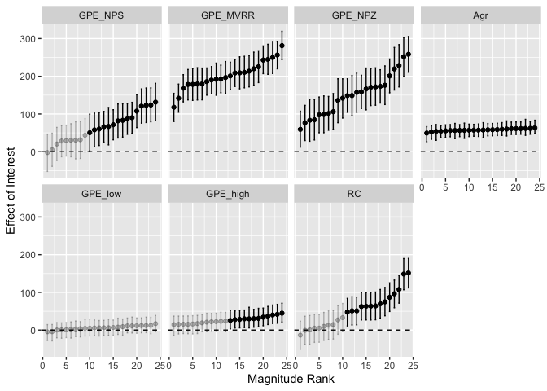
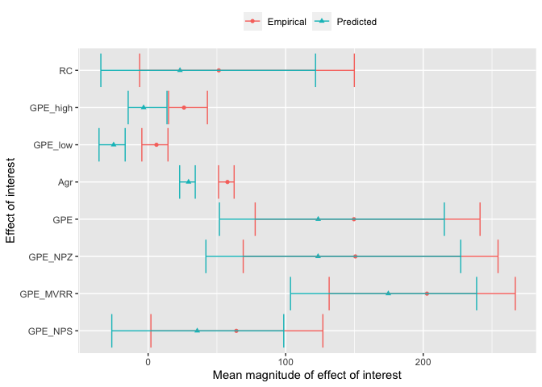

Plots for SAP Benchmark
================

## Plot 1: By item variance across subsets

``` r
by_item_gp <- readRDS('./saved_objects/by_item_ClassicGP.RDS')

by_item_attach <- read.csv('./saved_objects/by_item_attach.csv') %>%
  select(!X) %>%
  mutate(ROI = as.character(ROI))

by_item_agreement <- readRDS('./saved_objects/by_item_agreement.rds') %>%
  select(item, ROI, coef, mean, lower, upper)

by_item_rc <- readRDS('./saved_objects/by_item_RCsubset.rds')

by_item <- dplyr::bind_rows(by_item_gp, by_item_attach, by_item_agreement, by_item_rc)

rm(by_item_gp, by_item_attach, by_item_agreement, by_item_rc)

by_item_ROI_summ <- by_item %>%
  group_by(ROI, coef) %>%
  summarise(mean = mean(mean)) %>%
  ungroup() %>%
  group_by(coef) %>%
  mutate(max = max(mean),
         max_ROI = ifelse(max == mean, TRUE, FALSE)) %>%
  select(ROI, coef, max_ROI)
```

    ## `summarise()` has grouped output by 'ROI'. You can override using the `.groups` argument.

``` r
x <- by_item_ROI_summ %>%
  filter(max_ROI)
  
  
by_item <- merge(by_item, by_item_ROI_summ, by=c('ROI', 'coef')) %>%
  group_by(coef, ROI) %>%
  mutate(item = reorder_within(item, mean, coef),
         rank = rank(mean),
         greater_than_zero = ifelse(lower > 0, TRUE, FALSE),
         coef = factor(coef, levels = c('GPE_NPS', 'GPE_MVRR', 'GPE_NPZ', 'GPE','Agr', 'GPE_low', 'GPE_high', 'RC')))
```

``` r
ggplot(by_item %>%
         filter(max_ROI) %>%
         filter(coef != 'GPE'),
       aes(x = rank, y = mean, alpha = greater_than_zero)) + 
  geom_point() +
  geom_errorbar(aes(ymin=lower,
                    ymax=upper),
                width=0.3) +
  facet_wrap(~coef, nrow=2)  + 
  geom_hline(yintercept=0, linetype = 'dashed') + 
  scale_alpha_manual(values=c(0.25, 1)) +
  theme(
    # axis.text.x = element_blank(),
    #     axis.ticks.x = element_blank(),
        legend.position = 'none') + 
  labs(x = 'Magnitude Rank', y = 'Effect of Interest')
```

<!-- -->

## Plot 2: Construction level effects

``` r
#  THIS DATA IS JUST AN APPROXIMATION. NEED TO LOAD IN ACTUAL PREDICTED AND EMPIRICAL DATA

by_construction_emp <- by_item %>%
  rename(mean_item = mean) %>%
  filter(max_ROI)%>%
  group_by(coef) %>%
  summarize(mean = mean(mean_item),
            lower = quantile(mean_item, 0.025)[[1]],
            upper = quantile(mean_item, 0.975)[[1]]) %>%
  mutate(type = 'Empirical')


by_construction_pred <- by_item %>%
  rename(mean_item = mean) %>%
  filter(max_ROI)%>%
  group_by(coef) %>%
  mutate(mean_item = mean_item-rnorm(1,30,2)) %>%
  summarize(mean = mean(mean_item),
            lower = quantile(mean_item, 0.025)[[1]],
            upper = quantile(mean_item, 0.975)[[1]]) %>%
  mutate(type = 'Predicted')


by_construction <- dplyr::bind_rows(by_construction_emp, by_construction_pred)
```

``` r
ggplot(by_construction, aes(y = coef, x= mean, colour = type, shape = type)) + 
  geom_point() + 
  geom_errorbarh(aes(xmin=lower,
                     xmax=upper)) + 
  labs(x = 'Mean magnitude of effect of interest', y = 'Effect of interest', colour = '', shape = '') + 
  theme(legend.position = 'top')
```

<!-- -->
