priors
================

### Writing down what we know for the least informative prior

##### Intercept

Under treatment coding, this is mean RT per word in the baseline
condition. Minimum RT is 0 ms. Maximum is unlikely to be greater than
3000

##### Fixed effects

It is quite unlikely that any between condition differences in RT are
going to be greater than 600 ms. We will set the mean to be a small
positive value, since we set up our contrasts so that the coefficients
are expected to be positive. However, we will also assume that the
effect can be positive or negative, and therefore specify

##### Random effects

Lets assume that random slopes and random intercepts are not likely to
be sampled from distributions with sds greater than 500

##### Residual variance

Lets assume that it is very unlikely our residual variance is going to
be greater than 2000

### Prior 1

``` r
prior1 <- c(prior("normal(300,1000)", class = "Intercept"),
                prior("normal(0,150)", class = "b"),  
                prior("normal(0,200)", class = "sd"),  #brms automatically truncates the dist.  
                prior("normal(0,500)", class = "sigma"))
```

``` r
## Intercept
hist(extraDistr::rtnorm(10000, mean = 300, sd = 1000, a = 0))
```

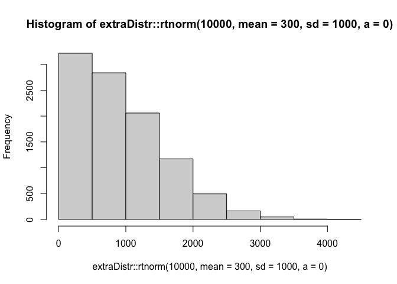<!-- -->

``` r
hist(rnorm(10000, mean = 300, sd = 1000))
```

<!-- -->

``` r
# fixed effects
hist(rnorm(100000, mean=20, sd = 150))
```

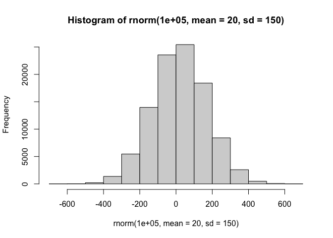<!-- -->

``` r
# random effects
hist(rnorm(100000, mean=0, sd = 200))
```

<!-- -->

``` r
# residual variance
hist(rnorm(100000, mean=0, sd = 500))
```

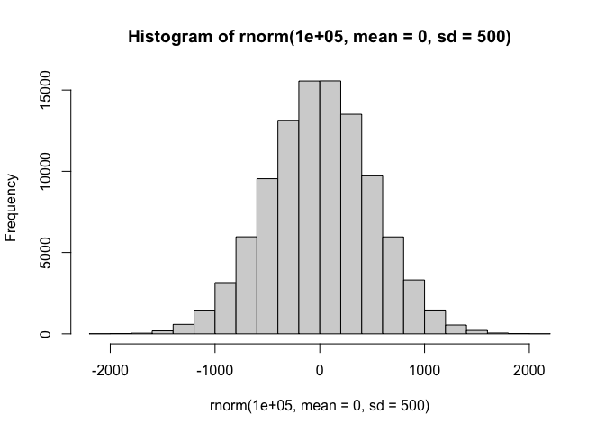<!-- -->

``` r
verb_dat <- readRDS('./saved_objects/verb_dat')

prior1_fit_notrunc <- brm(corrected_rt ~ Type_num + (0 + Type_num | participant) + (1 + Type_num | item),
                      data=verb_dat,
                      cores = 4,
                      prior = prior1,
                      iter = 4000,
                      seed = 117,
                      sample_prior = "only")
```

    ## Compiling Stan program...

    ## Trying to compile a simple C file

    ## Running /Library/Frameworks/R.framework/Resources/bin/R CMD SHLIB foo.c
    ## clang -mmacosx-version-min=10.13 -I"/Library/Frameworks/R.framework/Resources/include" -DNDEBUG   -I"/Library/Frameworks/R.framework/Versions/4.1/Resources/library/Rcpp/include/"  -I"/Library/Frameworks/R.framework/Versions/4.1/Resources/library/RcppEigen/include/"  -I"/Library/Frameworks/R.framework/Versions/4.1/Resources/library/RcppEigen/include/unsupported"  -I"/Library/Frameworks/R.framework/Versions/4.1/Resources/library/BH/include" -I"/Library/Frameworks/R.framework/Versions/4.1/Resources/library/StanHeaders/include/src/"  -I"/Library/Frameworks/R.framework/Versions/4.1/Resources/library/StanHeaders/include/"  -I"/Library/Frameworks/R.framework/Versions/4.1/Resources/library/RcppParallel/include/"  -I"/Library/Frameworks/R.framework/Versions/4.1/Resources/library/rstan/include" -DEIGEN_NO_DEBUG  -DBOOST_DISABLE_ASSERTS  -DBOOST_PENDING_INTEGER_LOG2_HPP  -DSTAN_THREADS  -DBOOST_NO_AUTO_PTR  -include '/Library/Frameworks/R.framework/Versions/4.1/Resources/library/StanHeaders/include/stan/math/prim/mat/fun/Eigen.hpp'  -D_REENTRANT -DRCPP_PARALLEL_USE_TBB=1   -I/usr/local/include   -fPIC  -Wall -g -O2  -c foo.c -o foo.o
    ## In file included from <built-in>:1:
    ## In file included from /Library/Frameworks/R.framework/Versions/4.1/Resources/library/StanHeaders/include/stan/math/prim/mat/fun/Eigen.hpp:13:
    ## In file included from /Library/Frameworks/R.framework/Versions/4.1/Resources/library/RcppEigen/include/Eigen/Dense:1:
    ## In file included from /Library/Frameworks/R.framework/Versions/4.1/Resources/library/RcppEigen/include/Eigen/Core:88:
    ## /Library/Frameworks/R.framework/Versions/4.1/Resources/library/RcppEigen/include/Eigen/src/Core/util/Macros.h:628:1: error: unknown type name 'namespace'
    ## namespace Eigen {
    ## ^
    ## /Library/Frameworks/R.framework/Versions/4.1/Resources/library/RcppEigen/include/Eigen/src/Core/util/Macros.h:628:16: error: expected ';' after top level declarator
    ## namespace Eigen {
    ##                ^
    ##                ;
    ## In file included from <built-in>:1:
    ## In file included from /Library/Frameworks/R.framework/Versions/4.1/Resources/library/StanHeaders/include/stan/math/prim/mat/fun/Eigen.hpp:13:
    ## In file included from /Library/Frameworks/R.framework/Versions/4.1/Resources/library/RcppEigen/include/Eigen/Dense:1:
    ## /Library/Frameworks/R.framework/Versions/4.1/Resources/library/RcppEigen/include/Eigen/Core:96:10: fatal error: 'complex' file not found
    ## #include <complex>
    ##          ^~~~~~~~~
    ## 3 errors generated.
    ## make: *** [foo.o] Error 1

    ## Start sampling

``` r
prior1_fit<- brm(RT |trunc(lb=0) ~ Type_num + (0 + Type_num | participant) + (1 + Type_num | item),
                data=verb_dat,
                cores = 4,
                prior = prior1,
                iter = 4000,
                seed = 117,
                sample_prior = "only")
```

    ## Compiling Stan program...
    ## Trying to compile a simple C file

    ## Running /Library/Frameworks/R.framework/Resources/bin/R CMD SHLIB foo.c
    ## clang -mmacosx-version-min=10.13 -I"/Library/Frameworks/R.framework/Resources/include" -DNDEBUG   -I"/Library/Frameworks/R.framework/Versions/4.1/Resources/library/Rcpp/include/"  -I"/Library/Frameworks/R.framework/Versions/4.1/Resources/library/RcppEigen/include/"  -I"/Library/Frameworks/R.framework/Versions/4.1/Resources/library/RcppEigen/include/unsupported"  -I"/Library/Frameworks/R.framework/Versions/4.1/Resources/library/BH/include" -I"/Library/Frameworks/R.framework/Versions/4.1/Resources/library/StanHeaders/include/src/"  -I"/Library/Frameworks/R.framework/Versions/4.1/Resources/library/StanHeaders/include/"  -I"/Library/Frameworks/R.framework/Versions/4.1/Resources/library/RcppParallel/include/"  -I"/Library/Frameworks/R.framework/Versions/4.1/Resources/library/rstan/include" -DEIGEN_NO_DEBUG  -DBOOST_DISABLE_ASSERTS  -DBOOST_PENDING_INTEGER_LOG2_HPP  -DSTAN_THREADS  -DBOOST_NO_AUTO_PTR  -include '/Library/Frameworks/R.framework/Versions/4.1/Resources/library/StanHeaders/include/stan/math/prim/mat/fun/Eigen.hpp'  -D_REENTRANT -DRCPP_PARALLEL_USE_TBB=1   -I/usr/local/include   -fPIC  -Wall -g -O2  -c foo.c -o foo.o
    ## In file included from <built-in>:1:
    ## In file included from /Library/Frameworks/R.framework/Versions/4.1/Resources/library/StanHeaders/include/stan/math/prim/mat/fun/Eigen.hpp:13:
    ## In file included from /Library/Frameworks/R.framework/Versions/4.1/Resources/library/RcppEigen/include/Eigen/Dense:1:
    ## In file included from /Library/Frameworks/R.framework/Versions/4.1/Resources/library/RcppEigen/include/Eigen/Core:88:
    ## /Library/Frameworks/R.framework/Versions/4.1/Resources/library/RcppEigen/include/Eigen/src/Core/util/Macros.h:628:1: error: unknown type name 'namespace'
    ## namespace Eigen {
    ## ^
    ## /Library/Frameworks/R.framework/Versions/4.1/Resources/library/RcppEigen/include/Eigen/src/Core/util/Macros.h:628:16: error: expected ';' after top level declarator
    ## namespace Eigen {
    ##                ^
    ##                ;
    ## In file included from <built-in>:1:
    ## In file included from /Library/Frameworks/R.framework/Versions/4.1/Resources/library/StanHeaders/include/stan/math/prim/mat/fun/Eigen.hpp:13:
    ## In file included from /Library/Frameworks/R.framework/Versions/4.1/Resources/library/RcppEigen/include/Eigen/Dense:1:
    ## /Library/Frameworks/R.framework/Versions/4.1/Resources/library/RcppEigen/include/Eigen/Core:96:10: fatal error: 'complex' file not found
    ## #include <complex>
    ##          ^~~~~~~~~
    ## 3 errors generated.
    ## make: *** [foo.o] Error 1

    ## Start sampling

``` r
##note for corrected RT truncation won't work because there can be negative values!
```

**Non-truncated distribution**

``` r
prior1_fit_samps_notrunc <-  data.frame(t(posterior_predict(prior1_fit_notrunc, ndraws=1000))) %>%
  gather(key='sim', value = 'pred_sample') 


ggplot(prior1_fit_samps_notrunc, aes(x = pred_sample)) + 
  geom_density()
```

<!-- -->

``` r
## Plotting the difference between SRC and ORC 

post_samples <- posterior_samples(prior1_fit_notrunc) %>%
  select(starts_with('b_')) %>%
  gather(key=Parameter, val = 'Param_val', starts_with('b_'))
```

    ## Warning: Method 'posterior_samples' is deprecated. Please see ?as_draws for
    ## recommended alternatives.

``` r
ggplot(post_samples, aes(y=Param_val, x = Parameter)) +
  geom_boxplot()  +
  facet_wrap(~Parameter, scales="free")
```

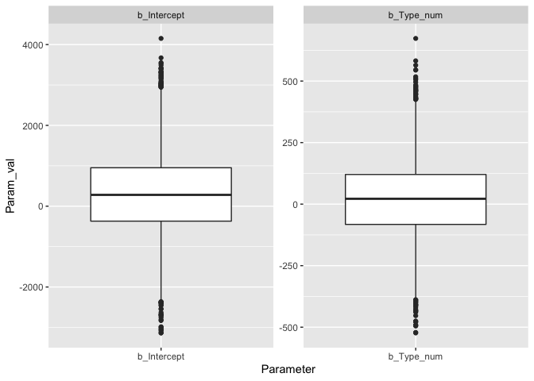<!-- -->

``` r
## Plotting the histograms for SRC and ORC

post_samples_bycond <-  posterior_samples(prior1_fit_notrunc) %>%
  mutate(RT_subj  = b_Intercept,
         RT_obj = b_Intercept + b_Type_num) %>%
  select(RT_subj, RT_obj) %>%
  gather(key = 'cond', value = 'RT', RT_subj, RT_obj) %>%
  group_by(cond) %>%
  summarise(mean = mean(RT),
            lower = quantile(RT, 0.025)[[1]],
            upper = quantile(RT, 0.975)[[1]]) 
```

    ## Warning: Method 'posterior_samples' is deprecated. Please see ?as_draws for
    ## recommended alternatives.

``` r
ggplot(post_samples_bycond, aes(x = cond, y=mean)) + 
  geom_point(stat="identity", postion= position_dodge() ) + 
  geom_errorbar(aes(ymin=lower,
                    ymax=upper), 
                width=0.2) 
```

    ## Warning: Ignoring unknown parameters: postion

<!-- -->

**Truncated distribution**

``` r
prior1_fit_samps <-  data.frame(t(posterior_predict(prior1_fit, ndraws=1000))) %>%
  gather(key='sim', value = 'pred_sample') 


ggplot(prior1_fit_samps, aes(x = pred_sample)) + 
  geom_density()
```

    ## Warning: Removed 850487 rows containing non-finite values (stat_density).

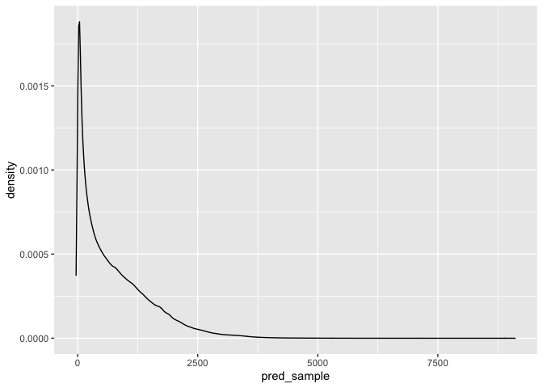<!-- -->

``` r
## Plotting the difference between SRC and ORC 

post_samples <- posterior_samples(prior1_fit) %>%
  select(starts_with('b_')) %>%
  gather(key=Parameter, val = 'Param_val', starts_with('b_'))
```

    ## Warning: Method 'posterior_samples' is deprecated. Please see ?as_draws for
    ## recommended alternatives.

``` r
ggplot(post_samples, aes(y=Param_val, x = Parameter)) +
  geom_boxplot()  +
  facet_wrap(~Parameter, scales="free")
```

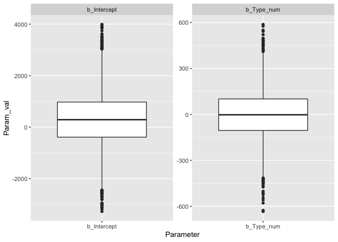<!-- -->

``` r
## Plotting the histograms for SRC and ORC

post_samples_bycond <-  posterior_samples(prior1_fit) %>%
  mutate(RT_subj  = b_Intercept,
         RT_obj = b_Intercept + b_Type_num) %>%
  select(RT_subj, RT_obj) %>%
  gather(key = 'cond', value = 'RT', RT_subj, RT_obj) %>%
  group_by(cond) %>%
  summarise(mean = mean(RT),
            lower = quantile(RT, 0.025)[[1]],
            upper = quantile(RT, 0.975)[[1]]) 
```

    ## Warning: Method 'posterior_samples' is deprecated. Please see ?as_draws for
    ## recommended alternatives.

``` r
ggplot(post_samples_bycond, aes(x = cond, y=mean)) + 
  geom_point(stat="identity", postion= position_dodge() ) + 
  geom_errorbar(aes(ymin=lower,
                    ymax=upper), 
                width=0.2) 
```

    ## Warning: Ignoring unknown parameters: postion

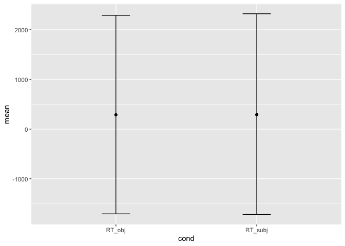<!-- -->

#### Prior 2

``` r
prior2 <- c(prior("normal(300,1000)", class = "Intercept"),
                prior("normal(0,100)", class = "b"),  
                prior("normal(0,200)", class = "sd"),
                prior("normal(0,500)", class = "sigma"))
```

``` r
# fixed effects
hist(rnorm(100000, mean=20, sd = 100))
```

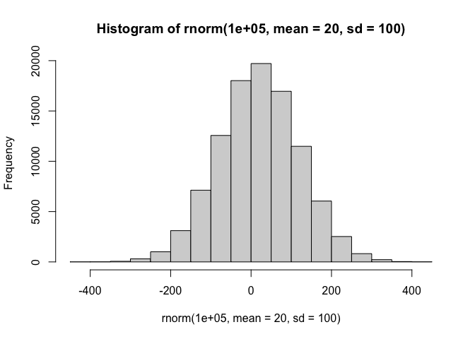<!-- -->

``` r
prior2_fit <- brm(RT |trunc(lb=0) ~ Type_num + (0 + Type_num | participant) + (1 + Type_num | item),
                      data=verb_dat,
                      cores = 4,
                      prior = prior2,
                      iter = 4000,
                      seed = 117,
                      sample_prior = "only")
```

    ## Compiling Stan program...

    ## Trying to compile a simple C file

    ## Running /Library/Frameworks/R.framework/Resources/bin/R CMD SHLIB foo.c
    ## clang -mmacosx-version-min=10.13 -I"/Library/Frameworks/R.framework/Resources/include" -DNDEBUG   -I"/Library/Frameworks/R.framework/Versions/4.1/Resources/library/Rcpp/include/"  -I"/Library/Frameworks/R.framework/Versions/4.1/Resources/library/RcppEigen/include/"  -I"/Library/Frameworks/R.framework/Versions/4.1/Resources/library/RcppEigen/include/unsupported"  -I"/Library/Frameworks/R.framework/Versions/4.1/Resources/library/BH/include" -I"/Library/Frameworks/R.framework/Versions/4.1/Resources/library/StanHeaders/include/src/"  -I"/Library/Frameworks/R.framework/Versions/4.1/Resources/library/StanHeaders/include/"  -I"/Library/Frameworks/R.framework/Versions/4.1/Resources/library/RcppParallel/include/"  -I"/Library/Frameworks/R.framework/Versions/4.1/Resources/library/rstan/include" -DEIGEN_NO_DEBUG  -DBOOST_DISABLE_ASSERTS  -DBOOST_PENDING_INTEGER_LOG2_HPP  -DSTAN_THREADS  -DBOOST_NO_AUTO_PTR  -include '/Library/Frameworks/R.framework/Versions/4.1/Resources/library/StanHeaders/include/stan/math/prim/mat/fun/Eigen.hpp'  -D_REENTRANT -DRCPP_PARALLEL_USE_TBB=1   -I/usr/local/include   -fPIC  -Wall -g -O2  -c foo.c -o foo.o
    ## In file included from <built-in>:1:
    ## In file included from /Library/Frameworks/R.framework/Versions/4.1/Resources/library/StanHeaders/include/stan/math/prim/mat/fun/Eigen.hpp:13:
    ## In file included from /Library/Frameworks/R.framework/Versions/4.1/Resources/library/RcppEigen/include/Eigen/Dense:1:
    ## In file included from /Library/Frameworks/R.framework/Versions/4.1/Resources/library/RcppEigen/include/Eigen/Core:88:
    ## /Library/Frameworks/R.framework/Versions/4.1/Resources/library/RcppEigen/include/Eigen/src/Core/util/Macros.h:628:1: error: unknown type name 'namespace'
    ## namespace Eigen {
    ## ^
    ## /Library/Frameworks/R.framework/Versions/4.1/Resources/library/RcppEigen/include/Eigen/src/Core/util/Macros.h:628:16: error: expected ';' after top level declarator
    ## namespace Eigen {
    ##                ^
    ##                ;
    ## In file included from <built-in>:1:
    ## In file included from /Library/Frameworks/R.framework/Versions/4.1/Resources/library/StanHeaders/include/stan/math/prim/mat/fun/Eigen.hpp:13:
    ## In file included from /Library/Frameworks/R.framework/Versions/4.1/Resources/library/RcppEigen/include/Eigen/Dense:1:
    ## /Library/Frameworks/R.framework/Versions/4.1/Resources/library/RcppEigen/include/Eigen/Core:96:10: fatal error: 'complex' file not found
    ## #include <complex>
    ##          ^~~~~~~~~
    ## 3 errors generated.
    ## make: *** [foo.o] Error 1

    ## Start sampling

``` r
prior2_fit_samps <-  data.frame(t(posterior_predict(prior2_fit, ndraws=1000))) %>%
  gather(key='sim', value = 'pred_sample') 


ggplot(prior2_fit_samps, aes(x = pred_sample)) + 
  geom_density()
```

    ## Warning: Removed 895514 rows containing non-finite values (stat_density).

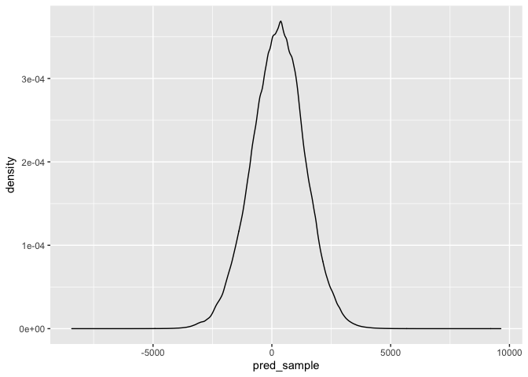<!-- -->

``` r
## Plotting the difference between SRC and ORC 

post_samples <- posterior_samples(prior2_fit) %>%
  select(starts_with('b_')) %>%
  gather(key=Parameter, val = 'Param_val', starts_with('b_'))
```

    ## Warning: Method 'posterior_samples' is deprecated. Please see ?as_draws for
    ## recommended alternatives.

``` r
ggplot(post_samples, aes(y=Param_val, x = Parameter)) +
  geom_boxplot()  +
  facet_wrap(~Parameter, scales="free")
```

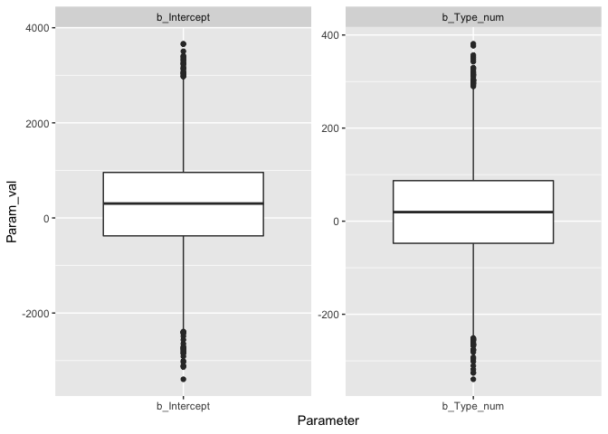<!-- -->

``` r
## Plotting the histograms for SRC and ORC

post_samples_bycond <-  posterior_samples(prior2_fit) %>%
  mutate(RT_subj  = b_Intercept,
         RT_obj = b_Intercept + b_Type_num) %>%
  select(RT_subj, RT_obj) %>%
  gather(key = 'cond', value = 'RT', RT_subj, RT_obj) %>%
  group_by(cond) %>%
  summarise(mean = mean(RT),
            lower = quantile(RT, 0.025)[[1]],
            upper = quantile(RT, 0.975)[[1]]) 
```

    ## Warning: Method 'posterior_samples' is deprecated. Please see ?as_draws for
    ## recommended alternatives.

``` r
ggplot(post_samples_bycond, aes(x = cond, y=mean)) + 
  geom_point(stat="identity", postion= position_dodge() ) + 
  geom_errorbar(aes(ymin=lower,
                    ymax=upper), 
                width=0.2) 
```

    ## Warning: Ignoring unknown parameters: postion

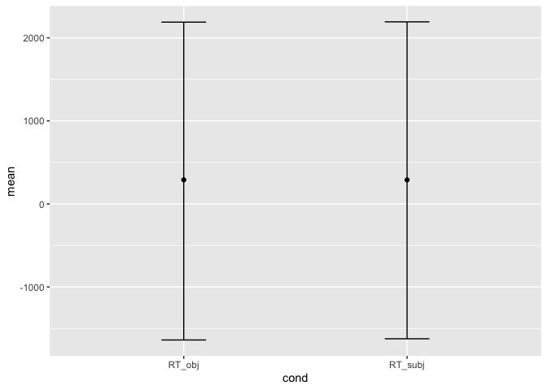<!-- -->

#### Prior 3

``` r
prior3 <- c(prior("normal(300,1000)", class = "Intercept"),
                prior("normal(0,100)", class = "b"),  
                prior("normal(0,150)", class = "sd"),
                prior("normal(0,300)", class = "sigma"))
```

``` r
# random effects
hist(rnorm(100000, mean=0, sd = 150))
```

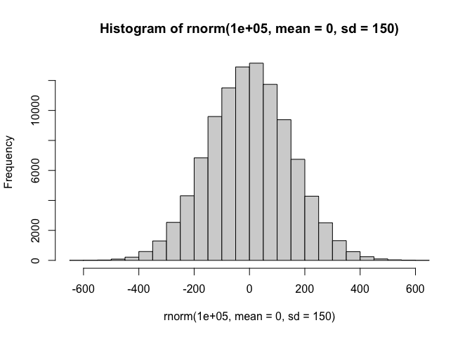<!-- -->

``` r
prior3_fit <- brm(RT | trunc(lb=0) ~ Type_num + (0 + Type_num | participant) + (1 + Type_num | item),
                      data=verb_dat,
                      cores = 4,
                      prior = prior3,
                      iter = 4000,
                      seed = 117,
                      sample_prior = "only")
```

    ## Compiling Stan program...

    ## Trying to compile a simple C file

    ## Running /Library/Frameworks/R.framework/Resources/bin/R CMD SHLIB foo.c
    ## clang -mmacosx-version-min=10.13 -I"/Library/Frameworks/R.framework/Resources/include" -DNDEBUG   -I"/Library/Frameworks/R.framework/Versions/4.1/Resources/library/Rcpp/include/"  -I"/Library/Frameworks/R.framework/Versions/4.1/Resources/library/RcppEigen/include/"  -I"/Library/Frameworks/R.framework/Versions/4.1/Resources/library/RcppEigen/include/unsupported"  -I"/Library/Frameworks/R.framework/Versions/4.1/Resources/library/BH/include" -I"/Library/Frameworks/R.framework/Versions/4.1/Resources/library/StanHeaders/include/src/"  -I"/Library/Frameworks/R.framework/Versions/4.1/Resources/library/StanHeaders/include/"  -I"/Library/Frameworks/R.framework/Versions/4.1/Resources/library/RcppParallel/include/"  -I"/Library/Frameworks/R.framework/Versions/4.1/Resources/library/rstan/include" -DEIGEN_NO_DEBUG  -DBOOST_DISABLE_ASSERTS  -DBOOST_PENDING_INTEGER_LOG2_HPP  -DSTAN_THREADS  -DBOOST_NO_AUTO_PTR  -include '/Library/Frameworks/R.framework/Versions/4.1/Resources/library/StanHeaders/include/stan/math/prim/mat/fun/Eigen.hpp'  -D_REENTRANT -DRCPP_PARALLEL_USE_TBB=1   -I/usr/local/include   -fPIC  -Wall -g -O2  -c foo.c -o foo.o
    ## In file included from <built-in>:1:
    ## In file included from /Library/Frameworks/R.framework/Versions/4.1/Resources/library/StanHeaders/include/stan/math/prim/mat/fun/Eigen.hpp:13:
    ## In file included from /Library/Frameworks/R.framework/Versions/4.1/Resources/library/RcppEigen/include/Eigen/Dense:1:
    ## In file included from /Library/Frameworks/R.framework/Versions/4.1/Resources/library/RcppEigen/include/Eigen/Core:88:
    ## /Library/Frameworks/R.framework/Versions/4.1/Resources/library/RcppEigen/include/Eigen/src/Core/util/Macros.h:628:1: error: unknown type name 'namespace'
    ## namespace Eigen {
    ## ^
    ## /Library/Frameworks/R.framework/Versions/4.1/Resources/library/RcppEigen/include/Eigen/src/Core/util/Macros.h:628:16: error: expected ';' after top level declarator
    ## namespace Eigen {
    ##                ^
    ##                ;
    ## In file included from <built-in>:1:
    ## In file included from /Library/Frameworks/R.framework/Versions/4.1/Resources/library/StanHeaders/include/stan/math/prim/mat/fun/Eigen.hpp:13:
    ## In file included from /Library/Frameworks/R.framework/Versions/4.1/Resources/library/RcppEigen/include/Eigen/Dense:1:
    ## /Library/Frameworks/R.framework/Versions/4.1/Resources/library/RcppEigen/include/Eigen/Core:96:10: fatal error: 'complex' file not found
    ## #include <complex>
    ##          ^~~~~~~~~
    ## 3 errors generated.
    ## make: *** [foo.o] Error 1

    ## Start sampling

``` r
prior3_fit_samps <-  data.frame(t(posterior_predict(prior3_fit, ndraws=1000))) %>%
  gather(key='sim', value = 'pred_sample') 


ggplot(prior3_fit_samps, aes(x = pred_sample)) + 
  geom_density()
```

    ## Warning: Removed 1399609 rows containing non-finite values (stat_density).

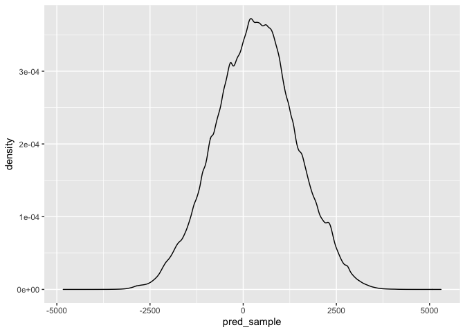<!-- -->

``` r
## Plotting the difference between SRC and ORC 

post_samples <- posterior_samples(prior3_fit) %>%
  select(starts_with('b_')) %>%
  gather(key=Parameter, val = 'Param_val', starts_with('b_'))
```

    ## Warning: Method 'posterior_samples' is deprecated. Please see ?as_draws for
    ## recommended alternatives.

``` r
ggplot(post_samples, aes(y=Param_val, x = Parameter)) +
  geom_boxplot() +
  facet_wrap(~Parameter, scales="free")
```

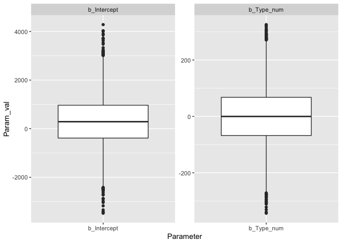<!-- -->

``` r
## Plotting the histograms for SRC and ORC

post_samples_bycond <-  posterior_samples(prior3_fit) %>%
  mutate(RT_subj  = b_Intercept,
         RT_obj = b_Intercept + b_Type_num) %>%
  select(RT_subj, RT_obj) %>%
  gather(key = 'cond', value = 'RT', RT_subj, RT_obj) %>%
  group_by(cond) %>%
  summarise(mean = mean(RT),
            lower = quantile(RT, 0.025)[[1]],
            upper = quantile(RT, 0.975)[[1]])
```

    ## Warning: Method 'posterior_samples' is deprecated. Please see ?as_draws for
    ## recommended alternatives.

``` r
ggplot(post_samples_bycond, aes(x = cond, y=mean)) + 
  geom_point(stat="identity", postion= position_dodge() ) + 
  geom_errorbar(aes(ymin=lower,
                    ymax=upper), 
                width=0.2) 
```

    ## Warning: Ignoring unknown parameters: postion

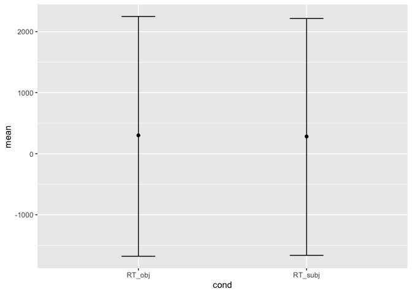<!-- -->
